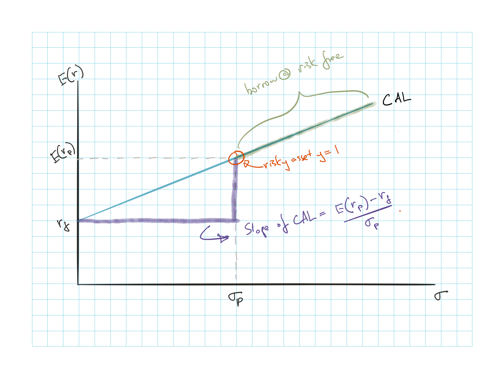
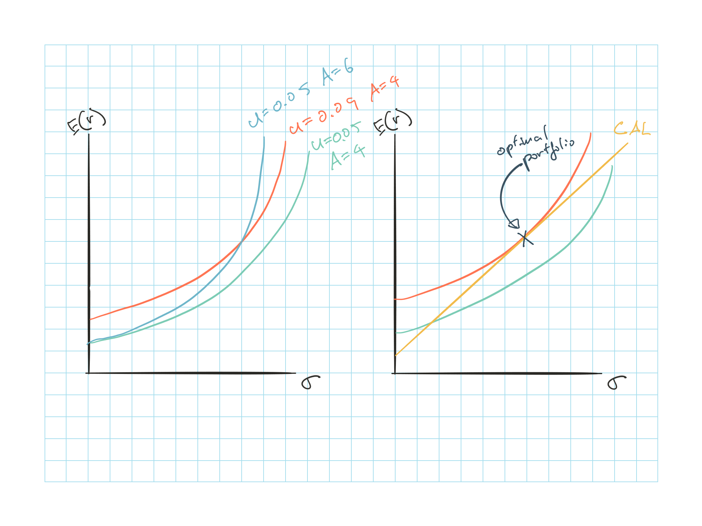

## Introduction

Risk appetites:

* Risk adverse: $A>0$ Prefer lower risk, require risk premium
* Risk neutral: $A=0$ Ignore risk, only cares about expected return
* Risk lovers: $A<0$ Prefer higher risk, accept lower return for higher risk

## Utility

Utility is dependent on investor's risk appetite, expected return and risk level

$U = \operatorname{E}[r] - 0.5A\sigma^2$

**Certainty Equivalent Rate**  
Rate that a risk free investment need to offer to provide the same level of utility as the risky investment

* Where investors is indifferent between a sure thing and the risky option

* Solve for the $\operatorname{E}[r]$ by setting $U = \operatorname{E}[r_f] = \operatorname{E}[r] - 0.5A\sigma^2$

Based on **mean-variance (M-V) criterion**, portfolio $A$ dominates $B$ if:

* $\operatorname{E}(r_A) \geq \operatorname{E}(r_B)$

* $\sigma_A \leq \sigma_B$

### Estimating Risk Aversion

Binomial loss

$r = \begin{cases} -1 & p \\ 0 & (1-p) \\ \end{cases}$

$\hookrightarrow$ $\operatorname{E}[r] = -p$; $\sigma^2(r) = p(1-p)$

$\hookrightarrow$ $U = -p-0.5Ap(1-p)$

Insurance with premium $v$

$\operatorname{E}[r] = -v$; $\sigma^2(r) = 0$

$\hookrightarrow$ $U = -v$

Set $U$ from binomial loss and premium equal

$A = \dfrac{2v}{p-1}\dfrac{1}{1-p}$

## Capital Allocation

**Complete Portfolio**  
Allocation between risk free (F) and risky assets (P)

* Assumption: Money is shifted between F & P and components of P remain in fixed proportions

$\operatorname{E}[r_c] = r_f + \dfrac{\sigma_c}{\sigma_p}\left( \operatorname{E}[r_p] - r_f \right)$

* $\operatorname{E}[r_c] = y \operatorname{E}[r_p] + (1-y) r_f = \cdots$

* $\sigma_c = y \sigma_p$

### Capital Allocation Line (CAL)

Slop of CAL = $\left. \dfrac{\operatorname{E}[r_p] - r_f}{\sigma_p} \right \} \text{Sharpe Ratio} = \dfrac{\text{Incremental Return}}{\text{Unit of }\sigma}$

CAL to the right of ($\operatorname{E}[r_p]$, $\sigma_p$) is achieve by borrowing at risk free rate

* If borrowing at risk free is not possible, the slope will be less steep = $\dfrac{\operatorname{E}[r_p] - r_f^B}{\sigma_p}$ where $\r_f^B$ is the risk free rate we can borrow

### Risk Tolerance & Asset Allocation

**Optimal Portfolio** maximizes investor utility with ratio $y^*$ on the risky asset

$y^* = \dfrac{\operatorname{E}[r_p] - r_f}{A\sigma^2 p}$

* Derived by setting the derivative of the utility equation = 0

**Graphically** derive optimal risk portfolio

1) Plot **indifference curves**, which are curves that contain different portfolios that the investor is indifferent about, given the same $U$ and $A$

    * Higher $A$ produceds a steeper sloping indifference curve as an increase in $\sigma$ requires higher $\operatorname{E}[r]$ for investors that are more risk adverse

2) Investor will pick the highest possible indifference curve that touches the CAL

3) Optimal portfolio is located at the intersection point of the CAL and the curve tangential to the CAL

### Non Normal Returns

Analysis so far used the $\sigma$ as the measure of risk and it assumes return $\sim N(\mu, \sigma)$

If returns are more heavy tailed than normal $\Rightarrow$ Reduce allocation to the risky portfolio compared to the indication above

### Capital Market Line

**Capital Market Line**  
CAL that uses a passive portfolio as the risky portfolio

**Passive** strategy for risky portfolio:

* Based on a selected benchmark portfolio
* Significant cheaper than an active strategy
* Free rider benefit: Assets should be fairly priced as mispricings should disappear from investors implementing the active strategy

**Active** strategy is to determine the risky portfolio with security analysis