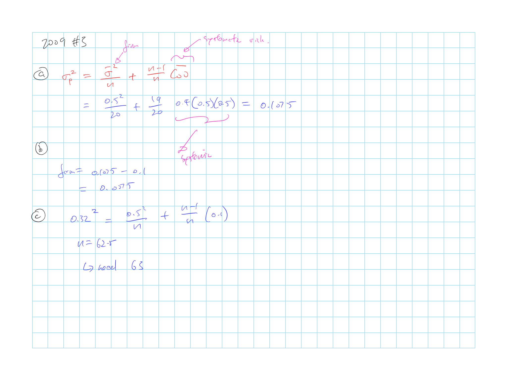

## Cliff's Summary

**Total Variance of a Portfolio of Equally Weighted Assets**

$\sigma^2_p = \underbrace{\overbrace{\dfrac{\bar{\sigma}^2}{n}}^{\lim \limits_{n \rightarrow \infty} \rightarrow 0}}_{\text{Firm Risk}} + \underbrace{\dfrac{n-1}{n}\bar{\operatorname{Cov}}}_{\text{Systematic Risk}}$

**For 2 risky asset**

$\operatorname{E}[r_p] = w_D \operatorname{E}[r_D] + w_E \operatorname{E}[r_E]$

$\sigma^2_p = w^2_D \cdot \sigma^2_D + w^2_E \cdot \sigma^2_E + 2 \cdot w_D \cdot w_E \cdot \operatorname{Cov}(r_D, r_E)$

Weights for the minimum variance portfolio

$w_D^{Min} = \dfrac{\sigma^2_E - \operatorname{Cov}(r_D, r_E)}{\sigma^2_E + \sigma^2_D - 2\cdot\operatorname{Cov}(r_D, r_E)}$

Know the shape of the [portfolio opportunity set](#ptf-op-set) for different $\rho$

**For 2 risky asset and risk free**

Optimal Risky Portfolio: Available portfolio with highest Sharpe ratio

Weights of the optimal risky portfolio:

$w_D = \dfrac{\operatorname{E}[R_D]\sigma^2_E - \operatorname{E}[R_E] \operatorname{Cov}(r_D, r_E)}{\operatorname{E}[R_D]\sigma^2_E + \operatorname{E}[R_E]\sigma^2_D - \left( \operatorname{E}[R_D] + \operatorname{E}[R_E] \right) \operatorname{Cov}(r_D, r_E)}$

* $R_D = r_D - r_f$ = XS return over risk free

***

Markowitz Portfolio

[Seperation principle](#sep-prin)

Asset allocation vs security allocation

Risk pooling (does not reduce risk) vs risk sharing

* Caveat of risk sharing

Time diversification is not true

### Types of Exam Questions

Haven't done TIA practice questions

**Plug and play**

* 2000, Q8: minimum variance expected return by calculating the weight

**Weights Calculation**

* [2003, Q5](#2003-5): Weights for risky and risk free and CAL
* 2005, Q5: optimal risky portfolio and special case with $\rho = -1 or 1$
* 2006, Q5: weight for assets in optimal risky
* 2007, Q2: optimal risky weights and complete portfolio weights
* $\star$ 2008, Q1: optimal risky and complete ptf and rebalance
* 2009, Q2: optimal risky portfolio and sharpe ratio
* 2014, Q5: optimal complete portfolio return and $\sigma_c$

**Concepts**

* 2001, Q10: Draw CML and efficient frontier
* 2002, Q7: Draw portfolio opportunity set for $\rho = -1$ and $\sigma$ when $\rho = 1$
* 2002, Q13: Fallacy of time diversification
* 2003, Q7: Efficient frontier
* 2004, Q4: seperation principle; draw CAL, eff frontier; indifference curve
* 2005, Q6: draw ptf opporunity set
* 2007, Q3: fallacy of time diversification
* 2013, Q3: risk sharing and pooling in insurance

**Other**

* $\star$ [2009, Q3](#2009-3): systematic risk, variance
* $\star$ [2015, Q1](#2015-1): $A$, $\rho$, and backout $A$

## Diversification and Portfolio Risk

2 categories of risk:

* **Market/ Systematic/ Nondiversifiable Risk**: Risk that can no be diversified away

* **Unique/ Firm-Specific/ Nonsystematic/ Diversifiable**: Portion of the risk that can be eliminated via diversification

**Total Variance of a Portfolio of Equally Weighted Assets**

$\sigma^2_p = \underbrace{\overbrace{\dfrac{\bar{\sigma}^2}{n}}^{\lim \limits_{n \rightarrow \infty} \rightarrow 0}}_{\text{Firm Risk}} + \underbrace{\dfrac{n-1}{n}\bar{\operatorname{Cov}}}_{\text{Systematic Risk}}$

* Systematic risk remains even as $n \rightarrow \infty$

* Formula assumes each of the $n$ securities have the same $\sigma$ and $\bar{\operatorname{Cov}}$ with each other

* For a diversified portfolio the contribution to portfolio risk  will only depends on the covariance of the security's return with other securities

## Portfolios of 2 Risky Assets

**Efficient Diversification**  
Weights of risky assets that would produce lowest risk level for the risky portfolio P

$\operatorname{E}[r_p] = w_D \operatorname{E}[r_D] + w_E \operatorname{E}[r_E]$

$\sigma^2_p = w^2_D \cdot \sigma^2_D + w^2_E \cdot \sigma^2_E + 2 \cdot w_D \cdot w_E \cdot \operatorname{Cov}(r_D, r_E)$

Adding assets with $\rho < 1$ will reduce $\sigma_p$ without necessarily reducing $\operatorname{E}[r_p]$

* $\rho_{DE} = \dfrac{\operatorname{Cov}(r_D, r_E)}{\sigma_D \sigma_E}$

* **Hedge asset** = asset that has a negative correlation with other assets in the portfolio

Relationship between the $w_E$ in the risky portfolio P and $\sigma_p$ with different $\rho$

**Minimum Variance Portfolio**  
Portfolio with the lowest variance that can be constructed from assets with a given level of correlation

Weights for the minimum variance portfolio

$w_D^{Min} = \dfrac{\sigma^2_E - \operatorname{Cov}(r_D, r_E)}{\sigma^2_E + \sigma^2_D - 2\cdot\operatorname{Cov}(r_D, r_E)}$

$w_E^{Min} = 1 - w_D^{Min}$

 **Portfolio Opportunity Set** for a given $\rho$

$\operatorname{E}[r_p]$ vs $\sigma_p$ with varying weights for a given $\rho$

For assets with $\rho = -1$ you can achieve $\sigma = 0$

For assets perfectly correlated the minimum variance is investing all in the asset with lower risk

## Portfolios of 2 Risky and a $r_f$ Assets

**Optimal Risky Portfolio**  
Available portfolio with **highest Sharpe ratio**

* Portfolio formed where the CAL is tangential to the portfolio opportunity set

* This only consist of risky assets, only use the CAL to identify the best weight of risky assets (weight between risky portfolio P and $r_f$ is determined later)

Minimum variance portfolio is *not* the optimal portfolio

* CAL with minimum variance portfolio does not yield the greatest Sharpe ratio

Weights of the optimal risky portfolio:

$w_D = \dfrac{\operatorname{E}[R_D]\sigma^2_E - \operatorname{E}[R_E] \operatorname{Cov}(r_D, r_E)}{\operatorname{E}[R_D]\sigma^2_E + \operatorname{E}[R_E]\sigma^2_D - \left( \operatorname{E}[R_D] + \operatorname{E}[R_E] \right) \operatorname{Cov}(r_D, r_E)}$

* $R_D = r_D - r_f$ = XS return over risk free

**Optimal Complete Portfolio**

Weights between $r_f$ and risky portfolio P depends on investors risk aversion $A$ as per BKM 6

## Markowitz Portfolio Selection Model

**Minimum-variance Frontier**  
Made up of dominant portfolios

* Portfolios with the lowest variance for each level of expected return

**Global Minimum-variance porfolio**  
Portfolio with the lowest variance

**Efficient Frontier**  
Portion of the minimum-variance frontier above the global minimum-variance portfolio

***

Expected return and variance of the optimal complete portfolio

$\operatorname{E}[r_p] = \sum_i w_i \operatorname{E}[r_i]$

$\sigma^2_p = \sum_i \sum_j w_i w_j \operatorname{Cov}(r_i, r_j)$

## Separation Principle

Optimal risky portfolio P is the same for all investors

Difference between investors is the portion of the complete portfolio in the risky portfolio vs risk free asset driven by investor's risk aversion $A$

2 steps in portfolio selection under **separation principle**:

1) Select optimal risky portfolio

    * This only differs depending on the analyst
    
    * CAL is the same for all investors

2) Select the optimal complete portfolio

    * Allocate between risk free vs risky assets depending on investors $A$
    
    * Investor's $A$ dictates where the optimal complete portfolio lies on the CAL

## Asset Allocation vs Security Selection

So far focused has been on *asset allocation*

* Allocation of a complete portfolio to the various asset categories

Step 1: Asset allocation

* Figure out how much to allocate to each asset class

Step 2: Security selection

* Select specific securities in order to try increase return

Procedure of optimal security selection is the same as the procedure of optimal asset allocation in the above sections

Since it's impossible to be expert in all securities from all asset class, after allocating money to the different asset classes, consult expert for the security selection in each class

## Risk Pooling vs Risk Sharing {.tabset}

### Risk Pooling

**Risk pooling** involves merging several uncorrelated projects together, aka the **insurance principle**

* Does not reduce risk (sharpe ratio and $\sigma$ both increase)

* Increases the total exposure to risk

* As investor increase the risk pooling to include $n$ assets, both the Sharpe ratio and $\sigma$ will increase by $n^{0.5}$ for asset with the same $R$ and $\sigma$ that is uncorrelated with each other

### Risk Sharing

**Risk sharing** involves taking a fixed amount of risk and sharing it among several investors

* Selling shares of an risky portfolio so that total investment remains constant

* Increase Sharpe ratio and reduce total risk

Practical perspective:

* Reduce risk by selling share of the insurer to investors

* Assuming that the total risk per investor remains constant, Sharpe ratio will increase as the # of policies written increases

Caveat: 

* Disadvantages of managing a very large firm and will put pressure on the profit margin

* Impact of any error when estimating the risk of the insured will be compounded over many policies

## Investment for the Long Run

**Time diversification** is not true and does not reduce risk

* Volatility of the *average* annual return do go down, but

* Volability of the dollar return increase with the time

* Extending investment horizon for an additional period is similar to adding additional risky asset

* Similar to risk pooling

* To increase Sharpe ratio while maintaining the same level of risk, investor needs to half the investment if double the time horizon

## Past Exam Questions

 2003, Q5

 2009, Q3

 2015, Q1

