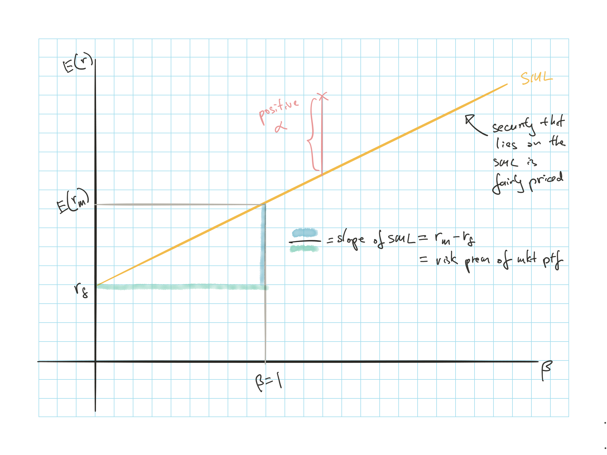

## Introduction

**CAPM**

Shows the relationship between risk and expected return in equilibrium

Assumes:

* All investors optimized portfolio using Markowitz procedure $\Rightarrow$ Construct efficient frontier based on all available risky assets $\Rightarrow$ Identify efficient risky portfolio P

* Investors face an identical investable universe and same input list to construct efficient frontier $\Rightarrow$ Same weights for each risky asset

* Since market portfolio is based on the same risky portfolios, it will have the same weights $\Rightarrow$ Investor will hold the market portfolio $\Rightarrow$ CAL = CML

**Mutual fund theorm**: All investors hold a common risky portfolio, they would have no problem if all the stock in the market were replaced with shares of a single mutual fund holding the market portfolio

Key implications:

* Market portfolio is efficient

* Premium on a risky asset is $\propto$ its $\beta$

## CAPM Assumptions

**Individual Behavior Assumptions**

* Investors are rational mean-variance optimizers

    * Not concerned about correlation of asset return with inflation/ prices of consumption items
    
* Single period planning horizon (can alter later)

    * Longer periods would result in extra-market risk factors
    
    * e.g. $\Delta$ interest rates $\downarrow$ income $\Rightarrow$ Assets that can hedge this will be priced higher
    
* Identical input list

    * Implies that all information are public
    
* There are many investors and they are all price takers

    * Transactions have no impact on the price
    
* Investors have homogeneous expectations

    * Everyone's analysis come to the same conclusion
    
**Market Structure Assumptions**

* All assets are publicly traded (can alter later) and short positions are allowed

    * Assets have to be tradable for investors to be able to derive identical input list

* Can borrow/lend at a common risk free rate (can alter later)

    * Necessary for investors to derive the same tangency portfolio
    
* All information is publicly available

* No taxes

    * Different tax rate $\Rightarrow$ Different after tax rates on the same stock $\Rightarrow$ Investor could derive different after tax optimal risky portfolio
    
* No transaction costs

### Assumptions Testing

**Model Testing**

* Normative: test model assumptions

* Positive: examines the predictions

Impossible to create a model consistent with the complexity of markets $\Rightarrow$ CAPM is a simplification of reality

$\hookrightarrow$ Ideally assumptions will be robust (outcome not highly sensitive to the violation of the assumptions)

### Derivation of CAPM

Proved:

* Contribution of an individual stock to the portfolio risk premium is $w_i[\operatorname{E}[r_i]-r_f]$

* Contribution of an individual stock the portfolio variance is $w_i \operatorname{Cov}(r_i, r_M)$

**Reward-to-risk ratio** based on above:

$\dfrac{\text{Contribution to Risk Premium}}{\text{Contribution to Variance}} = \dfrac{w_i[\operatorname{E}[r_i]-r_f]}{w_i \operatorname{Cov}(r_i, r_M)} = \dfrac{[\operatorname{E}[r_i]-r_f]}{\operatorname{Cov}(r_i, r_M)}$

Reward-to-risk ratio for *market portfolio* is the **market price of risk**:

$\dfrac{[\operatorname{E}[r_M]-r_f]}{\sigma^2_M}$

In equilibrium all securities should have the same reward-to-risk ratio $\Rightarrow$ reward-to-risk ratio for individual stock = market price of risk:

$\begin{array}{ccc}
  \dfrac{[\operatorname{E}[r_i]-r_f]}{\operatorname{Cov}(r_i, r_M)} &= \dfrac{[\operatorname{E}[r_M]-r_f]}{\sigma^2_M} \\
  \operatorname{E}[r_i] &= r_f + \beta_i [\operatorname{E}[r_M] - r_f] &\text{where } \beta_i = \dfrac{\operatorname{Cov}(r_i, r_M)}{\sigma^2_M} \\
\end{array}$

### Security Market Line

$\beta$ measures the risk of the security

**Security Market Lines**  
Graphs relationship between $\beta$ and $\operatorname{E}[r]$ of a stock

**SML vs CML**

* CML: Risk premium of *efficient Portfolios* vs $\sigma$

    * $\sigma$ is the appropriate risk measure for portfolios
  
* SML: Risk premium of *individual asseets* vs $\beta$

    * $\beta$ is the appropriate risk measure for individual securities held as part of a well diversified portfolio
    
### Testing CAPM

Impossible to construct market portfolio, so test the SML equation instead $\operatorname{E}[R_i] = \beta_i R_M$

Regression on the XS returns of a sample of stocks against their betas over time

$R_{i,t} = \lambda_0 + \lambda_1 \beta_i + \lambda_2 \sigma^2(e_i) + \eta_{i,t}$

CAPM predicts:

* $\lambda_0 = 0$ as the average $\alpha = 0$

* $\lambda_1 = R_M$ as the slope of SML = market risk premium

* $\lambda_2 = 0$ as the risk premium is only based on proportion of market risk premium

Estimate the $\beta$ and residual variance for each stock from time series of stock return

**Caveat**

* Parameter estimates have large errors and may be correlated $\Rightarrow$ Downward bias in $\lambda_1$ and upward bias on $\lambda_0$

* Might reject CAPM even if it is valid

    * Returns simulated following CAPM but regression still indicates that CAPM does not hold
    
* Parameters are time varying but the regression techniques does not recognize this

## CAPM Extensions

Problematic assumptions:

* No restrictions on short sales, but in reality it can be difficult to take short positions

* All assets are tradable

* No transaction costs

* Single period horizon

However the extensions of CAPM are not perfect so none have superseded CAPM so far

### Zero Beta CAPM

When investors face borrowing restrictions of risk free asset

$\operatorname{E}[r_i] = \operatorname{E}[r_Z] + \beta_i \left[\operatorname{E}[r_M] - \operatorname{E}[r_Z]\right]$

* $Z$ =  zero-beta portfolio for M

* Uncorrelated portfolio on the inefficient side of the minimum-variance frontier

Investors with borrowing restrictions will invest more in high $\beta$ stocks and less in low $\beta$ $\Rightarrow$ $\uparrow$ price of high $\beta$ stocks

* $SML_{zb} < SML_{reg}$

* Risk premium on the market portfolio is smaller as the $\operatorname{E}[r_Z] > r_f$ so less reward for bearing risk

### Non-Traded Assets

Some assets are tradable e.g. human capital and privately held business

* These are of significant values and can have a material impact on the equilibrium returns of traded securities

**Privately held business**

* Privately held business w/ similar characteristics to traded assets:  
Little impact to CAPM as owners can still achieve diversification by reducing their portfolio of other similar traded assets $\Rightarrow$ Still holding market portfolio

* Privately held business w/o similar characteristics to traded assets:  
Portfolio of traded assets that hedge the private business will be up $Rightarrow$ $\downarrow$ expected return $\Rightarrow$ $-\alpha$ in traditional CAPM

**Human Capital**

* Only way to hedge is for employees to avoid purchasing share of their own employer $\Rightarrow$ labor intensive firms will have lower demand $\Rightarrow$ $+\alpha$ in traditional CAPM

* Adjusted CAPM for labor income:

    * $\operatorname{E}[R_i] = \operatorname{E}[R_M] \dfrac{\operatorname{Cov}(R_i, R_M) + \frac{P_H}{P_M}\operatorname{Cov}(R_i, R_H)}{\sigma^2_M + \frac{P_H}{P_M}\operatorname{Cov}(R_M,R_H)}$
    
    * $P_H$: value of aggregate human capital
    
    * $P_M$: market value of traded assets
    
* Adjustment produce lower $\beta$ so a SML with a less steep slope, which explain negative alpha of high beta securities indicated by some tests

### Multiperiod CAPM

**Intertemporal CAPM**

Assume investors will optimize their consumption/ investment over their lifetime

ICAPM = CAPM when:

* Only type of risk is the uncertainty about portfolio returns

* Investment opportunities are constant over time

However, over the long run we expect additional sources of risk to arise and **hedge portfolios** will be bid up

1) Changes in the parameters that describe investment opportunities

    * Investors will bid up prices of assets that have higher return during periods of adverse economic environment $\Rightarrow$ lower expected return
    
2) Changes in the prices of consumption goods

    * Investors will bid up prices of assets that hedge the increases in prices of consumption goods (inflation protection)
    
ICAPM with $K$ sources of extramarket risk and $K$ hedge portfolios:

$\operatorname{E}[R_i] = \beta_{iM}\operatorname[R_M] + \sum_k \beta_{ik}\operatorname[R_k]$

* $\beta_{ik}$ is the $\beta$ on the $k$^th^ hedge portfolio

### Consumption Based CAPM

Assume that in a period, investors need to allocate the current wealth between consumption today and savings/ investments to support future consumption

Optimal mix: utility from an additional dollar of consumption today = utility associated with the future consumption generated from the investment of that dollar

* Additional income from savings are more valued during tough economic times (w/ limited consumption opportunities) $\Rightarrow$ Assets with (+) covariance with consumption growth (higher payoff when consumption is already high) are viewed as riskier $\Rightarrow$ Risk premium higher

CCAPM:

$\operatorname{E}[R_i] = \beta_{iC}RP_C$

* $C$ is a consumption tracking portfolio, one with the highest correlation with consumption growth

* $\beta$ of market portfolio can be > 1

Disadvantages: consumption growth figures are published infrequently and with significant error

### Liquidity Adjusted CAPM

Security prices should be discounted to reflect illiquidity

* Standard CAPM ignores liquidity costs like bid-ask spread

* Discount $\uparrow$ as trading cost $\uparrow$ but *not* proportional to the increase due to **clientele effect**

    * Frequent traders hold more liquid assets and long term traders hold less liquid assets
    
Investor also demand additional return on liquidity risk (risk of unanticipated changes in liquidity)

* Can be adjusted with liquidity $\beta$ that reflects the sensitivity of the return of the security to changes in market liquidity