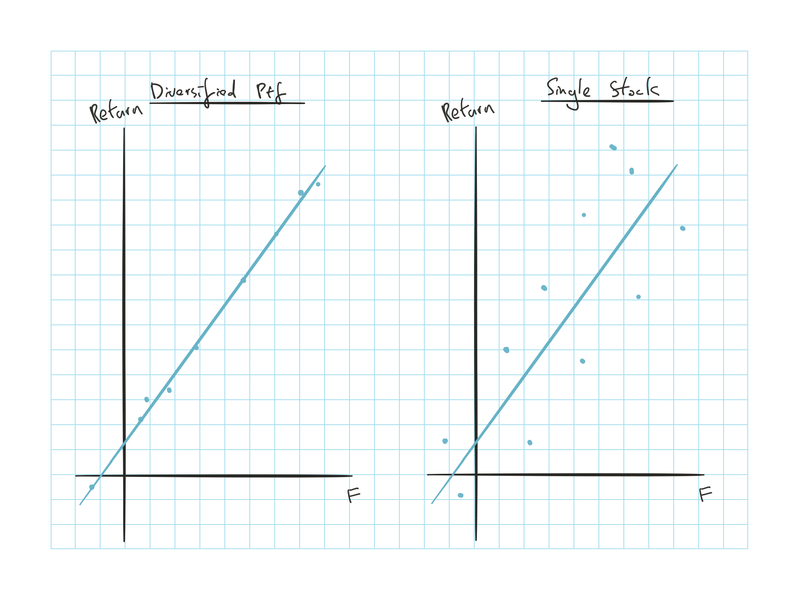
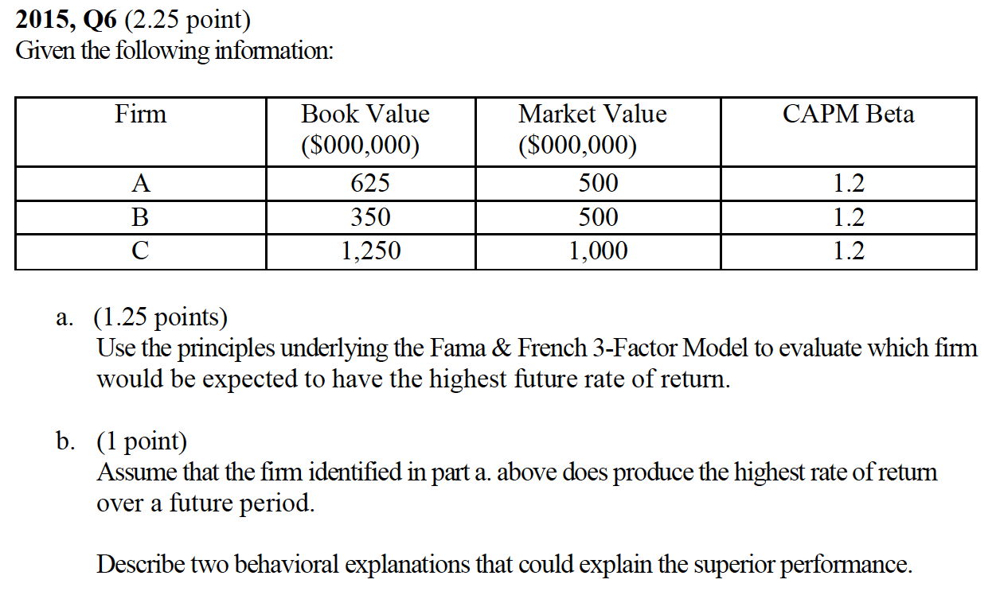

## Cliff's Summary

Factor model (single, multi)

* Multifactor SML (how is this derived?)

[Fama French Three Factor](#famma)

* Small minus big stocks
* High minus low book:market ratio
* Market index
* The formula adds the $\alpha$ instead of $r_f$ like CAPM

**Arbitrage**:  
Opportunity to earn 1) risk-less profit 2) without need to make a net investment

**Law of one price**:  
Two assets with equivalent economical aspects should have the same market price

**APT Assumptions**:

1) Security returns can be described by a factor model

2) There are a sufficient number of securities to diversify away idiosyncratic risk

3) Well functioning securities markets do not allow for persistence of arbitrage opportunities

2 ways to reach [equilibrium](#equil)

Know how to execute an arbitrage opportunity

[APT vs CAPM](#APT-v-CAPM)

[Treynor Black Model](#TB) for optimal risky if arbritrage is identified so not to be over exposed to residual risk

### Types of Exam Questions

Haven't done TIA practice questions

**Concepts**

* 2006, Q9: Famma French additional factors
* $\star$ 2011, Q2: arbitrage equilibirum; risk return dominance
* $\star$ [2015, Q6](#2015-6): FF model and behavioral

**Arbitrage opportunity**

* 2000, Q13: structure an arbitrage opportunity
* 2003, Q13 b: structure arbitrage

**Factor Model**

* 2001, Q32: expected XS return and weighted $\beta$
* 2003, Q13 a: expected return
* 2004, Q9: arithmetic to back out factors from 2 equations
* 2006, Q7: factor model arithmetic
* 2008, Q4: factor model arithmetic
* 2009, Q4: factor model arithmetic

## Factor Models

Similar to the index model but focus on individual risks rather than using market as proxy

* Index model implicitly assumes that the security has the same relative sensitivity to each risk factor that is represented by $M$

### Single Factor Model

Recall from BKM8, return based on a single factor $F$:

$r_i = \operatorname{E}[r_i] + \beta_i F + e_i$

* $F$: deviation of a factor from is expected value

* $\beta_i$ sensitivity of the security return to the factor

### Multifactor Model

Add additional factors to account for varying sensitivities to different factors

$r_i = \operatorname{E}[r_i] + \sum \limits_{j=1}^n \beta_{ij} F_j + e_i$

Impact of actual return = $\beta_i F$ where $F$ is the actual - expected

#### Multifactor SML

Calculate the risk premiums for the risk factors with a **factor portfolio**

* Portfolio that have $\beta = 1$ for which the risk premium is being measured, else $\beta = 0$

$\operatorname{E}[r_i] = r_f + \sum \limits_{j=1}^n \beta_{ij} \left( \operatorname{E}[r_j] -r_f \right)$ Where is this from?

### Fama French Three Factor Model

Uses firm characteristics that seem to be proxy for exposure to systematic risk

$R_{it} = \alpha_i + \beta_{iM}R_{Mt} + \beta_{iSMB}SMB_t + \beta_{iHML}HML_t + e_{it}$

* $SMB$ = return of a portfolio of small stocks in XS of portfolio of large stocks

* $HML$ = return of a portfolio of high $\frac{\text{book}}{\text{market}}$ in XS of portfolio of low $\frac{\text{book}}{\text{market}}$ stocks

* Include market index as well to include systematic risk from macroeconomic factors

The 2 additional factors maybe acting as proxies for something fundamental

* Measure some of the systematic risk not captured by only using the market portfolio

* F-F not necessarily thought small firms or high B:M had better returns

**Problem with FF model**: It is derived from empirical evidence, and none of the factors can be identified as hedging a specific source of uncertainty

* Pattern might be purely due to chance

## Arbitrage Pricing Theory

**Arbitrage**:  
Opportunity to earn 1) risk-less profit 2) without need to make a net investment

**Law of one price**:  
Two assets with equivalent economical aspects should have the same market price

**APT Assumptions**:

1) Security returns can be described by a factor model

2) There are a sufficient number of securities to diversify away idiosyncratic risk

3) Well functioning securities markets do not allow for persistence of arbitrage opportunities

### Equilibrium

Market prices change to eliminate arbitrage opportunities and reach equilibrium when the opportunity disappears

**Risk return dominance**  
Many investors will make limited changes to their portfolio (depending on risk aversion) and the cumulative changes from sufficient volumes move the market price

**Arbitrage**  
Investor who discovers the arbitrage will maximize his position to maximize profits so lower number of investors are needed to move prices back to equilibrium

### Impact of Diversification

Return of portfolio with $n$ stocks using single factor model
$r_p = \operatorname{E}[r_p] + \beta_p F + e_p$

$\sigma^2(e_p) = \dfrac{\sigma^2(e_i)}{n}$ $\Rightarrow$ $\underbrace{\lim \limits_{n \rightarrow \infty} \sigma^2(e_p) = 0}_{\text{diversification}}$

$\hookrightarrow$ After diversification $r_p = \operatorname{E}[r_p] + \beta_p F$ as the non factor risk can be diversified away and security will only receive risk premium for the factor risk

### Executing Arbitrage

Given 2 well diversified portfolio $M$ and $P$ that has (+) $\alpha$

Construct $Z$ a zero beta portfolio with $M$ and $P$

$\beta_Z = w_p \beta_p + (1-w_p)\beta_M = 0$ $\Rightarrow$ $w_p = \dfrac{1}{1-\beta_p}$

$\hookrightarrow$ $Z$ is riskless since no residual risk from diversification and 0 systematic risk from $\beta$

$\operatorname{E}[R_z] = \alpha_Z = w_p \alpha_p = \dfrac{\alpha_p}{1 - \beta_p}$

* If $\beta_p < 1$, borrow money and invest in $Z$ to make a risk free profit

* If $\beta_p > 1$, short $Z$ and invest in risk free

### No-Arbitrage Equation

Return of well diversified portfolio with APT $\operatorname{E}[R_p] = \alpha_p + \beta_p \operatorname{E}[R_M]$

$\Downarrow$ No arbitrage, $\alpha = 0$

APT SML: $\operatorname{E}[R_p] = \beta_p \operatorname{E}[R_M]$

* Same as CAPM SML

For APT, there can not be 2 parallel APT SML as that would mean one to be dominant over the other and investor can produce arbitrage opportunity

### APT vs CAPM

Disadvantages:

* Based on diversified portfolio $\Rightarrow$ 0 residual risk

* If residual risk is sufficiently high, cannot have full confidence in APT

Advantages:

* Does not reply on mean-variance optimizers assumption

* Does not require an all inclusive portfolio

### Optimization in a Single Index Market

APT indicates how to generate infinite profit if risk premium of well diversified portfolio differs from the SML

* If arbitrage portfolio not perfectly well diversified, increasing the size of an investment to take advantage of an arbitrage opportunity will also increase the risk of the arbitrage position

 **Treynor-Black Model**

To construct an optimal risky portfolio based on identified underpriced asset or portfolio under a single factor market

* Model produces an optimal risky portfolio if there is residual risk

* More flexible that APT in reflecting residual risk that may exist

## Past Exam Questions

 2015, Q6

a. Ignore $\beta$ since it's the same; A because highest B:M value and lower MV

b.

* Small firm ignored by large investors due to regret avoidance, require higher return due to less information and unconventional choice
* Forecast error, more weight in recent performance of glamour firm
* Smaple size neglect, tend to infer too quickly and extrapolate price of low B:V too high