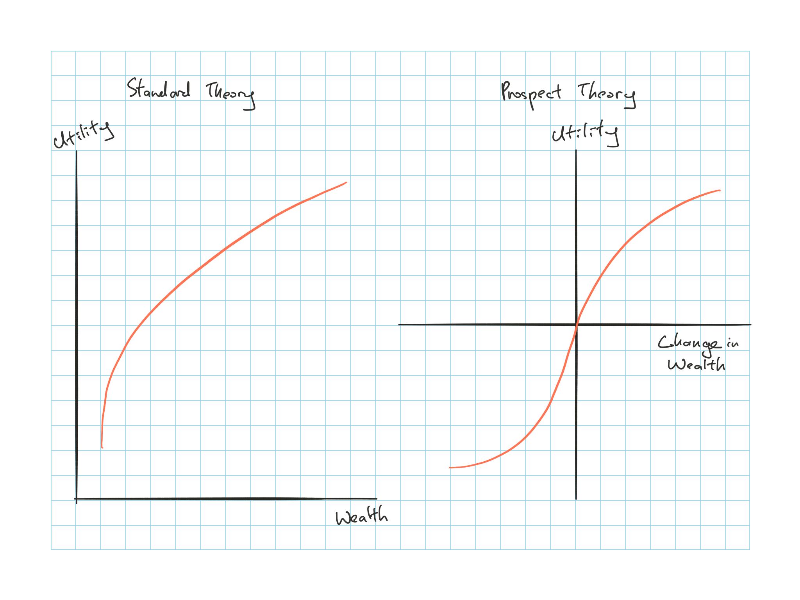

## Cliff's Summary

Important to know the incorrect [information processing](#info-process) and [behavior bias](#bias)

The [limits](#limits-to-a) to arbitrage: mispricing doesn't disappear, implementation cost and model risk

* Examples on the violation of law of 1 price

[Critique](#bad-behav) behavioral finance

How technical anlaysis can work

* Trends indications and market sentiments indicators

### Types of Exam Questions

**Concepts**

* 2007, Q7: information processing error and market anomaly associated
* 2008, Q6: Law of 1 price and violation examples
* 2013, Q5: anomaly based on example shown; and associated information process error; what efficient market would look like

## Critique of Financial Theory

Account for irrationalities in decision making

* **Incorrect information processing** $\Rightarrow$ Incorrect probability distributions

* Inconsistent/ suboptimal decisions due to **behavioral biases** even if the probability distribution generated was correct

### Information Processing

**Forecasting Errors**:

* Too much weight assigned to recent experience
* Forecasts are too extreme given the actual level of uncertainty

**Overconfidence**: Overestimate their abilities and think they can outperform market and trade too much

* Lead to the prevalence of active investment

**Conservatism**: Too slow to update their beliefs in response to new evidence

* Lead to post earnings announcement drift

**Sample Size Neglect & Representativeness**: Infer a pattern based on too small a sample

* Lead to stocks that have best recent performance tend to show reversals in a few days due to investor adjusting their initial beliefs

### Behavioral Biases

**Framing**: Decisions are often materially impacted by how the question is framed

* E.g. preference of discount over surcharge, more risk adverse with gain and risk seeking with loss

**Mental Accounting**: Segregate decisions

* E.g. Segment their investment portfolios into pieces which go towards different goals and they will have different risk attitudes to each piece

**Regret Avoidance**: Unconventional decisions that turned out to be wrong will have more regret

**Affect**: Good or bad feeling investors may associate with investing in a stock

* E.g. Socially responsible firms may generate higher affect $\Rightarrow$ Drive up the prices as investors prefer them $\Rightarrow$ Lower risk adjusted returns

**Prospect Theory**: 

Modifies the standard definition of risk averse investors

Utility depends on changes in wealth instead of level of wealth

There is diminishing return of utility as wealth increases but in addition it shows that investors become risk seeing as they begin to lose money

## Limits to Arbitrage

Actions for arbitrageurs are limits $\Rightarrow$ Price irrationalities can continue

**Fundamental Risk**: Mispricing are not necessarily going to disappear, so it's not actually risk free

**Implementation Costs**: There are limitations to short selling e.g. short notice to return the security and some investors are not permitted to short sell

**Model Risk**: Fault in the arbitrageur's model that falsely indicate a mispricing

## Violations of the Law of One Price {.tabset}

Examples where the law of one price has been violated

### Siamese Twin Companies

When Shell and Royal Dutch Petroleum merged, the profits are set to split 40/60

$\hookrightarrow$ Royal Dutch shares should be 150% of Shells but the price relativity deviated from the 150% level for extended period

* Arbitrageurs who tried to profit may have lost money as there were periods of time where the deviations actually grew in size

### Equity Carve-outs

When 3Com spun off Palm, each 3Com shareholder gets 1.5 shares of Palm

3Com shares should be traded for at least 1.5x of Palm but Palm was traded for more

Arbitrageurs were not able to exploit this by short selling Palm as not enough shares were available for short selling

### Closed-End Funds

They typically trade at discount or premium of net asset value

Not a true violation as the fund incurs expenses which will reduce the share prices

$\dfrac{\text{Premium}}{\text{Net Asset Value}} = \dfrac{\text{Price} - \text{NAV}}{\text{NAV}} = \dfrac{\alpha - \varepsilon}{\delta + \varepsilon - \alpha}$

* $\delta$ = Dividend yield; $\varepsilon$ = Expense ratio

* Fund will sell at a premium is $\alpha > \varepsilon$

## Critique of Behavioral Finance

**Unstructured**: Allows virtually any anomaly to be explained by a combination of irrationalities

* Critics would have more faith in behavioral finance if it provides a single behavioral characteristic that explains a range of anomalies

**Inconsistent**: Some anomalies are inconsistent in their support for one irrationality vs another

**Benchmark**: Picking the wrong benchmark can produce an apparent abnormality

## Technical Analysis

Behavioral Finance suggest that technical analysis will be successful in many cases due to irrationalities in decision making from investors

**Disposition effect** where investors hold on to losing investments because they are reluctant to realize losses $\Rightarrow$ Slow down the adjustment of the share price to the appropriate value

**Overconfidence** investors trade more $\Rightarrow$ Relationships between trading volume and market returns

* Technical analyst uses volume data to capture this

**Irrational factors** can disturb market fundamentals and technical analysis can exploit the corrections

### Trends & Corrections

Technical analysis has to do with uncovering trends

**Moving Averages**

Average stock price over an interval

* Falling stocks' moving average > current price

* If market breaks through the moving average line from below = bullish signal as it's a sign of a shift from falling trend to rising trend

* **Elliott wave theory** Decomposes the actual movements into long term and short term wave cycles, buy when the long term direction is positive

**Relative Strength**

Measures how the stock has performed relative to the industry or market

* Ratio of the stock price vs market index

**Breadth**

Measures how widely the movement in the market index is reflected in the price movements of all stocks

* e.g. measure the spread between the # of stocks that advance and decline, as # of advances > # of declines by a wider margin the market is viewed as being stronger

### Sentiment Indicators

Methods to measure market sentiment

**Trin Statistics**

Market advances are considered to be stronger when they are accompanied by stronger trading volumes

$\text{Trin} = \dfrac{\text{Vol. Declining}/\text{# Declining}}{\text{Vol. Advancing}/\text{# Advancing}}$

* Ratio > 1.0 are bearish

**Confidence Index**

Based on bond market data assuming actions of bond traders reveal trends that will later follow in the stock market

$\text{Confidence Index} = \dfrac{\text{Avg yield on top 10 rated corporate bonds}}{\text{Avg yield on intermediate 10 rated corporate bonds}}$

* Approaches 100% when traders are optimistic as they'll require smaller default premiums

**Put/ Call Ratio**

$\dfrac{\text{o/s put options}}{\text{o/s call options}}$

* Increase in the ratio is a bearish sign as put options profit from falling markets

## Past Exam Questions

n/a