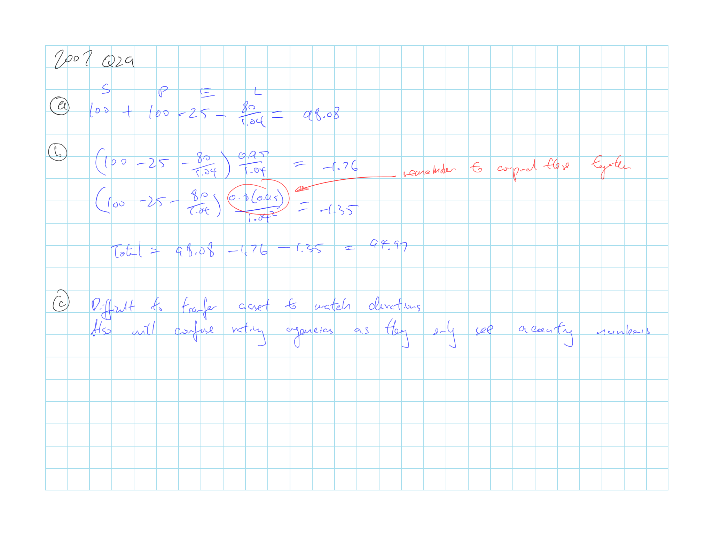
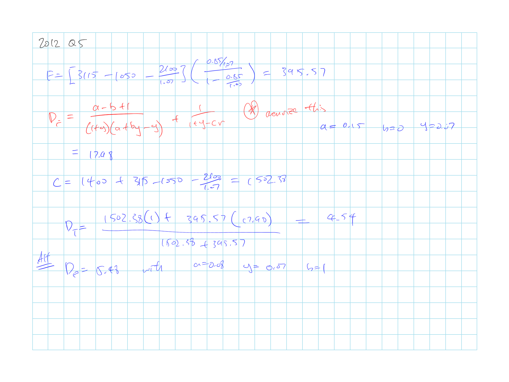

## Cliff's Summary

Memorize formulas is key here espeically the interest rate sensitive formula for the duration

Franchise value

**Net Income** = $P - L - E + (S + P - E) \times y$

$P = \dfrac{S(k-y)+L}{1+y} + E$

* Premium based on target dollar return ($kS =$ Net Income)

**Current economic value**

$\underbrace{C}_{MVS} = \underbrace{S + P - E}_{MV_A} - \underbrace{\dfrac{L}{1+y}}_{MV_L}$

* $D_C = \dfrac{(S+P-E)D_A - \frac{L}{1+y}D_L}{C}$

**Franchise Value**

$\begin{array}{ccc}
  F &= \left[ P - E - \dfrac{L}{1+y} \right] &\dfrac{d}{1-d} \\
  &= \left[ P - E - \dfrac{L}{1+y} \right] &\sum \limits_{k=1}^{\infty} \left[ \dfrac{cr}{1+y} \right]^k \\
\end{array}$

* $d = \dfrac{cr}{1+y}$ = discounted retention

$F = \dfrac{cr \cdot S[a + y (b-1)]}{(1+y)(1+y-cr)}$

$D_F = \dfrac{a - b + 1}{(1+y)(a + by - y)} + \dfrac{1}{1 + y - cr}$

$D_{total} = \dfrac{D_C \cdot C + D_F \cdot F}{C +F}$

Managing interest rate risk by varying $k$ based on $y$

* [Difficulties](#difficul) in managing interest rate risk the traditional way
* [pros and cons](#pro-cons)

### Types of Exam Questions

Haven't done TIA practice questions

**Concepts**

* 2009, Q25: Shortcomings of ALMathing (Does not reflect franchise value; matching durating may confuse regulators; better to use pricing strategy)
* 2010, Q24 b c: What traditional ALM ignores (franchise value, value of future renewals); method to reduce duration of total economic value

**Calculation**

* [2007, Q29](#2007-29): Total value of firm and dilemma in managing duration using traditional method
* 2010, Q24 a: Total economic value with formula
* $\star$ [2012, Q5](#2012-5): Duration reduction with pricing strategy
    * Memorize the formula
* 2013, Q9: Total econ value straight forward calc
* 2014, Q10: Franchise and duration and pricing strategy
    * Need to memorize the franchise value formula

## Introduction

Asset liability management measure impact on $\Delta$ interest rates on the economic value of a firm, but typically does not account for the franchise value

**Franchise value**:  
Economic value of the profits that will be earned in the future years from the future renewals of the current policies

* Franchise value can make up a large portion of the total economic value

* Value is reflected in stock price

* Based on the PV of future $CF_t$ to the firm $\Rightarrow$ Exposed to interest rate risk

* Invisible to senior executives $\Rightarrow$ Unmanaged

## Calculation of Franchise Value

**Net Income** = $P - L - E + (S + P - E) \times y$

Assumes **premium** based on target dollar return ($kS =$ Net Income)

$P = \dfrac{S(k-y)+L}{1+y} + E$

* $S(k-y)$ is the additional required return on top of the investment income

**Current economic value**

$\underbrace{C}_{MVS} = \underbrace{S + P - E}_{MV_A} - \underbrace{\dfrac{L}{1+y}}_{MV_L}$

* $D_C = \dfrac{(S+P-E)D_A - \frac{L}{1+y}D_L}{C}$

**Franchise Value**

$\begin{array}{ccc}
  F &= \left[ P - E - \dfrac{L}{1+y} \right] &\dfrac{d}{1-d} \\
  &= \left[ P - E - \dfrac{L}{1+y} \right] &\sum \limits_{k=1}^{\infty} \left[ \dfrac{cr}{1+y} \right]^k \\
\end{array}$

* $d = \dfrac{cr}{1+y}$ = discounted retention

Total Economic Value = Current Economic Value + Franchise Value = Total Market Value

**Assumptions**

All business are written @ 1/1 for each year

Pays all expenses @ 1/1 each year

Know the true value of losses and pays all losses @ 12/31 each year

Expenses and $\operatorname{E}[Loss]$ are the same each year

Surplus is the same each year $\Rightarrow$ Profits are distributed, losses will be cover by additional equity

All calculations occur @ 1/1 just before the insurer writes its new business for the year

No taxes

**Definitions**

$P$ = Premium

$E$ = Expenses

$L$ = Loss & LAE

$y$ = $r_f$

$S$ = Surplus

$k$ = Target RoS

$cr$ = Client retention

$F$ = Franchise value

$C$ = Current economic value: PV of the surplus & business already written

### Interest Rate Sensitivity

**Assumption**

1) Premium is based on target return $k$

2) $k = a + b \cdot y$

    * $k$ is a function of the interest rate $y$

    * $y$ = spot rate corresponding to the firm's liabilities
    
    * A fixed $k$ means $b=0$ and $k = a$

$F = \dfrac{cr \cdot S[a + y (b-1)]}{(1+y)(1+y-cr)}$

* Formula only works when $P$ is set based on the formula in the earlier section

$D_F = \dfrac{a - b + 1}{(1+y)(a + by - y)} + \dfrac{1}{1 + y - cr}$

Weight the duration of the components of $F$ will also yield the duration

Duration of $P > L, E$ because premium is sensitive to interest rates $\Rightarrow$ Interest rate $\uparrow$ Premium size $\downarrow$

### Managing Interest Rate Risk

$D_{total} = \dfrac{D_C \cdot C + D_F \cdot F}{C +F}$ Check

Reducing the duration of invested assets does not work well as the $D_F$ is a big driver

* Difficult to manage interest rate risk when franchise value is large

* Reducing the duration of invested assets may puzzle regulatory authorities and rating agencies as they only see the accounting numbers $\Rightarrow$ Does not account for the franchise value when analyzing the actions of the firm

**Pricing strategy**:  
Reduce the sensitivity of the franchise value to interest rates

e.g. set $b \neq 0$ for $k = a + b \cdot y$

This is the ideal method to manage duration

* Find parameters $a$ and $b$ such that RoS and duration are both acceptable

**Advantages**: avoid rating agency and regulatory risk that are associated with managing the duration of the invested assets

**Disadvantages**: Desired combination of target RoS and target duration can be maintained only for small interest rate $\Delta$

## Past Exam Questions

 2007, Q29

 2012, Q5

