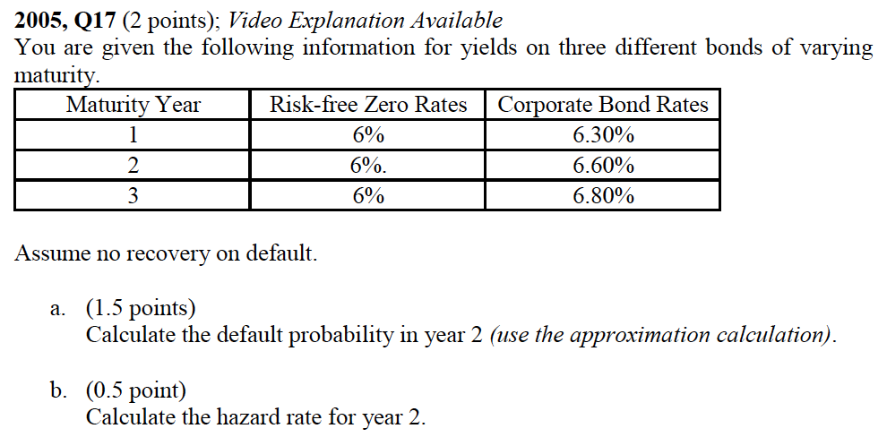
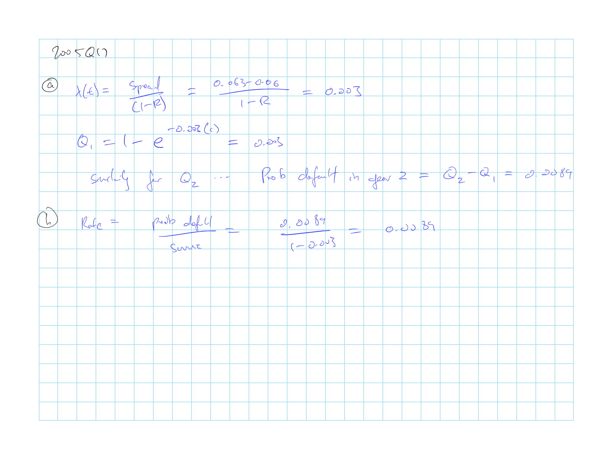
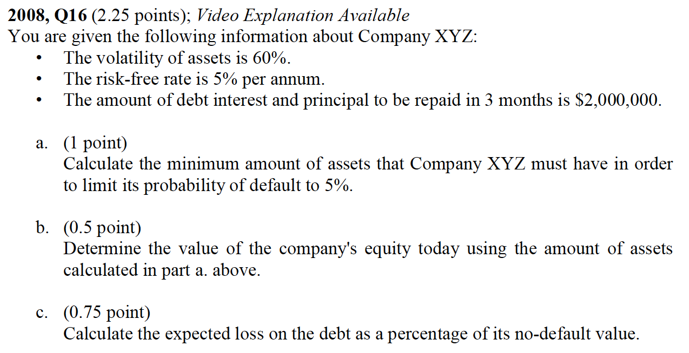
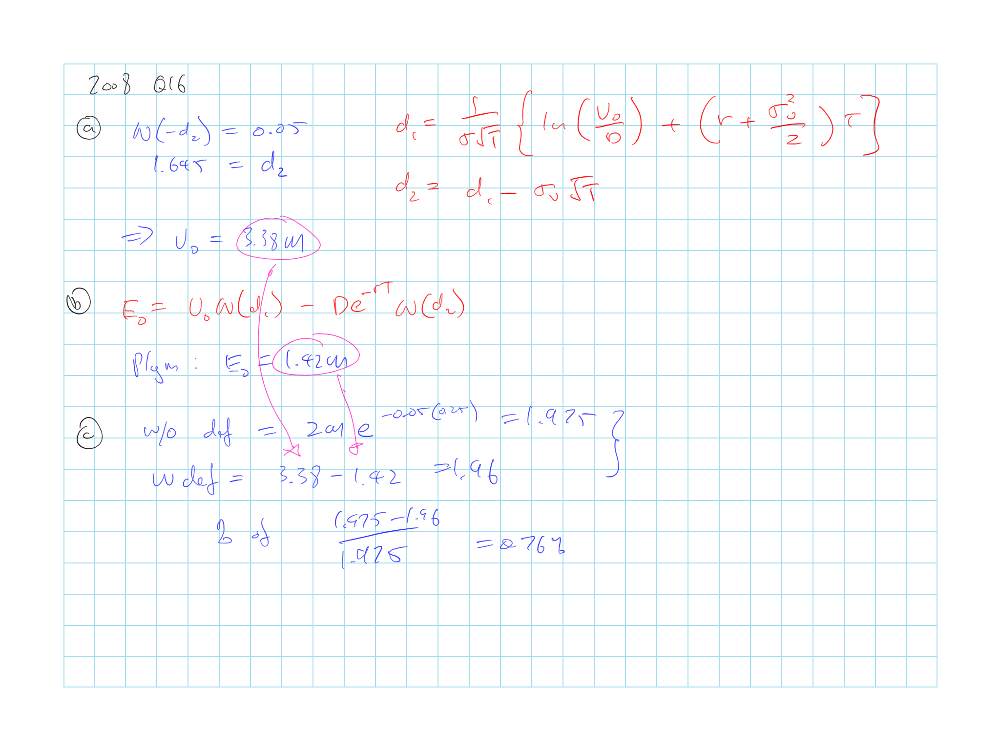
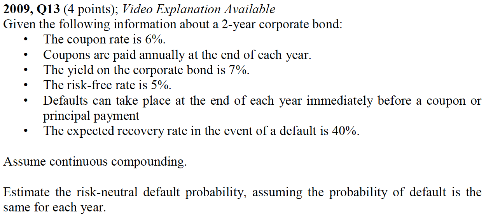
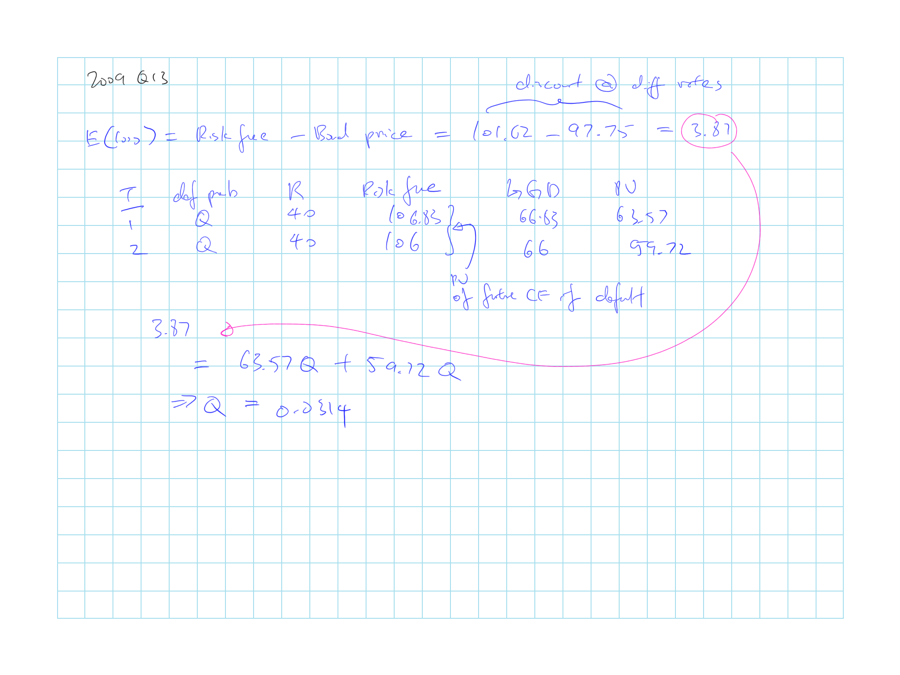

## Cliff's Summary

Unconditional default probabilities: $Q(t) = 1 - \operatorname{exp} \left\{ - \bar{\lambda} (t) \cdot t \right\}$

* $Pr(\text{Default})$ by $t$ given survival @ $T=0$

Estimate probability of default from bond price

* $\bar{\lambda}(t) = \dfrac{s}{1-R}$
* More [accurate method](#bond-default-method)
* Or use [asset swaps](#ass-swap)

Risk-neutral vs real world default probabilities and [reason](#rn-vs-rw) for difference

* Know when to use which one

Estimate probability of default from equity price

* [Black scholes](#BS); memorize formula
* Default [calculation](#BS-def-calc) procedure

Credit risk of derivatives

$f_0^* = f_0 e^{-(y^* - y)T}$

* $y^*$: Yield of ZCB issued by the counterparty

* $y$: Yield of similar risk free ZCB

* Know the underlying assumptions

Credit risk mitigation [methods](#CR-mit)

* Netting
* Collateralization
* Downgrade triggers

Correlation

* Reduced form models [pros and cons](#reduce)
* Structural model [pros and cons](#struct)
    * Gaussian copula
    
[Credit VaR](#c-var)

Credit metrics with transition matrix can account for impact of downgrade and incorporate mitigation clauses

### Types of Exam Questions

Haven't done TIA practice questions

**Default Probability**

* [2005, Q17](#2005-17): Default probability and intensity calc 
* 2006, Q15: default intensity given cumulative table
* 2007, Q13: Prob default, intensity given cumulative table
* 2008, Q14: probably of default using simple method and hazard rate
* $\star$ [2009, Q13](#2009-13): Long default calc
* $\star$ 2010, Q10: Long default calc, see change in default intensity
* $\star$ 2011, Q9: Long default calc, doing twice

**Default prob with equity**

* $\star$ [2008, Q16](#2008-16): black scholes
* $\star$ 2010, Q9: probability of default with black scholes and expected loss
* $\star$ 2013, Q10: current value of the firms debt

**Concepts**

* 2005, Q19: How to use black-scholes to get probability of default
* 2006, Q34: Credit risk mitigation techniques
* 2009, Q32: Credit mitigation clause
* 2011, Q10: Credit mitigation clause and limitations
* $\star$ 2015, Q12: interpret cumulative default and unconditional default prob
* 2015, Q13: Credit mitigation clause and limitations

**Credit Metrix**

* 2007, Q32: Credit metrics procedure and pros and cons
* $\star$ 2014, Q15: probability of downgrade for 2 bonds, mostly based on table and understanding

## Default Intensities

**Default intensity/ hazard rate**

$\lambda(t) \Delta t$ = $Pr(\text{Default})$ between $t$ and $t + \Delta$ given survival @ $t$

* $\lambda(t)$: Default intensity that applies at a given point in time

* $\Delta$ is short period of time

***

**Unconditional default probabilities**

$Q(t) = 1 - \operatorname{exp} \left\{ - \bar{\lambda} (t) \cdot t \right\}$ = $Pr(\text{Default})$ by $t$ given survival @ $T=0$

* $\bar{\lambda}(t)$: Average default intensity between 0 and $t$

Given survival @ $T=0$, $Pr(\text{Default})$ in *period* between $t$ and $t + x$  
$= Q(t+x) - Q(t)$

***

**Conditional default probabilities**

Given survival @ $T=t$, $Pr(\text{Default})$ in *period* between $t$ and $t + x$  
$= \dfrac{Q(t+x) - Q(t)}{1- Q(t)}$

***

**Cumulative default rates tables**

Row $\downarrow$ Ratings  
Column $\rightarrow$ Terms

* Given bond with rating $r_i$, $Pr(\text{Default})$ in the next $c_j$ years

* Each cell shows the $Q(t)$ give a given rating

## Recovery Rates

% of payments creditors can recover from a default

* $= \dfrac{\text{Bond Market Value}}{\text{Face Value}}$

* Calculate few days after the default for price to reach equilibrium

Recovery rate is significantly negatively correlated with the default rates

## Estimate Pr(Default): Bond Price

Assume difference from risk free bond is only due to possibility of default

**Simplified Method**

$\bar{\lambda}(t) = \dfrac{s}{1-R}$

* $s$ = spread between yield of a bond and an equivalent risk free bond

 **More Accurate Method**

$\operatorname{E}[\text{Loss from Default}] =$ Price of risk free bond - Price of bond

| Time | Default Probability | Recovery | Risk Free Value | LGD      | Discount Factor | PV $\operatorname{E}[L]$ |
| :--: | :--------: | :----: | :-------: | :-------: | :-----: | :------------: |
| (1)    | (2) | (3) | (4) | (5) | (6) | (7) |
| Assumption | Assumption | Assumption | Calculation | (4) - (3) | Risk Free | (5) $\times$ (6) $\times$ (2) |

Col 1 Times:

* Assumptions about times default can happen

Col 2 Default Probability:

* Make assumptions about conditional probability of default in that period
* Or, assume constant default intensity
* Can assume a different pattern of default probabilities
* This is usually the unconditional probability of default in a given period

Col 3 Recovery:

* Based on assumptions of recovery given default

Col 4 Risk free value:

* Recurse up from the bottom
* Depends if assumption on time of default (Col 1) is before or after coupon is paid out
* Discount future payments to current period @ risk free rate

Col 5 Loss given default

Col 6 Risk free discount factor to time 0

Col 7 PV of expected loss from default

Solve for probability of default (Col 2):

* $\sum$ Col 7 = Price of risk free bond - Price of risky bond

### Asset Swaps

Traders can use asset swaps to determine the $Pr(\text{Default})$ of bonds

* Swap provides an estimate of the spread of bond yield over LIBOR

* PV of swap spread (for all periods) = price of risk free bond - price of corporate bond

### Comparison of Estimates

$Pr(\text{Default})$ from historical data are typical $\ll$ from bond price estimate

* Difference were very large during 2007 credit crisis as investors were demanding safe treasury securities $\Rightarrow$ Credit spread increase

**Risk-neutral probabilities of default**:  
Default probabilities implied by the bond yields

* Calculation assumes that the $\operatorname{E}[\text{Default Loss}]$ are discounted at the risk free rate

**Real world default probabilities**:  
$Pr(\text{Default})$ derived from historical data

#### Risk-Neutral vs Real World

 **Reason for differences**:

1) Corporate bond are illiquid $\Rightarrow$ Higher yields to compensate

2) Traders may use higher $Pr(\text{Default})$ than historical data implies

    * To incorporate possible depression scenarios than obvserved historically
    
3) Bond defaults are not independent $\Rightarrow$ Systematic risk $\Rightarrow$ Need to be compensated with extra return

4) Difficult to diversify the non-systematic risk of bonds

    * Bond returns are highly skewed with limited upside $\Rightarrow$ Demand additional return

It's likely the combination of all 4 that explains the difference between real world default probabilities and risk-neutral

Use **risk-neutral** when valuing credit derivatives or estimating the impact of default risk on the pricing of instruments

Use **read world** if conducting scenario analysis to calculate potential losses from defaults

## Estimate Pr(Default): Equity Price

**Merton's Model**:  
Views the equity of a company as being an option on the company's assets

$E_T = (V_T - D)^+ =
\begin{cases}
  \text{Default on debt, }E_T= 0 &\text{if } V_T < D\\
  \text{Company will pay the debt, }E_T = V_T - D &\text{if } V_T > D\\
\end{cases}$

* Call option on company's asset with strike price = $D$

**Black Scholes Model**

$E_0 = V_0 N(d_1) - De^{-rT}N(d_2)$

* $d_1 = \dfrac{1}{\sigma_v \sqrt{T}} \left[ \operatorname{ln} \left( \dfrac{V_0}{D} \right) + \left( r + \dfrac{\sigma^2_V}{2} \right) \cdot T \right]$

* $d_2 = d_1 - \sigma_v \sqrt{T}$

**Assumption/Defintiions**:

Only liability is a single ZCB that matures at $T$

$V_T$: Value of company *assets* @ $T$

$E_T$: Value of company *equity* @ $T$

$D$: Debt repayment due @ $T$

$\sigma_V$: Volatility of *assets*

$\sigma_E$: Volatility of *equity*

$N(\cdot)$: CDF of the standard normal

### Probability of Default Calcuation

**Probability of Default**:  
$N(-d_2)$

**Step 1** $V_0$ and $\sigma_V$

Requires $V_0$ and $\sigma_V$ which are not directly observable

1) Use black scholes and the observed $E_0$ with $V_0$ and $\sigma_V$ unknown

2) Use Ito's Lemma: $\sigma_E E_0 = N(d_1) \sigma_V V_0$

Use the combination of the 2 equations above to back out $V_0$ and $\sigma_V$

**Step 2** $N(-d_2)$

Plug and play with black scholes

**Step 3** Expected loss on default

$\operatorname{E}[LGD]$ = Risk free PV of Debt - MV of Debt

* Risk free PV of Debt = $D$ discounted @ risk free rate

* MV of Debt = $V_0 - E_0$

**Step 4** Recovery Rate

$\operatorname{E}[LGD]$ = Risk free PV of Debt $\times$ $N(-d_2)$ $\times$ (1 - Recovery Rate)

## Credit Risk of Derivatives

Difficult to calculate credit exposure because the eventual claim that will be made is uncertain with 3 possible outcomes:

1) Contract is always a liability $\Rightarrow$ No credit risk

2) Contract is always an asset $\Rightarrow$ Always credit risk

3) Contract can either be an asset of liability $\Rightarrow$ May or may not be credit risk

### Adjust for Counterparty Risk

**Assumptions**

Value = $f_i$ given no defaults @ $i$

Contract last till time $T$ and can default $\in \{t_1, t_2, ..., t_n\}$ with probability of default @ $t_i$ to be $q_i$ with recovery $R$

**Exposure to loss @ $t_i$**:

$\underbrace{q_i(1-R)}_{u_i}\underbrace{\operatorname{E}[f_i^+]}_{v_i}$

**Credit Value Adjustment**:

$\sum \limits_{i=1}^n u_i v_i$

* $u_i = q_i (1-R)$

* $v_i =$ Value today of an instrument that pays off the exposure on the derivative at time $t_i$

**Scenario 2**

Always an asset $\Rightarrow$ $f_i^+ = f_i$

Assume only payoff is @ $T$:

* $\Rightarrow$ $PV(f_i) = f_0$ $\Rightarrow$ $v_i = f_0$

$\hookrightarrow$ Cost of default (credit value adjustment) = $f_0 \sum \limits_{i=1}^n q_i (1-R)$

Value after allowing for defaults:  
$\begin{array}{cc}
  f_0^* &= f_0 - f_0 \sum \limits_{i=1}^n q_i (1-R) \\
  &= f_0 \left[1 - \sum \limits_{i=1}^n q_i (1-R)\right] \\
\end{array}$

$\cdots$ After some proofs $\cdots$

$f_0^* = f_0 e^{-(y^* - y)T}$

* $y^*$: Yield of ZCB issued by the counterparty

* $y$: Yield of similar risk free ZCB

**Scenario 3**

Since the sign of $f_i$ is uncertain, the value $v_i$ can be thought of as a call option on $f_i$ with a strike price of 0

### Creidt Risk Mitigation

**Netting**:

If a company default on one contract with a counterparty, they have to default on all outstanding contracts

This is akin to defaulting on the overall net value

Entering into a new derivatives contract with an existing counterparty may reduce the total expected default losses due to netting if the new contract is negatively correlated with the existing contracts

**Collateralization**:

Calls for contracts to be revalued periodically

When value of contracts exceed a threshold, collateral needs to be posted to make up the difference

Or else the contracts can be close out unilaterally

*Limitation*: Company in financial troubles will most likely not respond to collateral call

**Downgrade Triggers**:

Contracts can be close out unilaterally if the credit rating of the counterparty falls below a specific level

*Limitation*: Provides little protection against large decrease in rating and will only works well if the counterpary only has issued a few contracts with downgrade triggers

## Correlation

Default rates of difference companies tend to be correlated:

* Companies in the same industry or geographical location are affected by similar economic events

* Default by one company may cause a default by another

$\hookrightarrow$ Credit risk can not be diversified away completely

### Reduced Form Models

Assume that the hazard rates for companies are correlated with macroeconomic variables

Default correlation driven by hazard rates for different companies are likely to be high at the same time

**Advantages**:

* Mathematically attractive

* Reflect the impact of the economic cycle on default correlations

**Disadvantages**:

* Only a limited range of default correlation can be achieved

    * e.g. 2 Companies with perfectly correlated hazard rate will default during the same short period of time is sill low
    
### Structural Models

Assume that a company defaults if its assets falls below a specific level

Default correlation is generated by assuming that the stochastic process followed by the assets of one company is correlated with the stochastic process followed by another company

**Advantage**:

* Default correlation can be as high as we want

**Disadvantage**:

* Computationally slow

### Gaussian Copula

Structural model that uses Gaussian copula model for the time to default

Assume all companies will eventually default

Quantify the correlation between the probability dist^n^ of the times to default for different companies

$x_i = N^{-1}(Q_i(t_i)) \sim N(0,1)$ where $t_i$ is the time to default for company $i$

* $Q_i(t_i)$ = CDF for $t_i$

Assume joint dist^n^ of $x_i$ and $x_j$ is bivariate normal $\Rightarrow$ correlation between $t_i$ and $t_j$ will be produced from the correlation between $x_i$ and $x_j$, the copula correlation

***

Given cumulative probabilities of default over a time horizon with probabilities $p_1$, ..., $p_T$ where $p_T = 1$

Simulation of the default of $n$ companies can be done by generating $n$ different $x_i$ from multivariate normal dist^n^ with a given pairwise correlation $\rho$

* Set the corresponding threshold of the normal values to the cumulative probability of default

* Then look up the simulated value to see where it lands

## Credit VaR

 **Credit VaR** of $Y$ at the $X$% CI = We are $X$% confident that the credit losses will not exceed $Y$ during the time period

$X$% certain that the % of losses over $T$ years on a large portfolio will be less than $V(X,T)$

$V(X,T) = N \left( \dfrac{N^{-1}(Q(T)) + \rho ^{0.5} N^{-1}(X)}{(1-\rho)^{0.5}} \right)$

* $Q(T)$: probability of default by $T$

* $\rho$: copula correlation between each pair of loans

* Assume a large portfolio of similar loans with same probability of default with same correlation between each pair

Credit VaR:

$VaR = L \cdot (1-R) \cdot V(X,T)$

* $L$: size of loan portfolio

* $R$: recovery rate

### Credit Metrics

Method to calculate Credit VaR

Derives probability dist^n^ of credit losses by conducting simulation of the credit rating changes and defaults of all counterparties and the resulting impact on the credit losses

Credit rating changes between companies are correlated using Gaussian copula

Changes in credit rating based on transition matrix from rating agencies that shows the probability of bond moving from one rating to another during a 1 year period

**Advantages**

* Accounts for the impact of credit downgrade instead of just defaults

* Can incorporate credit mitigation clauses

**Disadvantage**

* Computationally time intensive

***

Simulation is done using multivariate normal with a given pairwise correlation

## Past Exam Questions

 2005, Q17

 2008, Q16

 2009, Q13

