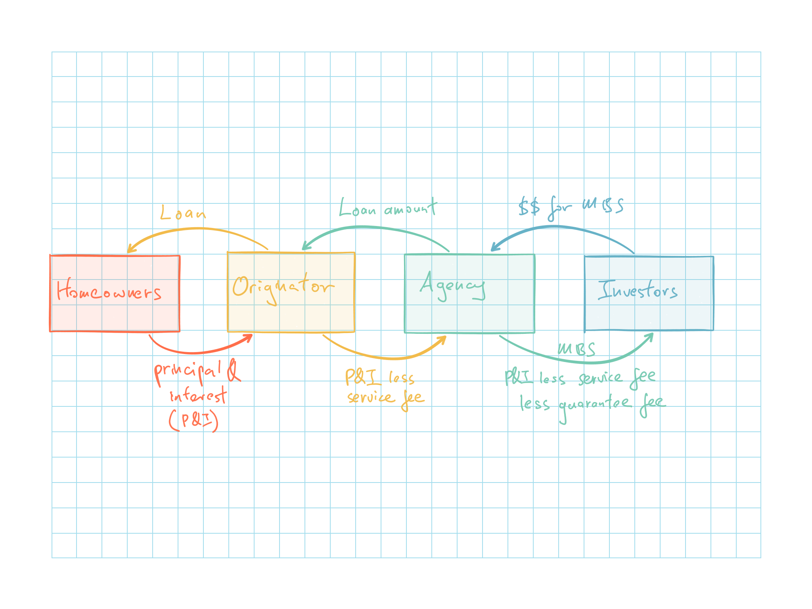

## Cliff's Summary

[3 Issues](#issues) with mortgage pass through

### Types of Exam Questions

## Introduction

Financial engineering uses mathematical models and engineering methodologies to create new financial products

Typically involves unbundling or bundling securities

## Mortgage Pass Through Securities

Regional lenders typically sell the conforming loans to federal agencies

* Fannie May (FNMA Federal National Mortgage Corporation) or Freddie Mac (FHLMC Federal Home Loan Mortgage Corporation)

* Conforming loans: loan size can not be too big, homeowners meet certain u/w criteria

The agencies then bundle them into mortgage backed securities (MBS) via securitization

MBS are known as pass through as the cash flow pass through many parties

### Caveat

**Issue 1**

Original issuers were originating to distribute instead of to hold

Investors bore most of the risk ultimately had no direct contact with the mortgagees and could not accurately determine the quality of the loan

* Need to rely on credit scores
    
$\hookrightarrow$ Less incentive for issuer to perform proper due diligence as long as the loan could be sold $\Rightarrow$ Issue a lot more non-conforming sub prime loans that have higher default risk

Sub prime loans:

* Low or no documentation
* Higher leverage ratios
* Piggyback loans or 2^nd^ lean loan

**Issue 2**

Government was encouraging Fannie and Freddie to buy these sub prime mortgages by increasing the supply of money available to lend in order to make housing more affordable for low income buyers

**Issue 3**

Lenders began issue lots of Adjustable Rate Mortgages (ARMs)

* Loans with low teaser rates for the first few years which then reset to market rates afterwards

* Borrowers took out large loans with high rates after the teaser rates $\Rightarrow$ Could not afford payments when the rate reset

## Collateralized Mortage Obligations

Collateralized Mortgage Obligations (CMOs) redirect cash flows from MBS to several trances

* Short pay trances
* Intermediate pay tranches
* Long pay tranches

All principal payments, including repayments will initially go towards the most short pay tranche

Once the tranche is retired, the principal payments will then go towards the next longer pay tranche

## Past Exam Questions