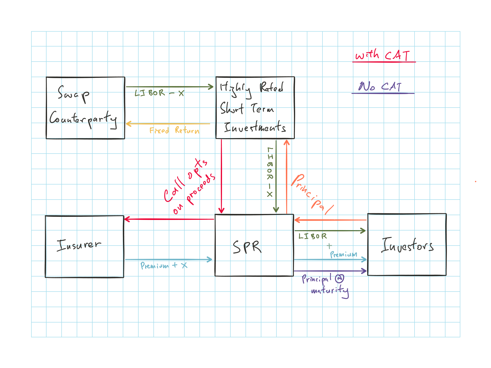

## Introduction

Risk linked securities enable insurance risk to be transferred to the capital market

Provide insurance market with additional capacity

CAT that are large relative to the resources of insurers will often still be small relative to the size of capital markets

**History**

Chicago Board of Trade introduced CAT futures, put and call after hurricane Andrew of 1992

However interest in them were low:

* Thinness of the market
* Counterparty risk on the occurrence of a major CAT
* Insurers wanting to avoid disrupting long term relationships with reinsurers
* Excessive basis risk

Nationwide issued 400M of contingent notes via a trust in 1995

* Proceeds invested in 10 year treasuries and investors get 220 bps of coupon over the treasuries
* Company had a substitutability option where it could substitute surplus notes for the treasuries during the 10 year period for any business reasons

2 major issues

* Investors were exposed to general business risk
* Investors could withdraw the funds from the trust, in which case the company would need to repay the trust

Due to these problems, contingent notes did not arise as a common risk linked security

## CAT Bonds

A class of **event-linked bonds** that provide payment on the occurrence of a specified event

**SPR**

Single purpose reinsurer is created by the insurer (sponsor)

Benefits of SPR

* Shields the investors from the general business risk of the insurer
* Lower financing costs for the insurer
* Transaction is more transparent than a debt issue
    * Funds are held in a trust and released according to very specific criteria

SPR issues CAT bonds to investors $\Rightarrow$ Invest proceeds in safe short term securities

***

CAT bond contains a call option that is triggered by a specified CAT event

* If event occurs, proceeds are transferred from the SPR to the insurer

Fixed returns from the investments are typically swapped for floating returns in order to immunize the insurer and investors from interest rate risk

**Principal protected tranches**  
Where the return of principal is guaranteed

* If event occur, it only impacts the interest and spread payments as well as the timing of the principal repayment of this tranche

* These are rare as they do not provide as much protection to the sponsor

### Loss Triggers

**Indemnity triggers**: Payouts are based on the sponsoring insurer's actual losses

**Index triggers**: Payouts are based on an index of industry losses

* *Industry loss indices*: Estimated losses to the industry from an event

* *Modeled loss indices*: Runs the parameters of the event through a model of a CAT modeling firm to generate either industry losses, or losses specific to the sponsoring insurer

* *Parametric indices*: Triggered by specified physical measures of an event e.g. wind speed of a hurricane, magnitude of an earthquake

**Hybrid triggers**: Blend of more than one trigger

***

Trigger selection is a trade off between *moral hazard* and *basis risk*

**Moral Hazard**

Investors want to minimize moral hazard which is most appropriate with industry loss index

However, this might lead to higher basis risk for insurer

Parametric triggers have the lowest exposure to moral hazard but highest basis risk

* Can be mitigated by selecting a geographic location where the insurer has a large concentration of insureds

**Basis risk**

Payment by the financial instrument may not be highly correlated with the sponsor's actual losses

Insurer is most interested in minimizing basis risk and indemnity triggers have the least basis risk, however:

* Insurer needs to reveal confidential info
* May require more time to reach settlement due to length of loss adjustment process

Investors are also concern with:

* Potential for moral hazard, where insurer pushes more losses to trigger the redemption
* It might also be difficult to obtain info on the sponsor's portfolio

### Advantages of CAT Bonds

CAT bonds are fully collateralized so no credit risk:

* CAT bonds are typically issued over the high layers of exposure and typically with reinsurer credit risk is a major concern in events of this magnitude

CAT bonds investors are willing to accept lower spreads from CAT bonds as they offer diversification benefits

* CAT events have low correlations with general investment returns

* Highest layers usually have the highest reinsurance profit margins for reinsurers

Multi year bonds are available for CAT bonds $\Rightarrow$ Shelter the sponsor from the cyclical price fluctuations of the reinsurance market

* Traditional reinsurance typically only offer coverage for 1 year period

* Bond is typically < 5 years

**Comparision w/ CAT Reinsurance**

Rate on Line (ROL) = $\dfrac{\text{Reinsurance Premium}}{\text{Policy Limit}}$

Loss on Line (LOL) = $\dfrac{\text{Expected Loss}}{\text{Policy Limit}}$

$\dfrac{ROL}{LOL}$ is comparable to the yield on CAT bonds $\Rightarrow$ Empirically pricing of CAT bonds is similar to reinsurance

***

Advantages for CAT bonds are becoming stronger as investment bank gain experience with insurance link securities $\Rightarrow$ Reducing transaction costs and increasing speed to market

## Sidecars

SPV formed by insurers or reinsurers to provide additional capacity to write reinsurance

Typically accept retrocessions exclusively from a single reinsurer and reinsurer will receive commissions for the premium ceded to the sidecar

Sidecars are mainly capitalized by private investors but can be funded by insurers and reinsurers as well

**Advantages**:

* Transaction are usually off balance sheet $\Rightarrow$ Can be used to improve the reinsurer's leverage
* Can be formed quickly with minimal documentation/ administration costs

## Catastrophic Equity Puts

CAT-E-Puts are options $\Rightarrow$ Not collateralized

Insurer purchases the put from the writer and receives the right to issue preferred stock to the writer at a specified price on the occurrence of a specified event

**Advantages**

* Will be able to raise equity after a CAT when its stock price is likely depressed
* Lower transaction costs than CAT bonds and no need for SPR

**Disadvantages**

* Not collateralized, so exposed to credit risk
* Preferred stock will dilute the value of the existing shares

## Catastrophe Risk Swaps

Swap between (re)insurers which are exposed to different types of CAT risk

Swap defines an amount that needs to be paid by each in the occurrence of a specified event

No money is exchanged if swap is structured at parity

**Advantages**

* Both parties reduce some of its core risk and achieves diversification
* Lower transaction cost than some of the other securities

**Disadvantages**

* Difficult to create a swap that achieves parity
* Can create more exposure to basis risk
* Not prefunded

## Industry Loss Warranties

ILW solves the problem of potentially not being treated as reinsurance by regulators

ILW has dual-triggers that both needs to be satisfied

* **Retention trigger**: based on incurred loss of the insurer
* **Warranty trigger**: based on industry wide loss index

2 categories of payments that can be made:

* **Binary trigger**: full payment is made once both triggers are satisfied
* **Pro rata trigger**: payoff depends on the magnitude of by which the loss exceeds the warranty

## Factors Impeding Growth of Market

Many factors could potentially impede the growth of the ILS market but none pose a material risk as the market is still growing

### Regulatory/ Accounting

**Issue 1**

CAT bonds have mainly been issued offshore due to regulations

However, advantages of issuing bonds offshore:

* Lower transaction costs
* Off-shore jurisdictions have demonstrated that they can perform very well in issuing and settling the securities

**Issue 2**

Uncertain regulatory/ accounting treatment of nonindemnity CAT bonds due to basis risk and potential use as a speculative instrument

Market countermeasure:

* Base the payment on narrowly defined geographic indices
* Dual-trigger contracts

### Tax Issues

There are no income, corporate or other significant taxes in offshore jurisdictions that impacts CAT bonds

Sponsors have been deducting the premium payments on the bonds for income tax purposes, consistent with the treatment of reinsurance premiums

### Dissemination of Info on Bonds

Lack of information about CAT bonds due to securities regulations that discourage releasing information about private placements

Prospectuses of privately placed bonds can only be issued to accredited investors (e.g. institutional investors, high net worth) $\Rightarrow$ Discourages research on the bonds

Author suggested change:

* Rules should be changed to allow the sponsors to distribute the prospectuses to researchers (while disclosing that it does not constitute an offer to sell)

* Regulators in certain jurisdictions mandate CAT loss reporting of a certain level of detail of events with industry losses exceeding a certain threshold

* Regulators account for reinsurance credit quality in regulatory capital calculations $\Rightarrow$ Improve insurance solvency regulation and also encourage the use of the ILS market