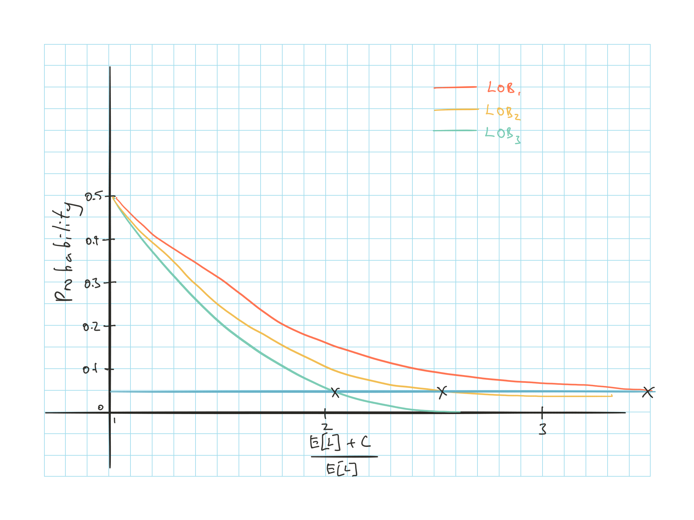

## Introduction

Useful to allocate capital to specific LoB or policy even though the entire capital of an insurer is available to pay claims

* Assist with value maximization by determining whether a LoB is producing sufficient return to cover its cost of capital

Various metrics to determine if the value is being maximized, based on allocated capital

**RAROC**

* RAROC > cost of capital $\Rightarrow$ Should continue to devote resources to the line

* See Goldfarb paper

**EVA** (Economic Value Added)

* Quantifies the value added to the firm from a given line

* $EVA_i = \text{Net Income}_i - r_i C_i$

* $EVAOC_i = \dfrac{\text{Net Income}_i}{C_i} - r_i$

    * Economic Value Added on Capital

* $r_i$: cost of capital for line $i$
    
***

2 methods for determining the cost of capital

* Based it on CoC of a monoline firm that write the same line

* Perform regressions on the data of multiline insurers to derive CoC by line

## Friction Costs

Costs that reduce the return on capital

Insurer needs to account for these cost when determining whether a LoB is earning the appropriate rate of return

**Agency & Information Costs**

Management may behave opportunistically and fail to achieve the owner's objective of value maximization

**Double Taxation**

Investing in securities via insurance companies produces lower after tax returns than purchasing the securities directly

**Rgulations**

Insurer are forced to hold inefficient investment portfolios (too much capital)

Typically not an issue for most insurers as they generally hold more capital than the regulatory requirement

## Capital Allocation Techniques

Various methods that are available to allocate capital

* RBC
* CAPM
* VaR
* Insolvency Put Option/ EPD Ratio
* Merton-Perold
* Myers-Read

### Risk Based Capital

Minimum level of capital to avoid regulatory intervention

Not an appropriate basis for capital allocation

* Factors used in RBC are of questionable accuracy
* Calculations are often based on book value instead of market
* RBC ignores several important risk sources

### CAPM

$r_E = r_f + \beta_E(r_M - r_f)$

* $r_E$: Cost of equity capital
* $\beta_E$: $\beta$ of firm (equity?)

Decompose the aggregate $\beta$ of the firm to determine $\beta$ by LoB and required rate of return of each LoB

* Not for surplus allocation

$I = r_A A + \sum_i r_i P_i$

* $r_A$: Return on assets
* $r_i$: Rates of return on u/w from line $i$
* $P_i$: Premium from line $i$

$\beta_E = \beta_A(1+ \sum_i k_i) + \sum_i \beta_i s_i$

* $\beta_A$: $\beta$ of assets
* $\beta_i$ $\beta$ of *insurance risk* of line $i$
* $k_i$: Liability leverage ratio for $i$ = $\dfrac{L_i}{E}$
* $s_i$: Premium leverage ratio for $i$ = $\dfrac{P_i}{E}$

Required rate of return on **underwriting**

$r_i = \underbrace{-k_i r_f}_{(1)} + \underbrace{\beta_i (r_M - r_f)}_{(2)}$

1) Each line is essentially paying interest for the use of p/h funds

2) Receiving a return which is based on the systematic risk

1 - r = combined ratio

* r is similar to the u/w provision from Robbin

**Problems with Model**

* Only reflects systematic underwriting risk (underwriting risk correlated with the market portfolio) and does not reflect other risk such as tail risk

* $\beta_i$ is hard to estimate

* Rates of return are impacted by other factors in addition to $\beta$

### VaR

Exceedence probability $\varepsilon_i = Pr[Loss_i > \operatorname{E}[Loss_i] + C_i]$

* Probability that the actual losses will exceed expected losses plus allocated capital

Allocate capital by equalizing the exceedence probability among lines

$\varepsilon_i = Pr \left[ \dfrac{Loss_i}{\operatorname{E}[Loss_i]} > 1 + \dfrac{C_i}{\operatorname{E}[Loss_i]} \right]$

**Issues**

* Firm may not have enough capital to achieve a certain $\varepsilon$
* Does not consider diversification
* Does not reflect the amount by which losses will exceed the resources in the event that the $\varepsilon$ is breached

### Insolvency Put/ EPD

Deficit to policyholder: $(L-A)^+$

* Same as payoff from a put option with strike price $A$ 

* EPD = value of the put

Value = $Le^{-rt} - P(A,L,r,\tau,\sigma)$

* $Le^{-rt}$: PV of claim if default risk were 0

* $P(\cdot)$ Value of the insolvency put based on the parameters

    * Aka expected policyholder deficit EPD
    
Capital can be allocated to achieve equivalent ratios of $\dfrac{EPD}{\text{Liabilities}}$

* Similar to the graph in VaR but with $\dfrac{\text{Asset}}{\text{Liabilities}}$ vs $\dfrac{EPD}{\text{Liabilities}}$

Advantage over VaR:

* Reflects the severity of the losses

Disadvantage:

* Still does not account for diversification

### Merton-Perold Method

Recognizes impact of diversification

Based on concept of **risk capital**

* Smallest amount that needs to be invested to insure the value of a firm's net assets against a loss in value relative to the risk free investment of those net assets

Derive the risk capital based on the marginal impacts of a line on the capital required to achieve a certain EPD

**Step 1**

Determine the amount of capital needed for a certain EPD ratio for:

* All lines combined
* All lines - one of the lines (for every line)

**Step 2**

Determine the marginal capital required when each line is added

All lines combined minus (All line - one of the lines)

***

Merton Perold method allocates less than 100% of the risk capital

Allocating all the capital would cause the firm to reject projects that would add to its market value

XS capital can then be allocated to the corporate level

### Myers-Read Method

M-R looks at the marginal impact of very small changes to the loss liabilities (as opposed to adding entire LoB)

Aims to equalize the marginal default values across LoBs

M-R allocates 100% of the capital

See Goldfarb paper

## Conclusions

EPD provides more information than VaR $\Rightarrow$ Decisions should focus on EPD

Allocation model that reflects the impact of diversification will lead to better decisions as diversification does have value

Cost of capital that is allocated to a line is the spread cost

* XS cost of investing in an insurer as opposed to investing directly in the capital market

Capital allocation must account for asset and liability risk, as well as the covariability between assets and liabilities

Capital allocation should factor in the duration & maturity of liabilities

Decision making should drive the design of the data system

Firms that allocate capital successfully will make better pricing, underwriting and entry/exit decisions, creating value for shareholders