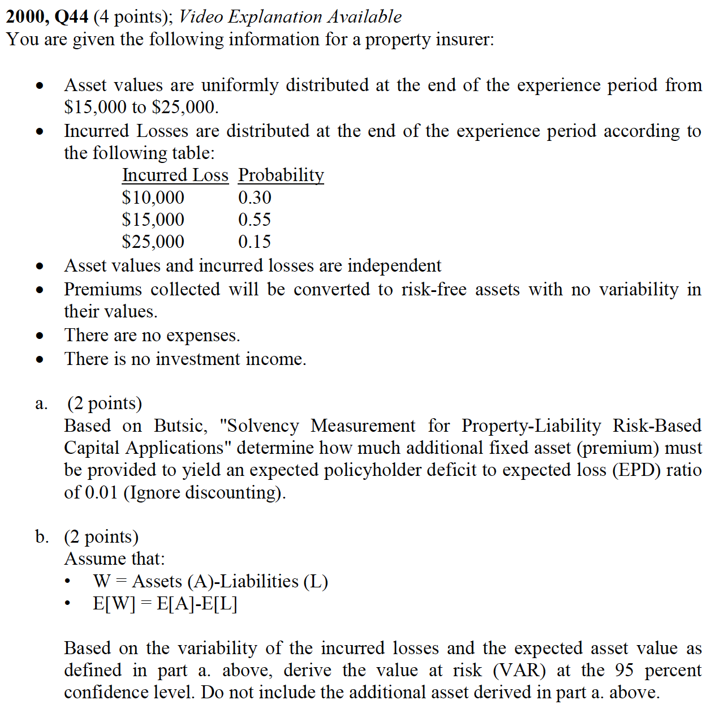
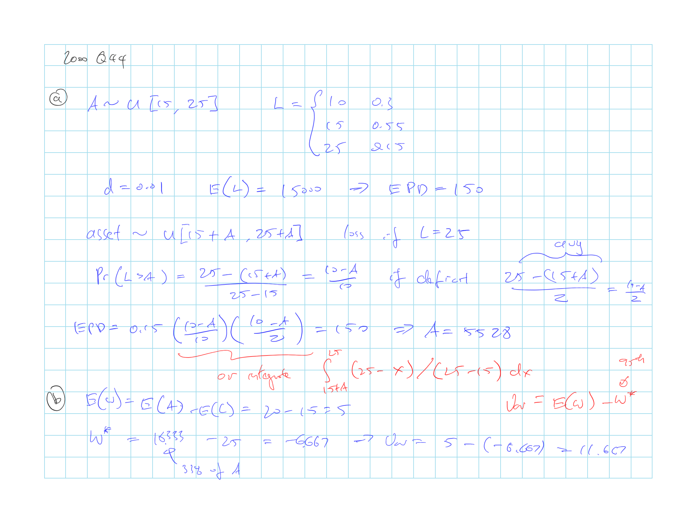

## Cliff's Summary

Know the EPD calc for varying asset or liability or both

* Typically get the expected loss first then convert the $d$ to EPD
* Then look at the scenarios that might get to the EPD and put up additioanl capital

Correlation: $C = \sqrt{\sum_i C_i^2 + \sum_j \sum_i \rho_{ij}C_i C_j}$

* If risky items appear on opposite sides of the B/S, correlation needs to be multiplied by -1

Accounting bias

Time horizon

Insuer as going concern

Insolvency cost as option

### Types of Exam Questions

Haven't done TIA practice questions

**EPD**

* $\star$ [2000, Q44](#2000-44): EPD and VaR
* 2001, Q46: EPD; 2 correlated and independent risk (make a new table and calculate again)
* $\star$ 2002, Q41: EPD calc with additional wrinkles
* 2004, Q39: EPD with one thing being uniform distributed
* 2006, Q39: EPD and some variations
* $\star$ 2009, Q33: EPD calc
* $\star$ 2010, Q30: multiperiod EPD
* $\star$ 2013, Q14: EPD calc more complicated
* 2015, Q16: EPD simple

**Concepts**

* 2002, Q40: VaR doesn't capture severity of ruin; EPD pros
* 2008, Q39: EPD vs VaR

## Introduction

RBC need to be fair for all parties to the insurance contract

* Same standard for all types of insurers (personal vs commercial; primary vs re)
* Needs to be objectively determined
* Be able to distinguish between items that differ materially in level of riskiness

## Expected Policyholder Deficit

EPD is the expected value of the difference between the amount the insurer is obligated to pay the claimant and the actual amount paid

EPD is better than probability of ruin as it account for the severity

Capital amount is set as $\operatorname{E}[A] - \operatorname{E}[L]$

Convert to EPD ratio ($d$) for comparison with insurers with different exposure sizes

$d = \dfrac{EPD}{\operatorname{E}[L]}$

**Fixed assets**

$D_L = \sum \limits_{x > A} p(x)(x-A)$

**Fixed loss**

$D_A = \sum \limits_{L > y} q(y)(L-y)$

### Setting Capital based on EPD Ratio

Assume regulator set an equal EPD ratio for all insurers

Adjust assets to achieve the desire ratio

### EPD w/ Continuous Distributions

$D_L = \int_A^{\infty} (x-A)p(x)dx$

$D_A = \int_0^L (L-y)q(y)dy$

Assuming risks have **normal** distribution

$d_L = k \varphi \left( \dfrac{-c}{k} \right) - c \Phi \left( \dfrac{-c}{k} \right)$

$d_A = \dfrac{1}{1-c_A} \left[ k_A \varphi \left( \dfrac{-c_A}{k_A} \right) - c_A \Phi \left( \dfrac{-c_A}{k_A} \right) \right]$

* $k$: CV of losses
* $k_A$: CV of assets
* $c$ = Capital $\div$ Loss Ratio
* $c_A$ = Capital $\div$ Asset Ratio
* $\Phi(\cdot)$ = Cumulative standard normal dist^n^
* $\varphi(\cdot)$ = Standard normal density

Probability of ruin: $\Phi \left( \dfrac{-c}{k} \right)$ and $\Phi \left( \dfrac{-c_A}{k_A} \right)$

Assuming risks have **lognormal** distribution

$d_L = \Phi(a) - (1+c)\Phi(a-k)$

$d_A = \Phi(b) - \dfrac{\Phi(b-k_A)}{1-c_A}$

Capital requirement is higher for losses under lognormal

* Difference $\uparrow$ as CoV $\uparrow$

* Probability of large losses is higher under lognormal

For assets, less capital is required under lognormal as lognormal assets > 0

## Correlation

Can not simply add the EPD for different lines unless they are perfectly correlated

If assume independence, we can simply build out a new set of scenarios for the combined and then calculate the EPD

For continuous, the previous formulas still apply

**Square Root Rule**

$C = \sqrt{\sum_i C_i^2 + \sum_j \sum_i \rho_{ij}C_i C_j}$

**Notes**: if risky items appear on opposite sides of the B/S, correlation needs to be multiplied by -1

## Additional Notes

### Accounting Conventions & Bias

RBC calculated on accounting book value is not appropriate due to accounting bias (e.g. recorded value $\neq$ current realizable value)

Market value account is preferable for solvency assessment as it is based on current realizable value

### Time Horizon

Variance should be measured per unit of time as the time span between valuation dates will have a material impact on the measurement of risk

For multi period horizon, can perform calculation by breaking up into several periods and a certain EPD ratio will be targeted for each period

Insurer would need to annually adjusts its capital to keep the risk level (EPD ratio) constant $\Rightarrow$ Capital should be adjusted such that the ratio of capital to reserves remains constant $\Rightarrow$ Can focus on the EPD ratio over the period

* Make adjustment at each period

### Insurer as a Going Concern

Need to consider risk from policies becoming effective in the future

Calibrate capital periodically to maintain a constant EPD ratio

Notations:

* $C_1$: Year end capital
* $P$: Added premium
* $L_P$: Losses from added premium
    * Assume incurred at end of period and paid at the end of the following period
* $r$: Annual return on assets
* $g$: Annual change in value of the liabilities

Assets and Losses at the end of the period

$A_1 = (A_0 + P) \times (1 + r)$

$L_1 = L_0 \times (1 + g) + L_P$

Assume premium is related to the initial capital based on a factor $p$

$P = p \cdot C_0 = p \cdot c \cdot L_0$

Assume incurred loss ratio is $b$

$L_P = b \cdot P = b \cdot p \cdot c \cdot L_0$

$c$ for the end of the year:

$c_1 = c \cdot (1+p) + r \cdot [1 + c \cdot (1+p)] - p \cdot c \cdot b - g$

Then derive the capital $c$ required to produce a specific expected value of $c_1$

Equation based on variables that make up most of the risk that insurer faces:

* Assets risk $r$
* Reserve risk $g$
* Incurred loss risk $b$

### Insolvency Cost as an Option

Think of EPD as a call option with 1 year maturity

For risk-less asset and risky liability, EPD = call option on the losses with strike price = assets at the end of the year

For risky asset and risk-less liability, EPD = put option on the ending assets with strike price = liability at the end of the year

## Past Exam Questions

 2000, Q44

