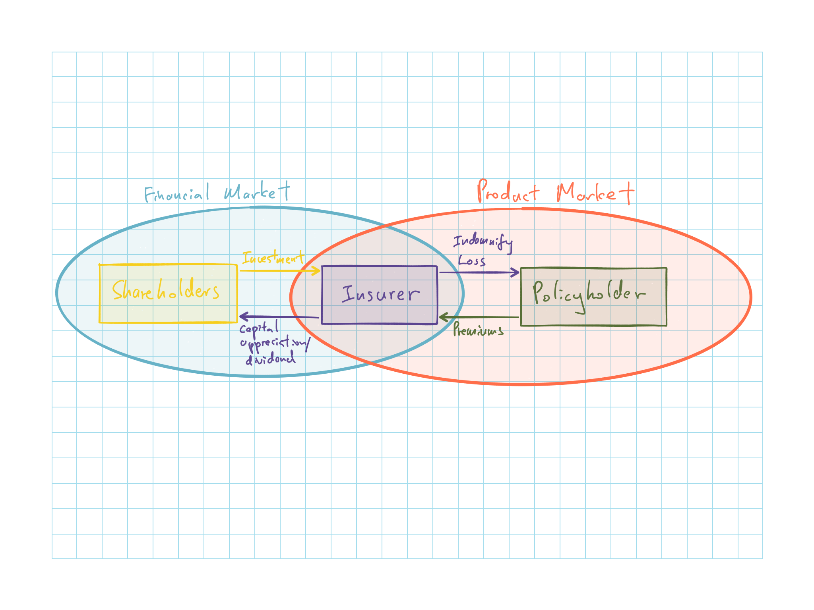
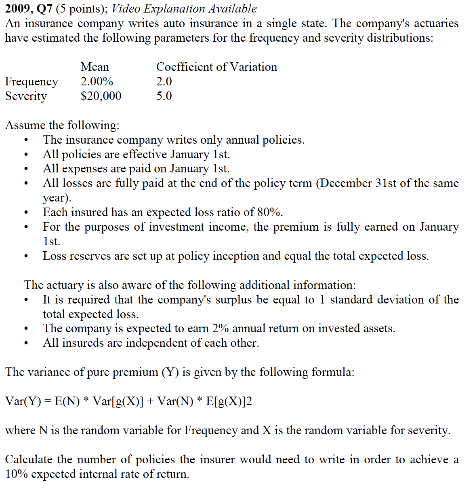
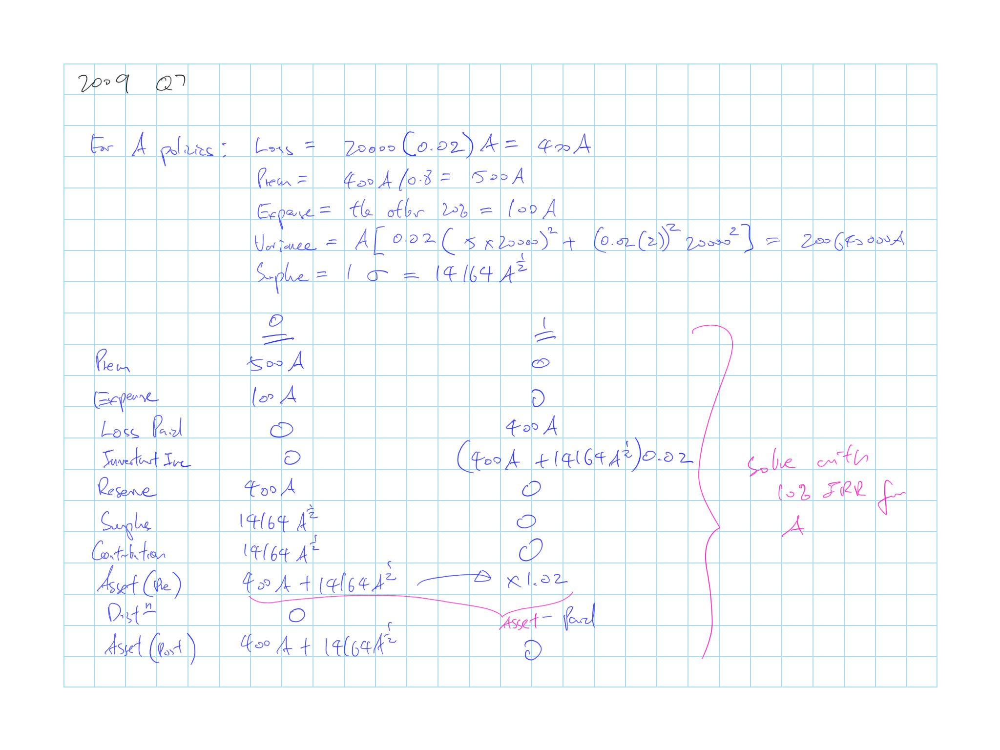

## Cliff's Summary

Financial market and product market [relationships](#fin-prod)

IRR [assumptions](#ass) and [calculations](#IRR-calc)

* Really key is just to be able to do the questions

IRR pitfalls with [cashflow](#cashflow) pattern and [mutually exclusive](#exclusive) projects

Other [practical](#practical) issues with IRR

Surplus requirements varies based on the different [insurance risk](#ins-risk) and [policy forms](#forms)

### Types of Exam Questions

Haven't done TIA practice questions

**IRR**

* 2000, Q27: IRR calc
* 2002, Q22: IRR calc no setup
* 2004, Q31: IRR calc
* 2005, Q18: IRR calc
* 2006, Q16: IRR back out premium, Surplus based on Pr(ruin)
* 2007, Q15 a b: IRR calc, adjust loss to have 0% IRR
* 2008, Q8: IRR calc with and without reinsurance
* $\star$ [2009, Q7](#2009-7): Surplus based on $\sigma$ of expected loss
* 2010, Q7: IRR back out premium
* $\star$ 2010, Q3: U/w profit provision $\Rightarrow$ $P = \dfrac{\operatorname{E}[L]}{1 - Expense - U}$; need to consider u/w tax, II tax
* $\star$ 2011, Q13: Long calc of backing out premium
* 2011, Q19: IRR calc with different allocation assumption
* $\star$ 2012, Q17: IRR calc with alt assumptions
* 2013, Q19: IRR calc backing out premium
* 2014, Q18: IRR calc
* 2015, Q19: IRR and NPV for different surplus option

**Other Calculation**

* 2006, Q21: NPV calc no setup
* $\star$ 2015, Q20: Different allocation method; impact of growing LoB

**Concepts**

* 2004, Q35: Risk surplus protect against (pricing, reserve, CAT, reinsurance)
* 2005, Q16: same as above
* 2007, Q15 c: IRR less than cost of capital
* 2008, Q9: Risk sources; problem with surplus allocation
* 2009, Q15: surplus allcation and commitment; considerations for allocating between AL and WC
* 2010, Q11: Risk sources

## Motivation for IRR

Early procedures for profit margin used a fixed %

Alternative pricing models were proposed due to:

* Lack of theoretical justification of the fixed margin
* High interest rates
* Increasing competitiveness of the insurance industry

## IRR Point of View

**Financial Market**

* Expected return is influenced by risk to shareholders
* IRR Model looks at this market

**Product Market**

* Premium is affected by supply/demand of insurance

The 2 views are interrelated

| Financial Market        |               | Product Market          |
| :--------------------- | :-----------: | :--------------------- |
| $\uparrow$ Cost of Capital | $\Longrightarrow$ | $\downarrow$ Supply of Insurance |
| $\uparrow$ Return to Shareholders | $\Longrightarrow$ | $\uparrow$ Supply of Insurance |
| $\uparrow$ Return to Shareholders | $\Longleftarrow$ | $\uparrow$ Demand of Insurance |
| $\downarrow$ Resources to Insurance Industry | $\Longleftarrow$ | Inadequate Rates |

Note that the relationship is only strong for the industry as a whole

* e.g. Increase supply of insurance doesn't necessary affect all firms

IRR model focus on the cash flows in the financial market

* Product market is only accounted for through its impact on the transactions between company and shareholders

## Non-Insurance IRR

Compare IRR to the opportunity cost of capital to determine whether or not to undertake a project

IRR = rate which set the NPV of cash flows to 0

Opportunity cost of capital = investment return that the providers of capital could earn from an alternative investment

Projects with IRR > Opportunity Cost of Capital are accepted

Focus on incremental cash flow is we are comparing proposed scenario with current

## Insurance IRR

IRR looks at cash flow pattern from the equity contributors POV

* Outflow first to provide surplus to support insurer's policies
* As policies expire and losses are paid, profit/loss and surplus return to investors

### Assumptions

 **Surplus requirement**

Difficult to determine as there are no fixed relationship between premium & surplus

* Does not need to derive the exact amount of surplus needed by basing it off premiums

Need to allocate surplus to LoB

* Typically $\propto$ reserve or premiums
* Using reserve will result in more surplus for longer tail lines

IRR reduces as the amount of surplus contributed increases

**Timing of surplus commitments and release**

If assume to commit after policy is written and no need when expires, short tail policy will have the same commitment/ release timing as a long tail LoB

If committed when the UEPR is established and declines as losses are paid, long tail lines will retain the surplus for a longer period than a short tail LoB $\therefore$ Long tail lines will have more surplus at any given point

***

Should account for the average duration between loss occurrence and claim payment

If average duration is $D$, then given $\$X$ of losses annually, at any given point in time, there are $\$X \cdot D$ of reserves

### Projecting Expenses

Expense projection is often less accurate than the premium and loss projection

* Data: companies often do no monitor the expense payment pattern as they are not required to populate Sch P
* Expense levels vary widely by company
* Risk size: unlike losses, not all expenses are $\propto$ premium
* Policy year: several expenses are higher in the first policy year than future years

Expenses that need to be allocated includes:

* State Premium Taxes
* Commission & Other Acquisition Expenses
* Underwriting & Admin Expenses

### Calculating Equity Flow 

This is the calculation bit of IRR in exam

Calculate the below for each time period until all loses are paid and surplus are released

Then calculate the IRR based on the equity flow

**Cash flow**

(+) Premium  
(+) Investment Income: Based on beginning surplus (or assets?)  
(-) Expense  
(-) Tax  
(-) Loss Paid

**$\Delta$ Liabilities**

Loss Reserves

* Can assume to know all losses @ t=0 and earn all premium @ t=0 $\Rightarrow$ No UEPR

UEPR

**$\Delta$ Surplus**

Required Surplus: Typically given as a ratio of reserve or premium  
Contribution by Shareholders: Might contribute more if $\operatorname{E}[Loss]$ > Premium  
Distribution to Shareholders

**$\Delta$ Assets**

Total Assets (Pre Distribution)  
Total Assets (Post Distribution)

## Potential IRR Pitfalls

Comparison of IRR with NPV and practical criticisms with IRR

### NPV vs IRR

NPV discounts all cash flow at opportunity cost

Projects with (+) NPV maybe accepted

NPV & IRR may differ:

* Unusual cash flows
* Projects with budget constraints/ mutually exclusive projects

### Cash Flow Pattern

There maybe 2 positive roots to the IRR if the cash flow changes signs more than once

* Typically they are not true reversals, but result from oversimplifications in the analysis

* e.g. Simplifies recognition of certain revenues/ expenses all at a single point in time

* Expected cashflow in insurance rarely show reversals $\Rightarrow$ IRR is okay

* Actual cashflow may have reversals though $\Rightarrow$ Use NPV

### Mutually Exclusive Projects

NPV & IRR do not necessarily result in the same ranking of projects

IRR assumes the revenues are reinvested at the IRR

* Not the case most of the time

* NPV does not make the assumption

Mutually exclusive is more likely an issue for capital budgeting and rarely an issue for pricing:

* If IRR > cost of capital $\Rightarrow$ Use revenue to write more policies and effectively grow at the IRR rate $\Rightarrow$ Reinvestment rate of revenue = IRR

    * Given that u/w-ing standards is maintained
    
* Policies are usually priced using an u/w profit provision which set the IRR = cost of capital $\Rightarrow$ Assumptions hold, IRR = CoC = Reinvestment rate

### Practical Criticisms of IRR

Regulators might believe company is making sufficient return when it is clearly unprofitable when:

* 0 < IRR < Cost of Capital, or
* Investment Yield < IRR < Cost of Capital

Insurers are more likely to run into problems of (+) IRR < cost of capital

* Insurers' required surplus is dependent on reserves of the company
* Deteriorating result $\Rightarrow$ increasing reserve $\Rightarrow$ required surplus increase $\Rightarrow$ increase investment income from additional surplus $\Rightarrow$ Offset u/w loss and keep IRR > 0

Important to present findings in such a way that regulators do not get false impression that a company is profitable when it is not

* NPV analysis may be more appropriate as it would produce a negative number when return on investment < CoC and clearly demonstrate that the project is not profitable

## Surplus

Some general information on surplus as it influences IRR

### Insurance Risks

Surplus to protect against various risks

**Asset** risk: depreciation

**Pricing** risk: ultimate L&LAE > expected

**Reserving** risk: insufficient reserves

**Asset-liability** risk: $\Delta$ in interest rates will affect market value of assets and liabilities differently

**CAT** risk: 

**Reinsurance** risk: uncollectable reinsurance

**Credit**: Agents/ insureds won't remit premium

### Policy Form

Amount of surplus depends on the policy form

**Claims Made**: No pure IBNR $\Rightarrow$ less uncertainty $\Rightarrow$ Less surplus

**Service**: No insurance risk

**Retrospective**: share risk between the insurer & insured so somewhere between the 2 above

IRR model will have different treatment for various policy forms

* No distinction is made:

    * Overstate risk on retro and understate risk for XS policies
    
* Allocate surplus only $\propto$ true insurance risk

    * Understate risk for retro, XS and LDD as they have less insurance risk but more volatility
    
### Surplus vs Fixed Assets

Insurer's required surplus is an estimate based on expected future development

Surplus allocation for an insurer is artificial

Amount of surplus held isn't a deliberate amount but rather heavily dependent on the past profits of the firm

## Past Exam Questions

 2009, Q7

