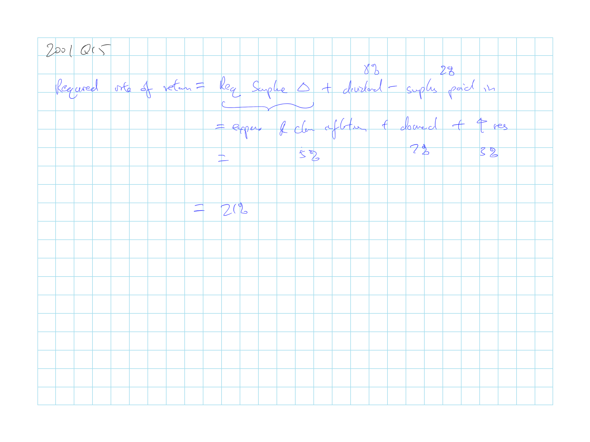
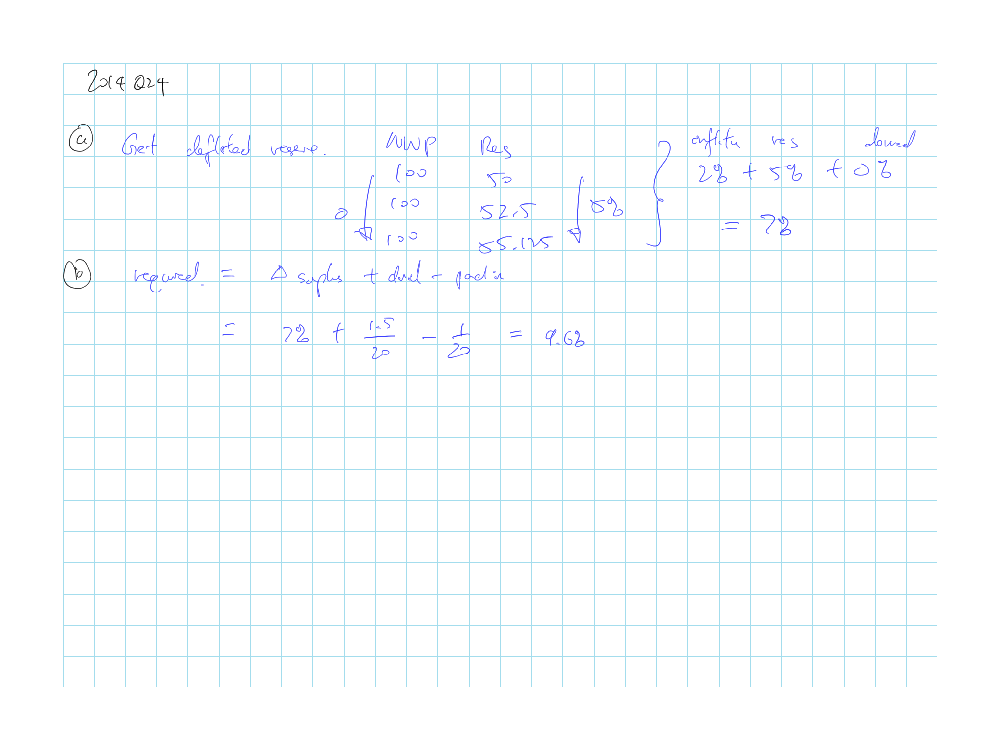
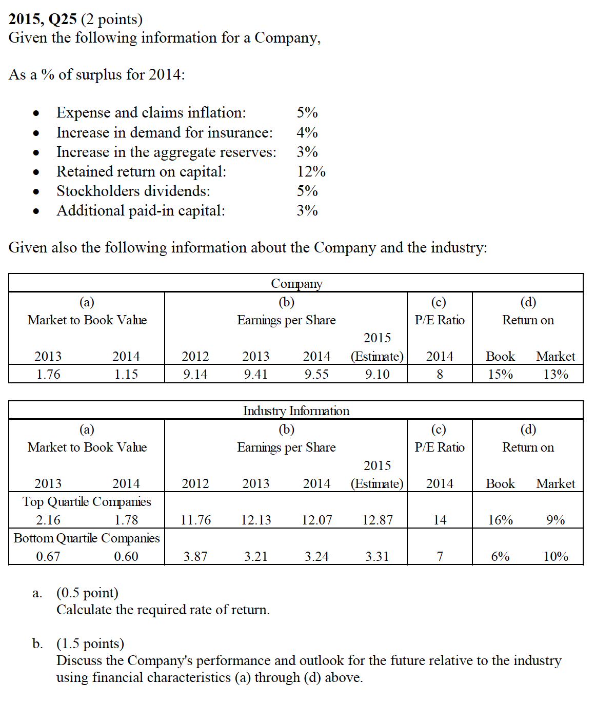

## Cliff's Summary

Using leverage ratios to allocate surplus is flawed as not risk faced are related to the premium volume

2 meaningful measure of surplus:

* Required surplus for the insurance group
* Required marginal surplus for a specific change in assets/liabilities/premiums

What is [fair and reasonable](#fair) return and what is [adequate](#adequate) or [inadequate](#inadequate) return

[Mutual vs stock](#mvs) insurer

Resaonable return:

* **Required surplus $\Delta$**:  
= expense & claims inflation + increase demand + increase reserve

* **Actual surplus $\Delta$**:  
= retained return on capital + surplus paid in

* **Required rate of return**:  
= required surplus $\Delta$ + stock dividends - surplus paid in

* **Actual rate of return**:  
= stock dividends - retained return on capital

* No stock dividends and surplus paid in for mutual

Return is reasonable individual insurer as they each has a unique share price, which changes in response to the investor’s assessment of its risk and return

### Types of Exam Questions

Haven't done TIA practice questions

**Calculations**

* 2000, Q10: required and actual RoR (back out the retained based on actual surplus $\Delta$ - surplus paid in)
* [2001, Q15](#2001-15): required rate of return
* 2002, Q25 a: rate of return calc just from income statement
* 2003, Q19: change in surplus just from I/S
* 2004, Q8: return of surplus
* 2005, Q12: Change in surplus calc from I/S
* 2007, Q14: required surplus change and likelihood of meeting requirement
* 2008, Q13: require return for stock and mutual
* $\star$ [2014, Q24](#2014-244): required change in surplus
* 2015, Q24: actual rate of return and compare companies

**Concepts**

* 2000, Q11: Retain return of capital = actual surplus $\Delta$ - surplus paid in
* 2002, Q4: No need to consider stock dividend for mutual
* 2002, Q25 b c: [fair and reasonable](#fair) return
* 2004, Q11: stock company doesn't need to consider divident to p/h
* 2009, Q16: Risk sources for insurers
* 2011, Q16: issues with allocation; risk sources; reasonable and fair
* 2014, Q21: Issues for allocation by line or industry P/S ratio
* $\star$ [2015, Q25](2015-25): rate of return and outlook

## Introduction

Surplus allocation is required for regulators and IEE using **leverage ratios** ($\dfrac{R}{S}$) What is it here? P:S or R:S?

Approach is flawed as not all risk which an insurer is exposed are related to the premium volume in just a specific segment (e.g. credit risk or investment risk)

## Surplus & Risk

Level of surplus depends on the level of risk and for risk that are not necessarily related to a particular line:

**Underwriting** risk: premium will be insufficient to cover loss & expense

**Investment income** risk: expected yield not achieved

**Investment asset** risk: fluctuations in market values; probability of default; asset/liability cash flow

**Reserve** risk: reserves not sufficient to pay losses

**Social** risk: inflation; law changes; impact of the economy on frequency

**CAT** risk

**Credit** risk: uncollectable reinsurance recoverable and agents' balances

P:S ratio vary greatly between insurers so we can not use a general leverage ratio for all insurers in the industry

Need to develop the total amount of risk based surplus for an insurer to account for diversification

2 meaningful measure of surplus:

* Required surplus for the insurance group
* Required *marginal* surplus for a specific change in assets/liabilities/premiums

## Reasonable Rate of Return

**Income**: annual increase in net worth of the business from actual business operations

* Excluding contributions or outflows of surplus from other sources

* Require for rate of return

* Includes $\Delta$ unrealized capital gains

**Rate of Return** $\dfrac{\partial S}{S}$ = income ($\partial S$) $\div$ initial surplus ($S$)

* Can use either GAAP or Stat and won't make a different as they are usually different by a fixed magnitude (x%)

### Fair & Reasonable Return

 Insurers are allowed to earn **fair & reasonable rate of return**

* Return will be similar to that of other companies with similar risk
* Return will be sufficient for the insurer to attract capital

 If the currently allowable return is **adequate** or there is a perception that returns are reasonable:

* Industry attracts capital
* New companies are being formed

 If the currently allowable return is **inadequate** or there is a perception that returns are not reasonable:

* Stockholder dividends > Capital inflow
* Companies are leaving the market

Insurers are only require to have the *opportunity* to earn a reasonable return

* Does not require that each insurer actually earns a reasonable return

## Mutual vs Stock Insurers

Mutual insurers: goal is to provide availability of insurance

* Looser u/w-ing standards and greater reliance of p/h dividends

Stock insurers: goal is profit maximization

Higher portion of stock insurers have historically become insolvent than mutuals

* Focus more on commercial LoB
* Higher leverage in order to make better use of capital

### Reasonable Return for Mutual

Stock insurers need to increase surplus to fund:

* Expense & claims inflation
* $\uparrow$ in aggregate reserves
    * $\uparrow$ in aggregate deflated reserves: from growing and increase in reserve from loss development (Confirm)
    * Typically need to remove the effect of increase demand from the increase in reserve
* $\uparrow$ demand for insurance
* Dividends to stockholders

Mutual does not pay dividend $\Rightarrow$ Only need to increase surplus enough to cover the first 3 to conclude that they are earning a fair & reasonable return

**Required surplus $\Delta$**:  
= expense & claims inflation + increase demand + increase reserve

**Actual surplus $\Delta$**:  
= retained return on capital + surplus paid in

**Required rate of return**:  
= required surplus $\Delta$ + stock dividends - surplus paid in

**Actual rate of return**:  
= stock dividends - retained return on capital

No stock dividends and surplus paid in for mutual

More difficult for mutual to increase their growth rate as that require additional surplus

* Stock company can have surplus paid in while mutual can only rely on retained capital

Stock insurers is required to pay higher rate of return

* To pay dividend

* Needs to write higher risk LoB such as commercial lines

## Stock Insurers: Book vs MV

Test to determine rate adequacy discussed earlier only works for industry in aggregate but not to individual insurers

However, test is not necessary as these investors are receiving a fair and reasonable return by definition

* Each insurer has a unique share price, which changes in response to the investor's assessment of its risk and return $\Rightarrow$ Return is reasonable

Stronger firm (higher Market/Book and P/E ratio) the higher the MV

Return on market is the return investors demand to invest in the shares

* Demand is higher for medium performers than great performers

* Higher risk projects should have higher returns

* Return is fair and reasonable

Return on book

* No widely accepted answer

* Should be fair (author)

    * Ratio of M:B is roughly the same as a benchmark ratio of companies from all industries combined
    
    * Actual return on book values derived above are close to the required rates of returns which were derived in an earlier table

## Past Exam Problems

 2001, Q15

 2014, Q24

 2015, Q25

a. Market/book:  
indicate financial performance

b. EPS:  
indicate financial performance, closer to top quartile but forcaste down while while industry is trending up

c. PE:  
measure of investor confidence. closer to bottom

d. return on book  
Compare to answer from part 1 shows that they met the target, but not the forecast though; higher return on market indicates more risky

Performance and outlook: good performance and uncertain future; good returns likely won't continue; average performance and not a good outlook