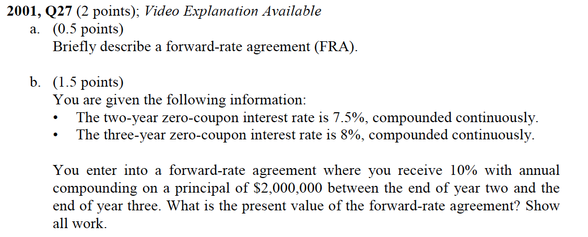
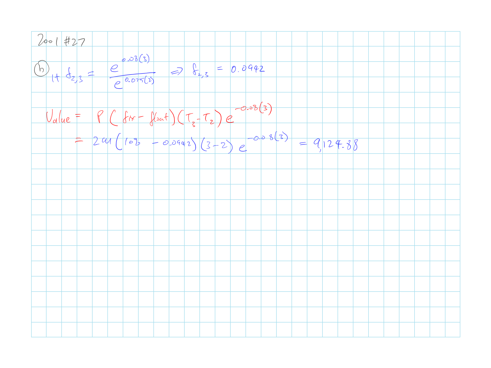
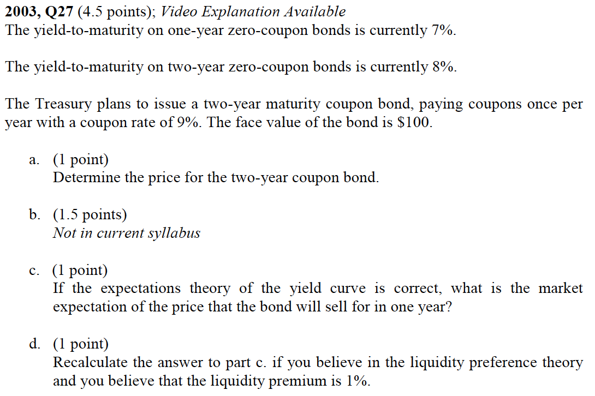
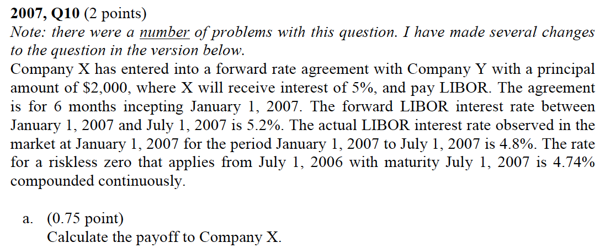
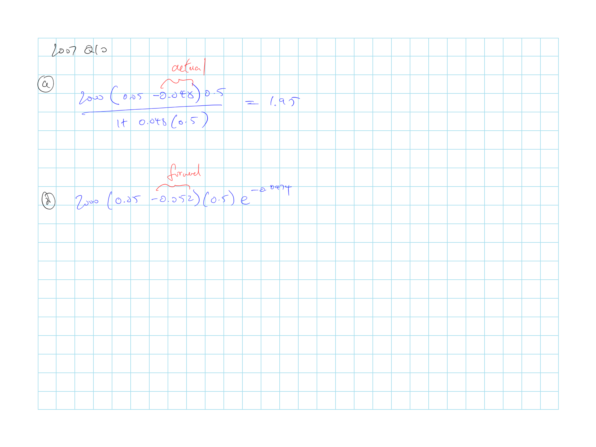
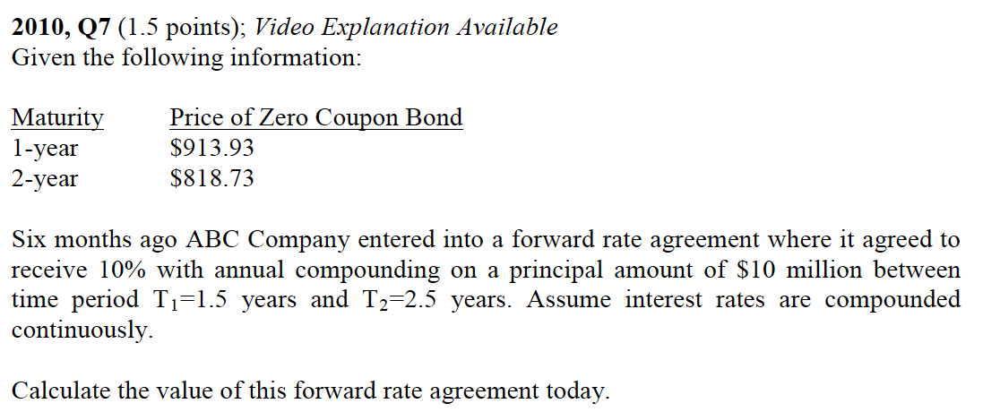
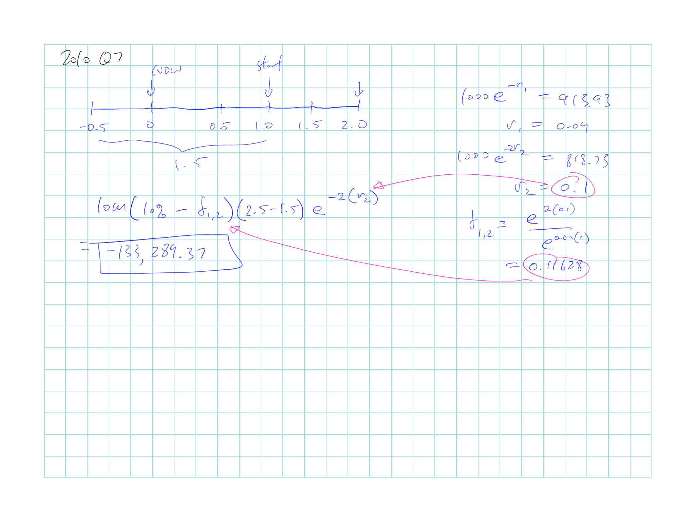
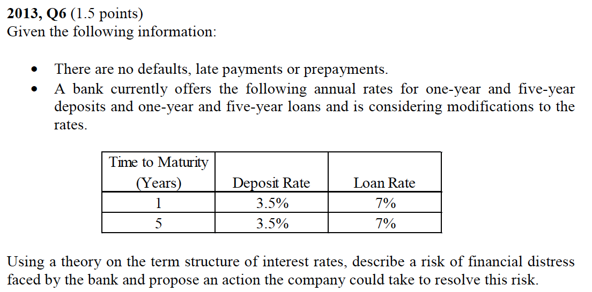
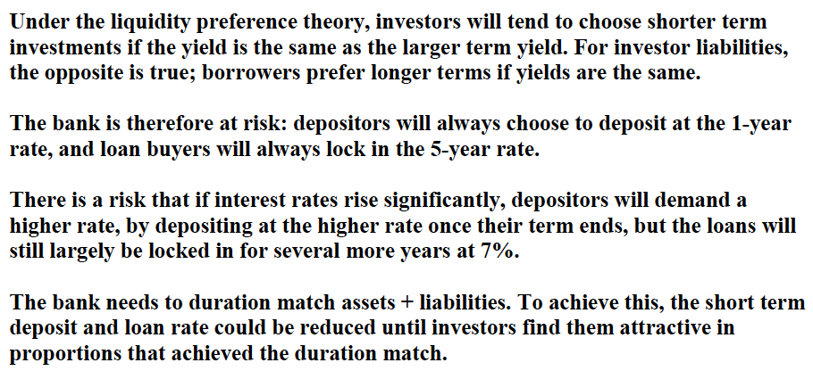

## Cliff's Summary

Covers the basic on the different rates, and bond pricing with bootstrap

[**FRA**](#FRA)

**Payoff**

$\dfrac{\overbrace{L(r_K - r_M)\overbrace{(T_2 - T_1)}^{\text{Pro-rate for Interval}}}^{\text{Payoff at }T_2}}{\underbrace{1 + r_M(T_2 - T_1)}_{\text{Discount to }T_1 \text{ from }T_2}}$

* $T_1$ and $T_2$ = beginning and end of the interval

* $r_M$ = Actual LIBOR rate at $T_1$ that applies between $T_1$ and $T_2$

* $r_k$ = fixed rate agreed for the FRA

* $L$ = principal

**Value** @ any point in time

$L(r_K - r_f)(T_2 - T_1)\underbrace{e^{-r_2T_2}}_{\text{Discount from }T_2}$

* $r_f$ = current forward rate that applies between $T_1$ and $T_2$

* $r_2$ = risk free spot rate for maturity $T_2$

Theories of the term structure of interest rate

* Expectation Hypothesis
* Liquidity Preference
* Segmentation Theory

### Types of Exam Questions

Haven't done TIA practice questions

**Concepts**

* 2001, Q27 a: describe FRA, agreement to pay a specified interest rate at a future time period on a specificed principal amount
* $\star$ 2004, Q16: term structure theory; implication of sloping down for all 3 theory
    * For liquidity the rate is expected to decrease even more than the expectation theory as there's additional illiquid premium baked in
* 2005, Q9: illiquidity premium = compensation for illiquidity since investors prefer liquidity
* 2005, Q14: liquidity preference theory
* 2009, Q9: term structure; prediction of slope; relationship of forward and expected future spot
* $\star$ [2013, Q6](#2013-6): term interest rate risk
* 2014, Q8: Plot yield curve and explain with theory

**FRA**

* [2001, Q27 b](#2001-27): FRA value
* [2007, Q10](#2007-10): FRA payoff and value
* 2008, Q6: FRA value
* $\star$ [2010, Q7](#2010-7): FRA value unwinding
* 2014, Q7: FRA

**Rates**

* 2000, Q16: bootstrap spot price
* 2001, Q16: forward rate from bootstrap
* 2002, Q24: zero rate and forward rate
* 2003, Q25: forward rate with bonds
* 2003, Q26: spot rate and forward
* $\star$ [2003, Q27](#2003-27): 
    * bond price
    * price under expectation theory we can just do the normal calculation
    * liquidity theory calc forward rate need to be adjusted
* 2004, Q15: bunch of bootstrapping, just testing your math
* 2004, Q17: forward rate
* 2006, Q11: forward rate
* 2006, Q12: bootstrap zero rate
* 2009, Q10: forward rate
* $\star$ 2012, Q2: Given list of price and forward rate, do arbitrage
* $\star$ 2015, Q8: Bond price with long calc involing FRA too
    * Lender of the FRA receive fix payments

## Introduction

**Spot rate**:  
Interest rate that applies from time 0 to $t$; Yield to maturity (YtM) on zero coupon bonds (ZCB)

* = Zero rates

**Short rate**:  
Interest rate that will apply during a future time interval

* Can use short rates to determine spot rates (But not the other way around?)

**Treasury rates**:  
Rates earned on T-bills and T-bonds; Risk free

**LIBOR**:  
Rate at which a bank will make a large wholesale deposit with another bank; Close to risk free

**Repo rate**:  
The difference between the higher repurchase prices and the price sold at t=0

* Essentially a collateralized loan

## Interest Rate

$A \times \left(1 + \dfrac{R}{m} \right)^{m \cdot n}$

* Terminal value of $A$ invested for $n$ years at rate $R$ compounded $m$ times per annum

$A \times e^{R \cdot n}$

* Terminal value of $A$ invested for $n$ years at rate $R$ compounded continuously

## Bond Pricing

**Bond yield**: Single discount rate that would produce a bond price equal to is market value

**Par yield**: Rate which would produce a bond price = par

## Bootstrapping Method

To determine the zero rates (spot rates) based on price of coupon bonds

* Typically start with bonds that do not pay coupons

## Forward Rates

**Forward rate**: future expected short rates

$(1 + f_n) = \dfrac{(1+y_n)^n}{(1+y_{n-1})^{n-1}}$

* $f_n$ forward rate that applies during the future interval $n$

* $y_n$ spot rates

## Forward Rate Agreements (FRA)

**FRA**:  
Over the counter agreement between two parties to exchange a specified *interest rate* that applies to a specified *principal* during a specified *future interval*

* On party will pay a fixed rate and the other would pay a floating rate (e.g. LIBOR)

* Agreement is typically settled financially at the beginning of the interval based on the different between the fixed and actual floating rate

**FRA Payoff**

$\dfrac{\overbrace{L(r_K - r_M)\overbrace{(T_2 - T_1)}^{\text{Pro-rate for Interval}}}^{\text{Payoff at }T_2}}{\underbrace{1 + r_M(T_2 - T_1)}_{\text{Discount to }T_1 \text{ from }T_2}}$

* For the party that pays $r_M$ and receive $r_K$

* $T_1$ and $T_2$ = beginning and end of the interval

* $r_M$ = Actual LIBOR rate at $T_1$ that applies between $T_1$ and $T_2$

* $r_k$ = fixed rate agreed for the FRA

* $L$ = principal

**FRA Value** @ any point in time

$L(r_K - r_f)(T_2 - T_1)\underbrace{e^{-r_2T_2}}_{\text{Discount from }T_2}$

* $r_f$ = current forward rate that applies between $T_1$ and $T_2$

* $r_2$ = risk free spot rate for maturity $T_2$

* Discount from $T_2$ because the FRA is for the principal over the whole period

* Note that both $T_1$ and $T_2$ are both points in the future

## Theories of the Term Structure

**Yield curve**: Graph that shows the relationship between the interest rate and time to maturity

3 theories that explain the shape of the yield curve:

### Expectations Hypothese

Forward rate = expected future short rates $\Rightarrow$ Upward sloping yield curve is a signal that investors expect rate increases

### Liquidity Preference

Investors select bond that matures around the time that need the money to avoid interest rate and reinvestment risk

* Forward rates shoud be higher than expected future spot rates

Liquidity premium is required to compensate short term investors for the interest rate risk they face

**Liquidity preferene theory**

Shape of the yield curve is influenced by the proportions of the different term investors

* Short term investors dominate $\Rightarrow$ Forward rates > expected spot rates $\Rightarrow$ Rising yield curve

* Vice versa

* There's some additional neuance with this... see old questions

### Segmentation Theory

Theory states that the short, medium and long term rates are independent

* Most large investors have certain maturities they are interested in and do not readily switch from them

* Different maturity bonds each find their equilibrium in their respective market based on supply and demand

$\hookrightarrow$ Rate for each maturity period is determined by the supply and demand for that specific maturity

### Interpretating the Term Structure

Consensus is that the expectation theory is correct

However the term structure may be impacted by other factors as well such as the liquidity premium (e.g. forward = expected short rate + liquidity premium) $\Rightarrow$ Impact of the additional factors will need to be removed

Yield curve can provide signs about the future business cycle:

* Steep (+) rise $\Rightarrow$ Market expects an expansion in economic activity

* (-) slope $\Rightarrow$ Interest rates are expected to decline

## Past Exam Questions

 2001, Q27

 2003, Q27

Part c.

Discount rate use $= \dfrac{1.08^2}{1.07} - 0.01 = 1.0801$

$P = \dfrac{109}{1.0801} = 100.92$

I guess the point is that in the forward rate there is an additiona 100bps bakes in and when you're looking at the short rate in the future you need to take out that illiquidity premium

 2007, Q10

 2010, Q7

 2013, Q6

