## Cliff's Summary

Relationships between [price and yield](#price-yield)

**Duration**

Macaulay

$D = \sum t \cdot w_t$

$w_t = \dfrac{CF_t(1+y)^{-t}}{\underbrace{\sum_i CF_i(1+y)^{-i}}_{\text{Price of bond}}}$

* Best to do this for each compounded period and then scale back at the end by dividing the $D$ with the number of compounds per year

Modified

$D^* = \dfrac{D}{1+y}$

* $y$ is for each period

Estimated change in price

$\dfrac{\Delta P}{P} = - D^* \Delta y$

* Remember the negative since yield and price moves opposite direction

[Duration](#dur-prop) properties

**Convexity**

$Convex = \dfrac{1}{P \cdot k^2 \left( 1+\frac{y}{k} \right) ^2} \sum \limits_{t=1}^n CF_t \cdot t \cdot (t+1) \left(1 +\frac{y}{k} \right)^{-t}$

* $y$: Annual rate compounded $k$ times per annum

* $n$: Period at which each cash flow is made (e.g. semi annual compound $\Rightarrow$ $n=1$ is @ 6mos)

For continuously compounded

$Convex = \dfrac{\sum CF_t \cdot t^2 \cdot e^{-yt}}{P}$

Estimated change in price (w/ Convexity)

$\dfrac{\Delta P}{P} = - D \left[ \dfrac{\Delta y}{1+y} \right] + 0.5 Convex (\Delta y)^2$

Immunization and [caveat](#immun-cav)

Cashflow matching pros and cons

Bond swaps for active management

***

**Interest rate swap**

Structure a [comparative advantage](#int-comp-adv)

Nature of swap rate and LIBOR swap zero rate

Valuation methods: [bond](#int-bond-method) and [FRA](#int-FRA-method)

* Bond method is to get the price of the floating bond and difference with fixed bond
* FRA needs to get the forward rates and then calculate the coupon payment based on that (need to watch out for the compounding period)

**Overnight indexed swap**

Not very testable... skipped

**Currency swap**

Structure a [comparative advantage](#curr-comp-adv)

Valuation methods: [bond](#curr-bond-method) and [FRA](#curr-FRA-method)

* Bond method is just calcuating the bond price at each respective currency and then convert and look at the difference

### Types of Exam Questions

Haven't done TIA practice questions

**Duration/Convexity**

* $\star$ [2000, Q14](#2000-14): full duration convexity price change calc
* 2003, Q6: full duration convexity price change calc
* 2004, Q32: change in bond price
* 2005, Q34: price change full calc with duration and convexity
* 2006, Q31: Duration
* 2008, Q30: Price, duration and estimate change

**Concepts**

* 2003, Q6: market and reinvestment risk
* $\star$ 2003, Q9: interet rate swap definition and structure and purpose
* 2010, Q22 b: cash flow matching pros anc cons
* 2011, Q5 b: immunization pros anc cons
* 2011, Q8: interest rate relationship with duration and why convexity is good
* $\star$ 2015, Q11: Bond purchase decision based on active or passive investment

**Swaps**

* [2003, Q34](#2003-34): structure based on comparative advantage
* $\star$ [2003, Q35](#2003-35): Swap value
* $\star$ [2005, Q25](#2005-Q25): Currency swap
* 2006, Q22: Comparative advantage
* 2007, Q18: swaps structure
* 2007, Q19: swap value
* 2008, Q20: Swap diagram and why does the comparative advantage comes up for swaps
* 2008, Q21: swap value
* 2009, Q18: currency swap
* 2010, Q11: Swap diagram and resulting rates
* 2012, Q6: Swap flow
* $\star$ [2013, Q7](#2013-7): Currency swap value as FRA
* 2014, Q9: comparative advantage structure and diagram
* 2015, Q9: currency swap

**Immunization**

* $\star$ 2010, Q22 a: Get the PV of the liability and then get the weight you need to match the duration
* 2011, Q5: Similar to above but need to get the duration of a bond too
* $\star$ 2011, Q7: strategy and limitations

## Introduction

Fixed income investments are exposed to interest rate risk

 Properties of relationships between bond prices and yields:

1) Price and yield are inversely related: $i \uparrow \Rightarrow P \downarrow$

2) Increase in yield produces a smaller price change than the same size decrease in yield

3) As the term of the bond increases $\Rightarrow$ Prices becomes more sensitive to yield changes

4) Sensitivity of bond prices to yield increases at a decreasing rate as the maturity increases (related to 3)

5) Lower coupon bonds are more sensitive to changes in yields

6) Sensitivity of bond prices to yield are inversely related to yield (related to 1 and 5)

## Duration

**Duration**:  
Average maturity of a financial instrument's cash flows

* Summary statistic of the effective average maturity
* Helps immunize portfolios from interest rate risk
* Measures interest rate sensitivity

### Macaulay's Duration

Weighted average of the lengths of time to future (discounted) cash flows

$D = \sum t \cdot w_t$

$w_t = \dfrac{CF_t(1+y)^{-t}}{\underbrace{\sum_i CF_i(1+y)^{-i}}_{\text{Price of bond}}}$

Alt formula for using annual rate, where $K$ is the number of time compounded per annum

$D = \dfrac{1}{P}\dfrac{1}{k}\sum \limits_{t=1}^n t \cdot CF_t \cdot \left( 1+\frac{y}{k} \right)^{-t}$

### Modified Duration

Measure that's used in practice, based on Macaulay's

$D^* = \dfrac{D}{1+y}$

* Note the $y$ here is the yield **compounded over each period**

* $D^* = D$ for continuously compounded interest rate

### Estimated Change in Price

$\dfrac{\Delta P}{P} = - D \left[ \dfrac{\Delta y}{1+y} \right]$ TIA looked wrong, changed

$\dfrac{\Delta P}{P} = - D^* \Delta y$

### Properties of Duration

1) Duration of ZCB = time to maturity

2) Coupon $\uparrow$ $\Rightarrow$ Duration $\downarrow$

3) Generally, maturity $\uparrow$ $\Rightarrow$ Duration $\uparrow$

4) Yield to maturity $\downarrow$ $\Rightarrow$ Duration $\uparrow$

5) Duration of perpetuity: $\dfrac{1+y}{y}$

## Convexity

Relationship of $\Delta$ in yield and price in not linear as implied by the duration equation ($\Delta$ yield vs $\Delta$ Price)

Actual graph of bond prices is convex $\Rightarrow$ Approximation always **understates the bond value**

* Understates the increase when yields fall
* Overstates the losses when yields rise

Bonds with higher convexity are more desirable because they appreciates more when yields fall and depreciates less when yields rise

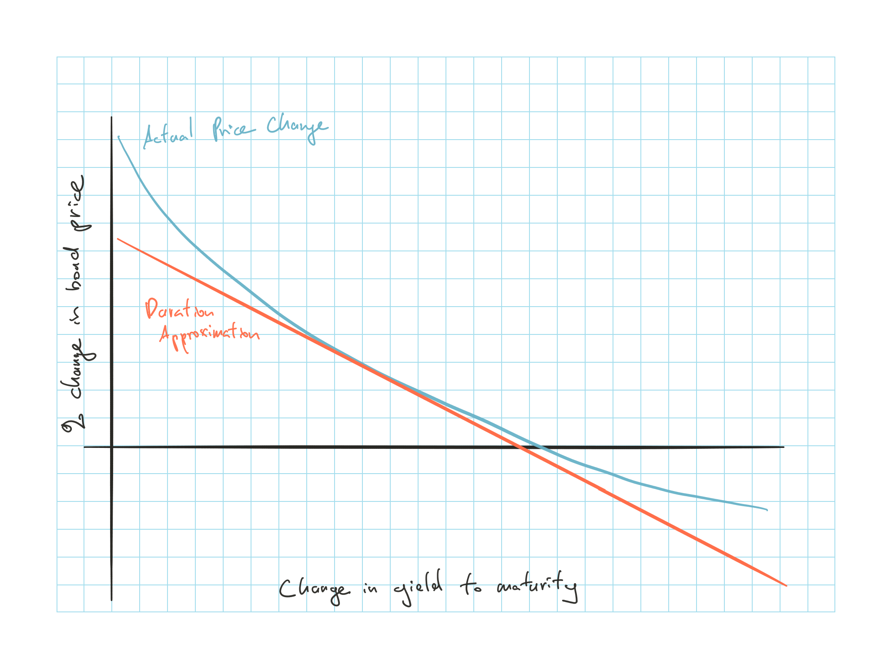

### Convexity Calculation

$Convex = \dfrac{1}{P \cdot k^2 \left( 1+\frac{y}{k} \right) ^2} \sum \limits_{t=1}^n CF_t \cdot t \cdot (t+1) \left(1 +\frac{y}{k} \right)^{-t}$

* $y$: Annual rate compounded $k$ times per annum

* $n$: Period at which each cash flow is made (e.g. semi annual compound $\Rightarrow$ $n=1$ is @ 6mos)

* $P$: Price of bond ($\sum$ PV of the future cash flows)

For continuously compounded

$Convex = \dfrac{\sum CF_t \cdot t^2 \cdot e^{-yt}}{P}$

* $t$: time at which the cash flow is made (e.g. $t=0.5$ for 6 mos)

### Estimated Chg in P (w/ Convexity)

$\dfrac{\Delta P}{P} = - D \left[ \dfrac{\Delta y}{1+y} \right] + 0.5 Convex (\Delta y)^2$

### Convexity of a Callable Bond

Issuer can recall the bond if its price reaches a certain level

convexity of a callable bond is different to that of a regular bond as the callability option places a ceiling on the price to which the bond can rise

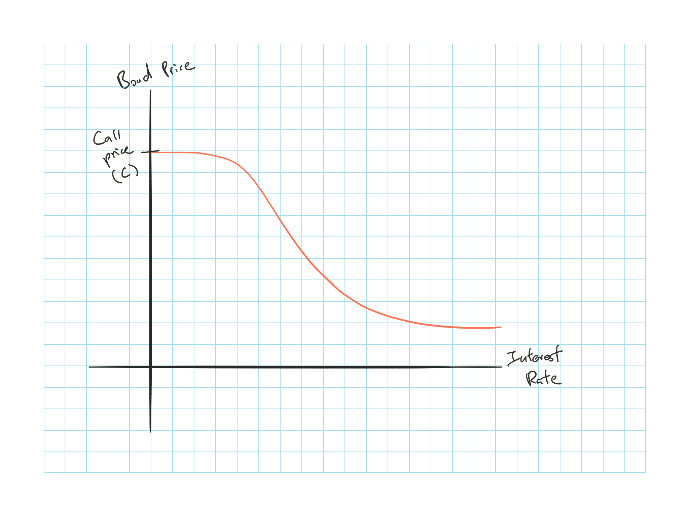

When the yield falls enough, the value of the bond compressed to the call price

Shape of the curve at that region have negative convexity, which is unfavorable to investors $\Rightarrow$ Unfavorable to investors as $\uparrow$ in i interest rates produces a larger price $\downarrow$ than the price increase produced by an equivalent decrease

#### Effective Duration

Difficult to calculate duration of callable bonds as the future cash flows are unknown

Use effective duration: $-\dfrac{\Delta P}{P} \dfrac{1}{\Delta r}$

## Passive Bond Management

Passive investors assume bond prices are fair $\Rightarrow$ Goal is to control the risk of fixed income portfolio (not searching for underpriced bond)

1) Immunization
2) Cash flow matching

### Immunization

Strategies used to protect the portfolio from interest rate fluctuations

* E.g. asset liability mismatch as assets have longer duration than liabilities; mismatch between interest rate sensitivity of fund assets and liabilities

2 types of interest rate risk:

1) Price risk
2) Reinvestment rate risk

**Immunization**:  
Process where an investors creates a portfolio with duration equal to the investment horizon so that the price risk and reinvestment risk cancels out

1) PV(Asset) $\geq$ PV(Liabilities)
2) Duration(Asset) = Duration(Liabilities)
3) Convexity(Asset) $\geq$ Convexity(Liabilities)

Duration is not constant:

1) duration $\Delta$ as rate $\Delta$ 
2) duration $\downarrow$ as time passes

$\hookrightarrow$ **Need to rebalance** the portfolio to remain immunized

 **Caveat**

1) Assumes flat yield curve
    * Or else need to discount all $CF_t$ with it's respective spot rate
2) Only effective for parallel shifts in yield curve
    * The whole curve shifting up and down by the same amount
3) Inappropriate in an inflationary environment
    * More on the Feldblum paper
    
### Cash Flow Matching/ Dedication

**Cash flow matching**:  
Buy a ZCB will make a payment that exactly matches the future obligation

**Dedication strategy**:  
Cash flow matching over multiple periods by purchasing a combination of coupon paying bonds and/ or ZCB to match a series of obligations

**Advantages**:

* Automatically immunizes the portfolio from changing interest rates
* Doesn't need to rebalance

**Disadvantages**:

* Difficult to implement as they impose strong constraints on the bonds that can be select

### Active Management

Try to gain additional value by selecting bonds believed to provide better returns than a benchmark index

Potential value:

* Interest rate forecasting, increase portfolio duration if rate declines are expected and vice versa

* Identification of relative mispricing e.g. identify bonds believe to have too high of a default premium

Similar to equities, active management will only generate abnormal returns if the insight is superior

4 types of bond swaps rebalancing strategies:

1) **Substitution swap**: Exchange for an almost identical substitute as we believe the market has mispriced the 2 bonds

    * Caveat is that it might actually because one is riskier 

2) **Intermarket spread swap**: If investors believes the yield spread between 2 sectors is temporarily out of line

    * Caveat is that spread might have changed due to expectations of additional risk

3) **Rate anticipation swap**: Move to longer duration bonds if anticipate rate decrease

4) **Pure yield pickup swap**: Move to higher yield bonds

    * If yield curve is upward sloping then moving to a loneger term bond but this is not exploiting mispricing

**Workout period**: the temporary period that is out of alignment (in 1 and 2)

**Tax swap**: To exploit tax advantage by swapping to bond that has decreased in price to receive the tax benefit from the capital loss

## Manage Interest Rate Risk with Securities

New few sections discuss tools to modify the duration of a portfolio

## Mortgage Backed Securities

Mortgage loans that are combined and resell

Callable risk due to potential of homeowner prepaying the loan at any time

Mortgage back derivatives such as collateralized mortgage obligation can help investors manager interest rate risk

* Segments the cash flow from the MBS into different tranches that have different levels of risk

* e.g. Lower tranches have their principal repaid before the higher tranches $\Rightarrow$ Different effective duration

## Swaps

Agreement between two parties to exchange future cash flows

### Interest Rate Swap

Pays a predetermined fixed rate on a specific principal and receives floating interest on the same principal during the same time period

Swap can be used to transform a floating rate loan into a fixed rate loan and vice versa

* Similarly, it can change the nature of an asset

Typically the swap is facilitated by a financial intermediary that earns a few basis point off the transaction and act as market makers

**Swap rate** is the average of the bid/offer rates from the market maker

Legal agreement underlying the swap is called a confirmation

**Day count difference**

LIBOR rates

* $\dfrac{\text{Actual}}{360}$ basis

* LIBOR based floating rate payment = $\dfrac{L \cdot R \cdot n}{360}$

    * $L$ = principal
    
    * $R$ = LIBOR rate
    
    * $n$ = # of days since the prior payment
    
Fixed rates

* $\dfrac{\text{Actual}}{365}$ basis, or $\dfrac{30}{365}$

* Apply to a full year

#### Comparative Advantage

When the difference between the fixed rates > difference in floating

Total gain to the parties = Difference in fixed - difference in floating

When structuring the diagrams, keep one of the flow as LIBOR to keep things simple

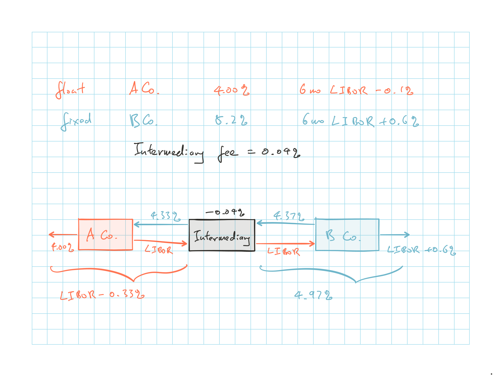

**Criticisms**

The difference in the spreads exists because the fixed rates apply for the entire term and the floating is reviewed everything 6 months

Probability of default by a company with low credit rating increase faster than company with a high rating $\Rightarrow$ Greater spread for the lower rating company as the term increases

The lower rating company's fixed rate is subject to its ability to continue borrow at the current floating rate

While the higher rating company's rate if actually locked in for the entire period subject to credit risk from the intermediary

#### Nature of Swap Rates

Not risk free but close

Financial institution can earn the $n$ year swap rate by:

* Lending the principal to different high rate borrowers during consecutive short terms over the $n$ year term

* Enter into a swap to convert the floating income from the loans into the $n$ year swap rate

The $n$ year swap rate is exposed to credit risk corresponding to a scenarios where the consecutive short term loans are made to high rate borrowers

Risk is lower than lending to a borrower with a high initial rating for the entire $n$ year term

#### LIBOR/ Swap Zero Rate

**Background**

LIBOR is used for proxy for risk free but it only observable for maturities out to 12 months

Extending LIBOR:

* Eurodollar futures can produce a d LIBOR zero curve out to 2 years (or 5 years)
* Use Swap rates to extend LIBOR zero curve further $\leadto$ LIBOR zero curve or LIBOR swap curve

**Extending LIBOR/ swap zero curve with swap rates**

For bond with coupon = swap rate $\Rightarrow$ $B_{fix} = B_{fl}$ since value of the swap is worth zero

Newly issued $B_{fl}$ = principal value (given that LIBOR/ swap zero is used for discounting)

$\therefore$ Swap rate define a set of par yield bonds

We can then use the bootstrap method to determine the LIBOR/ swap zero curve

#### Valuation of Interest Rate Swaps

 **Bond Method**

Assume principals are exchanged at inception and maturity (which it doesn't) $\Rightarrow$ Swap = long position in fixed rate bond and short position in a floating rate bond (p.o.v. of floating rate paying)

* $V_{swap} = B_{fix} - B_{fl}$

$B_{fl} = (L + k^*)e^{-r^*t^*}$

* Value of floating rate bond is worth the notional principal immediately after the coupon payment

    * Since floating bond is traded at par after coupon is paid elaborate a little

* $L$ = principal

* $k^*$ = next floating payment to be made at $t^*$

* $r^*$ = LIBOR/swap zero rate for maturity $t^*$

 **FRAs Method**

View as a portfolio of FRA

* First set of payments are known at the time the swap in negotiated

* Future payments can be viewed as FRAs and assume that the forward rates will be realized

We don't have to assume principal changes hand for this method

1) Calculate the $f_i$ for future points in time between each interval

    * Convert to $k$ compounded rate if the one given is continuous
    
2) Floating $CF_t$ for the first period is based on actual LIBOR $\times$ $L$; The subsequent $CF_t$ are based on $f_i$'s $\times$ $L$

3) Calculate the NPV of the cash flow between fix and floating

Swap should initially be worth close to 0 $\Rightarrow$ Sum of the values of the FRAs must be close to 0 but not necessarily for each of them individually

### Overnight Indexed Swaps

*Not very testable*

Overnight rate:

* Borrow and lend with other banks to satisfy liquidity needs at the end of each day

* Set by central bank

Overnight indexed swap:

* Fixed rate is exchanged for the geometric average of the overnight rates over a period

* Convert overnight borrowing/lending at the *overnight rate* borrowing/lending at the *fixed rate*

Example:

1) X borrow 100M in the overnight market for 3 months and roll the loan forward each night
2) X lend 100M for 3 months at LIBOR to Y
3) Use OIS to swap the overnight indexed swap rate for the overnight rate

$\hookrightarrow$ X is effectively paying the 3 month overnight indexed swap rate and receiving the 3 month LIBOR rate

Overnight indexed swap rate is typically lower than LIBOR

* e.g. X needs to compensate for the fact that it is exposed to the risk that Y will default on its loan

$\hookrightarrow$ LIBOR-OIS-spread, measure stress in the financial markets

### Currency Swaps

Exchanging *principal* and *interest* payments in one currency for another currency's

Principal is usually exchanged at inception and maturity

#### Comparative Advantage

Similar to interest rate swaps, the total gain = difference between the 2 company for the two currency

The deal should be structured such that only the financial institution is exposed to the FX rate risk

* It can hedge that with a forward

Comparative advantage here is genuine, might be due to tax

#### Valuation of Currency Swaps

 **Bond Method**

$V_{swap} = B_D - S_0 B_F$

* Receive domestic and paid foreign

* $B_F$: Value in foreign currency of the bond in foreign currency

* $B_D$: Value of the bond in domestic currency

* $S_0$: Spot FX rate of $\dfrac{\text{Domestic}}{\text{Foreign}}$

 **FRAs Method**

Forward FX Rate @ $t$ = $\dfrac{D e^{r_D t}}{F e^{r_F t}} = S_0 \dfrac{ e^{r_D t}}{e^{r_F t}}$

1) Convert the foreign cash flow into domestic with the forward FX rate

2) Discount net cash flow with the domestic rate

When 2 currencies have significant different interest rates, the payer of the currency with the high rate will be in a position where the forward contracts associated with the earlier cash flows with have negative value $\Rightarrow$ Impact the credit risk at a given point in time

#### Credit Risk

The intermediary will be fully hedged as long as the swap parties do not default

If one of the swap parties default, the intermediary will have to still honor the contract or find a third party to take the position

If the negative value party default, the intermediary will just sell that to another party

Potential losses from defaults on swaps are much less than loans with similar principal amounts as the value of the swap is only a small percentage of the value of the load

* Potential losses from currency swap is greater than interest rate swaps because the principal are exchanged at the end so the swaps will have greater value at the time of default

Due to systematic risk concern of credit risk from OTC swaps, clearing houses are used for swaps. Where it requires initial and variation margins as the value of the contracts change

## Past Exam Questions

 2000, Q14
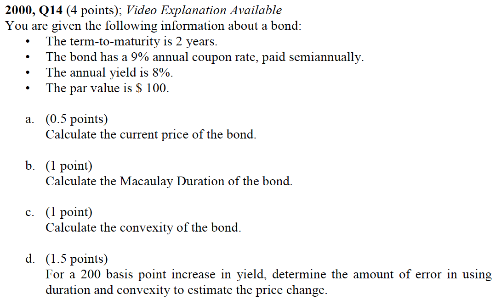
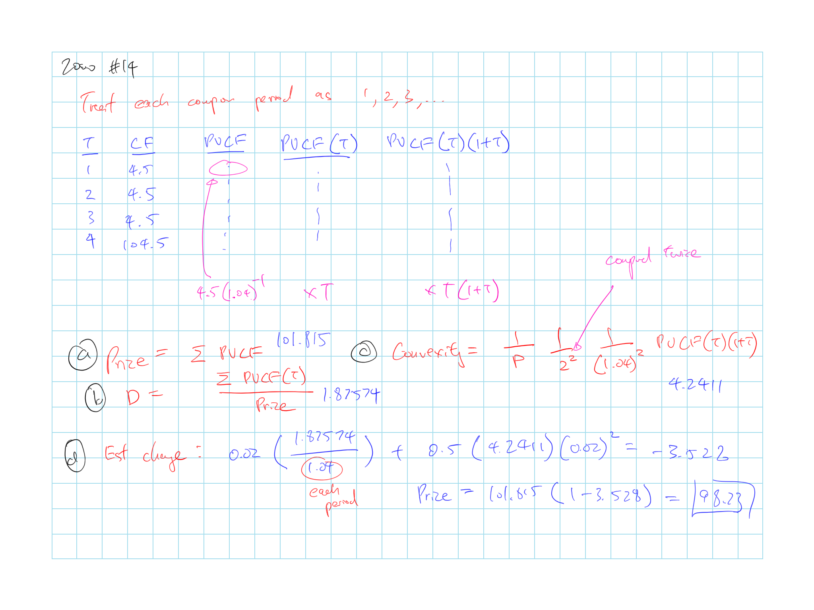

 2003, Q34
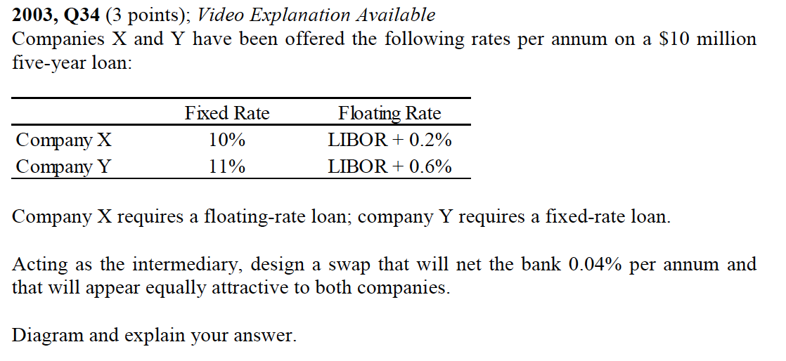
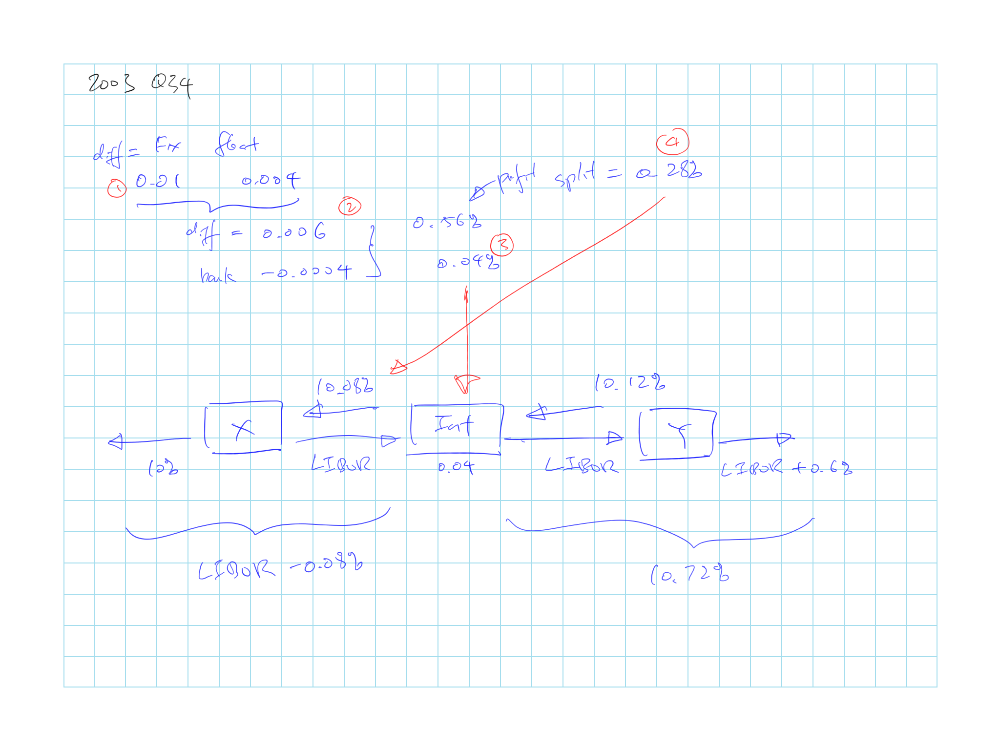

 2003, Q35
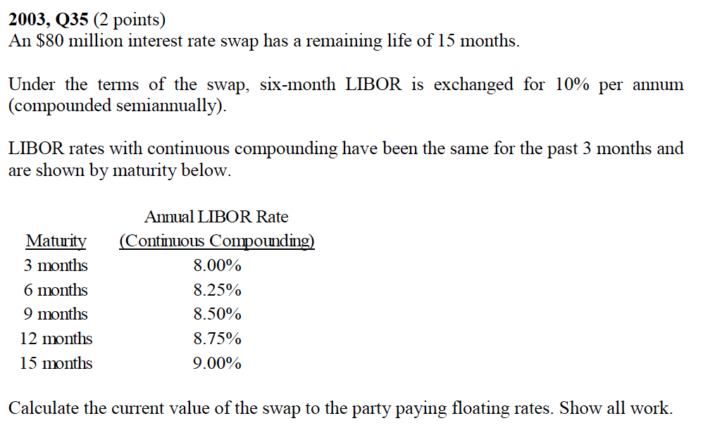
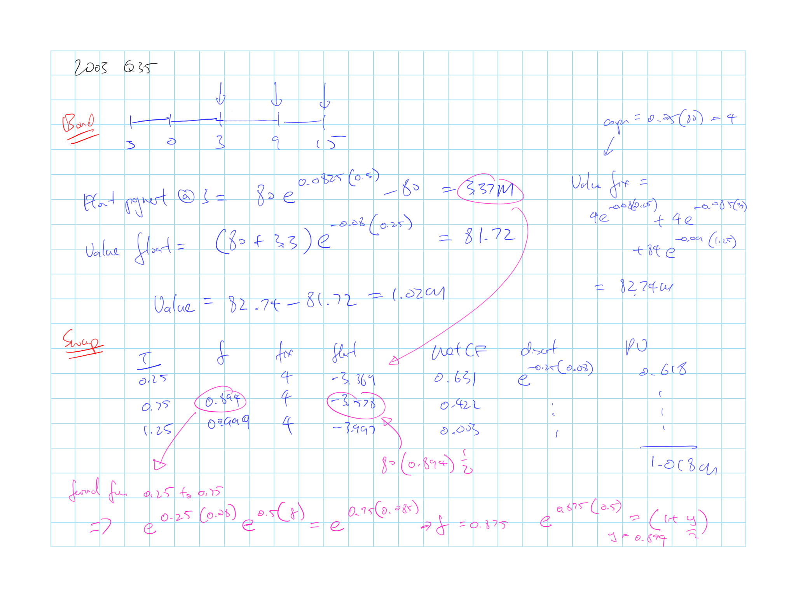

 2005, Q25
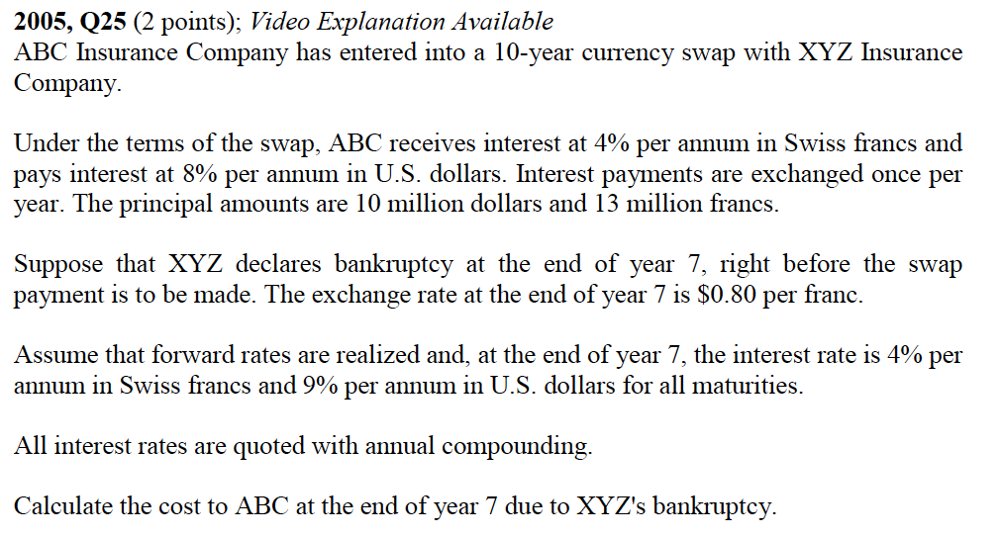
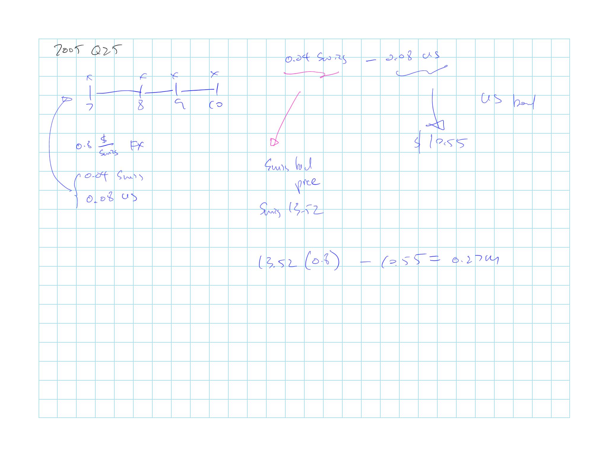

 2013, Q7
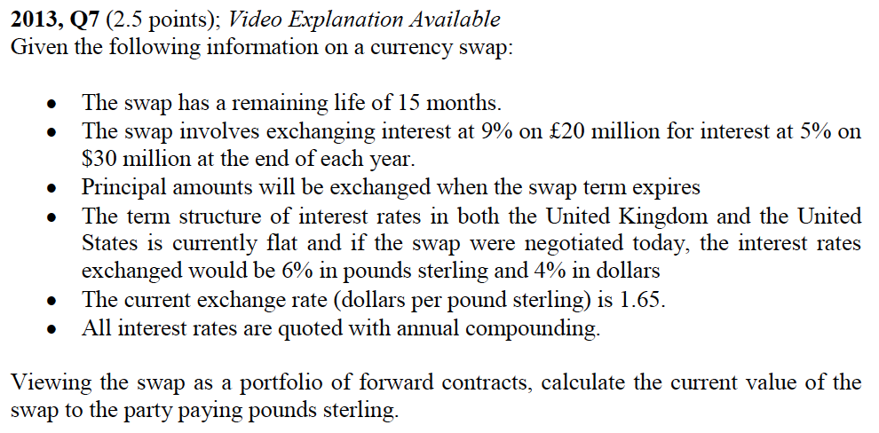
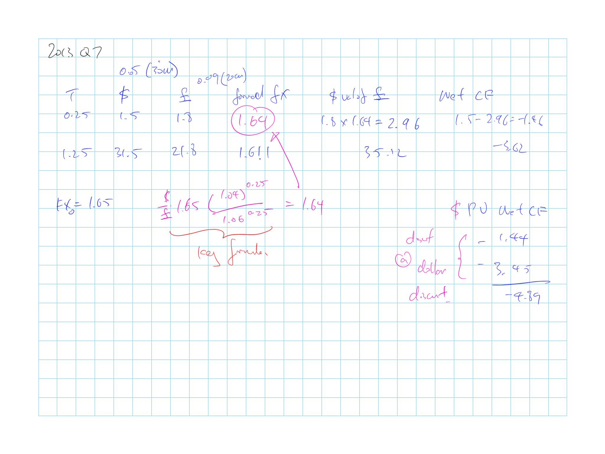