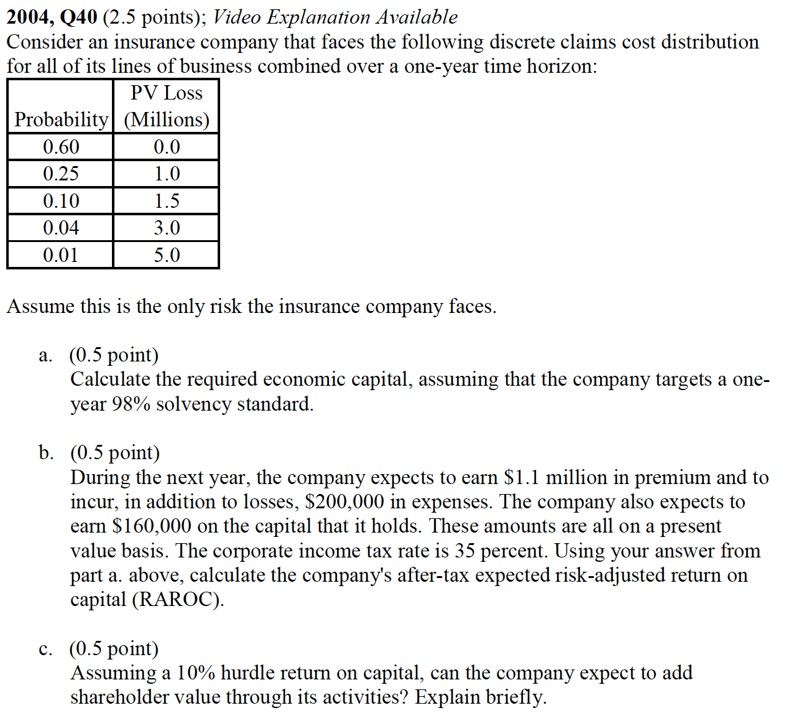
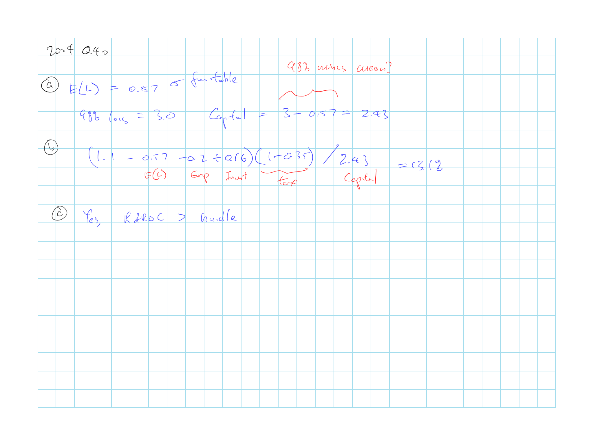
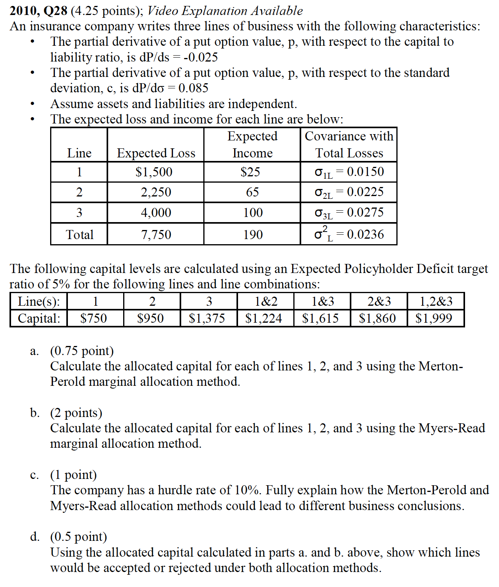
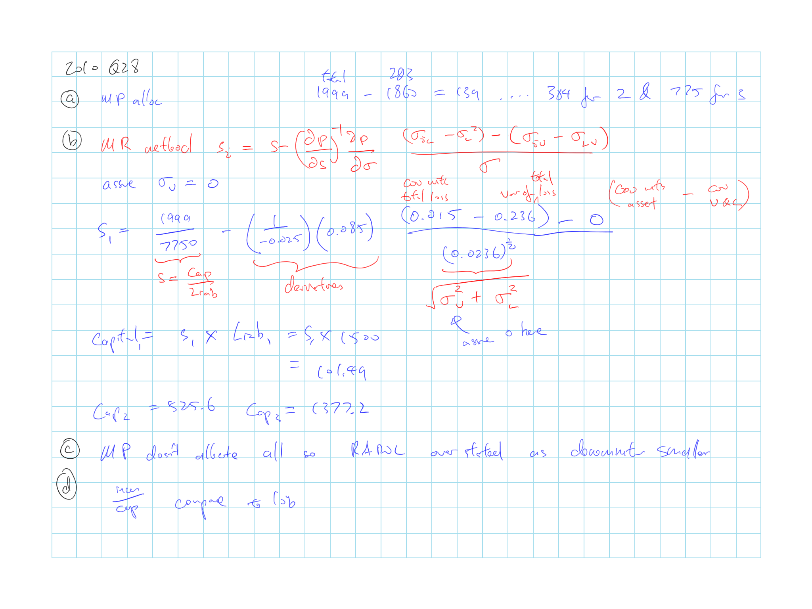
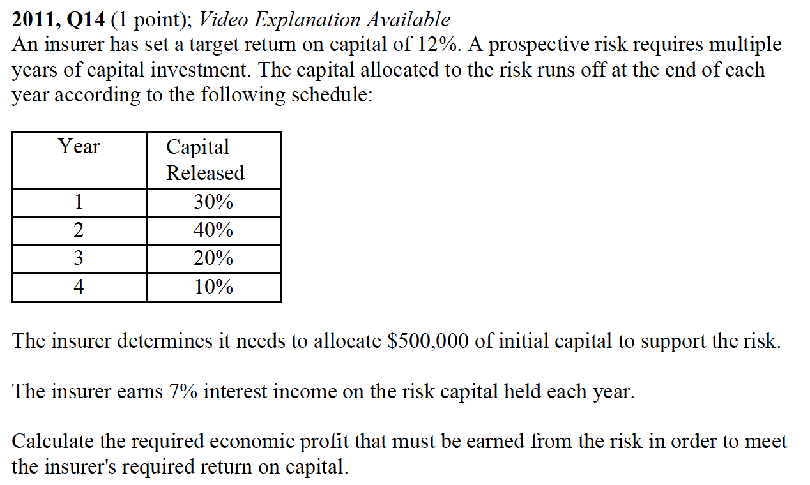
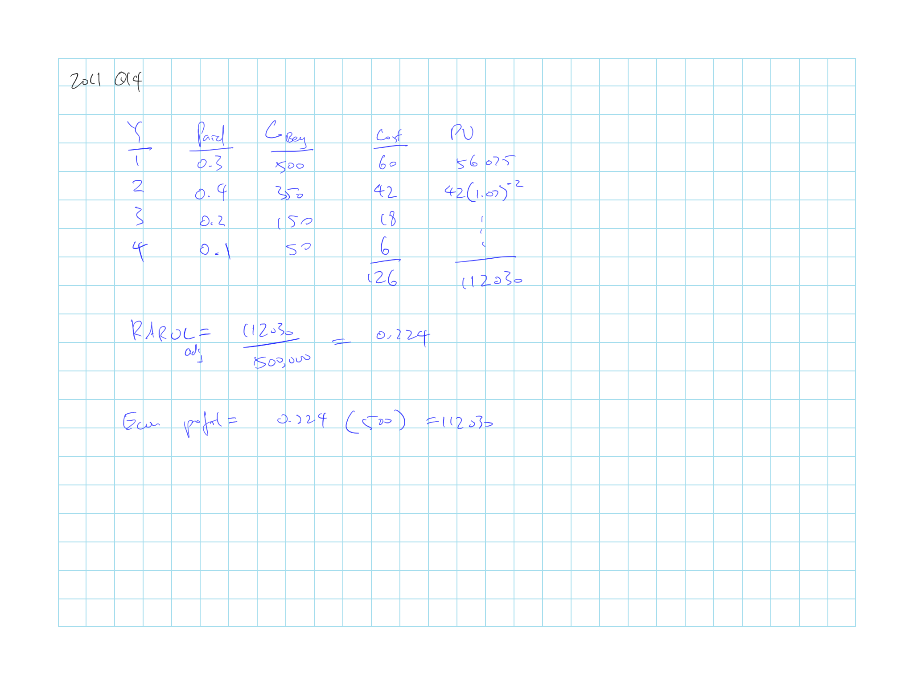
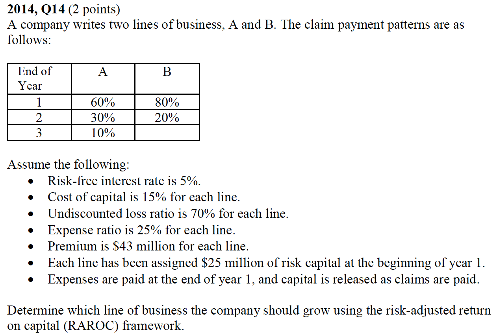
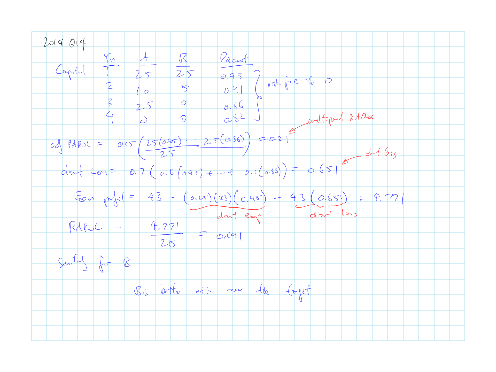

## Cliff's Summary

Know this well since it typically has 2 questions in a year

Talks about the [income](#income) and [capital](#cap) measures to get the RORAC

Need [risk measures](#risk-measure) to get the risk capital

3 different ways to select a [threshold](#threshold) for the risk measures

Major risk source of a insurer includes [market](#market), [credit](#credit), [insurance underwriting](#ins-uw) (Reserve, U/w, CAT), and other such as op risk and strategic risk

All different risk sources need to be aggregated and [dependencies](#aggre) quantified

Once we have the total risk capital we can allocated them with different methods of allocation

* [Proportional](#prop)
* [Incremental](#inc)
* [Marginal](#mar)

    * $s_i = s - \left(\dfrac{\partial p}{\partial s}\right)^{-1} \left(\dfrac{\partial p}{\partial \sigma}\right) \dfrac{(\sigma_{iL} - \sigma_L^2) - \overbrace{(\sigma_{iV} - \sigma_{LV})}^{=0 \text{ if asset }\perp\!\!\!\perp \text{ liab}}}{\sigma}$

* [Co-measures](#com)

RORAC can be used for:

* Assessing capital adequacy
* Setting risk management priorities
* Evaluating alternative risk management strategies
* Risk adjusted performance measurement
* Insurance policy [pricing](#pricing)
    * Know how to get the RORAC for a line
    * [Multi period](#multi) commitment

Other practical considerations

* Time horizon of market and insurance risk don't match
* Look at alternative return measures and consider the cost of stranded capital
* Focus on less extreme events
* RORAC is driven by many assumptions along the way so shouldn't be the sole measure used

### Types of Exam Questions

Quesitons:

* Economic capital with 95% solvency is just 95% VaR - mean? Why is that
* What should the time period for the income and capital be?

Haven't done TIA practice questions

**RORAC**

* [2004, Q40](#2004-40): RORAC with prob of loss given
* 2005, Q42: RORAC calc
    * Econ capital here can be VaR over mean or reserve
* 2008, Q35: RAROC and EVA; additional margin = required income calculated based on EVA less actual and discounted based to time 0
* 2008, Q37: RORAC comparison by line
* $\star$ 2009, Q31: Co measure allocation; additional risk margin; RORAC
* $\star$ 2010, Q27: Lots of disgesting the information; RORAC, capital allocation
* $\star$ [2010, Q28](#2010-28): Myers Read method
* 2011, Q13: Back out combined ratio from RAROC and what captial would be under MP for lines with high correlation
* $\star$ [2011, Q14](#2011-14): Multi period
* 2013, Q15: analyze 2 lines (invest in both if both over cost of capital)
* $\star \star$ [2014, Q14](#2014-14): RAROC multi period
* $\star$ 2015, Q15: Econ Profit only vs RAROC; adjust premium to match RAROC
* $\star$ 2015, Q18: RAROC

**Capital Allocation**

* 2008, Q36: Capital allocation by Co-CTE
* $\star$ 2012, Q10: allocation with proportional, incremental; risk capital vs book value
* $\star$ 2014, Q12: allocation with CTE and VaR (for VaR 99.5% is the 6th highest number); Var vs CTE; identify difference with CTE

**EVA**

* 2006, Q38: Simple EVA calc

**Concepts**

* 2007, Q35: Capital measures; risk measures; allocation methods; Each LoB should have different rate
* 2013, Q16: economic capital is important to s/h to achieve capital adequacy objective to pay dividends and grow business; for p/h is to achieve solvency objective
    * risk cap vs market cap: mkt includes franchise value not risk adjusted; risk cap = amount of capital to protect the firm from the risk that it is exposed to, lower than market cap
* $\star$ 2015, Q17: CAT exposed line needs higher premium risk; reserve risk for long tail; long tail also higher interest rate risk; CTE would give more capital to CAT risk prone line
    
## Introduction

Risk adjusted performance measures

* Explicitly reflect the risks to which a business is exposed
* Adjusting either numerator or denominator of the return

**Risk-adjusted return on captial** (RAROC)

* $RAROC = \dfrac{\text{Income}}{\text{Risk-Adjusted Capital}}$

* Adjusts denominator

* Focus of this paper

## Income Measures

**GAAP Net Income**

* Based on GAAP accounting
* Convenient when RAROC is used in management decisions

**Statutory Net Income**

* Based on Stat accounting

**IASB Fair Value**

* Based on fair value accounting
* Removes accounting biases of various accounting conventions

**Economic Profit**

* Change in economic value of the firm over a period
* MV asset & discounted liabilities
* Caveat:
    * Ignores franchise value
    * Make less sense to management as they do not reconcile with GAAP
    * Difficulty in justifying decisions to external parties that only have access to Stat and GAAP accounting
* Basis for this paper

## Capital Measures

Not risk adjusted

* **Actual committed capital**: actual capital provided by shareholders
    * Just capital a point in time, not prospective
    * Volatile based on past u/w performance
    * However it is reliable and readily available
* **Market value of equity**: market capitalization

Risk adjusted

* **Regulatory required capital**
* **Rating agency required capital**: necessary for a specific rating
* **Economic capital**: capital necessary to provide the firm with a certain probability of achieving a specific objective over the time horizon
    * Solvency objective: firm can meet existing obligations to policyholders
    * Capital adequacy objective: firm can continue to pay dividends/ grow premiums/ maintain a certain financial strength
* **Risk capital**: amount of capital the needs to be provide by the shareholders to cover the risk that the liabilities may exceed the funds already provided (in the form of loss reserve or premium)
    * Dependant on risk metric

***

Risk based measures of the required capital are typically much lower than the market value of the firm's equity $\Rightarrow$ May result in an understated number when using the risk adjusted capital to determine the cost of capital

* Alternative is to allocate actual capital using a risk based approach

## Risk Measures

Derive the necessary amount of capital

**Percentile risk measure**: provides a capital required to achieve a certain probability of ruin (asset < liabilities)

* Probability of ruin: estimated probability that losses exceed capital
* VaR: dollar amount that will not be exceeded in the next N days with X% certainty

**Conditional Tail Expectation**(CTE): mean loss of all the losses that exceed a certain percentile

**Expected Policyholder Deficit Ratio**

### Threshold Level

**Bond default probabilities** @ a selected credit rating level

Maintain enough capital that would result in a probability of default of the firm equal to the probability of default of a bond with a specific credit rating

Disadvantages:

* Need to select credit rating target
    
* Does not account for downgrade risk
    
Cautions on industry default rate data

* Historical vs Current estimate: stability vs responsiveness
    
* Source of default statistics may indicate different numbers due to using data from different periods
    
* Time horizon: data is typically annual default probabilities, while risk capital models are often based on default during the lifetime of the liabilities

**Management's risk preferences**

Threshold based on the risk tolerance of management

Disadvantages:

* Difficult to articulate and agree on

* Preferences will be differ to preferences of directors and shareholders

* Does not factor in risk, which is important consideration to compare to reward

* Hard to isolate the estimate of the threshold to just the probability of default

    * Likely be focused on a number of issues that concern policyholders
    
**Arbitrary default probabilities**

Arbitrary percentile that is relatively easy to measure

Does not have to estimate values at very low probability of occurrences, where a lot of uncertainty exists

## Risk Sources

* Market risk
* Credit risk
* Insurance u/w risk
* Operational risk
* Strategic risk

### Market Risk

Risk to the firm's current investments from changes in market variables

* e.g. equity indices, interest rates, FX rates

Financial industry typically calculate them based on very short duration (< 10 days)

Insurers however typically calculate them over a 1 year horizon to make it easier to aggregate with the other risks to which it is exposed

### Credit Risk

Risk of loss due to credit events

* e.g. counter-party default, changes in counter-party rating etc

3 sources of exposures:

Firm's investments in **securities** may lose value from credit events

* Marketable securities/ derivatives/ swap positions etc

**Insured's** contingent premium and deductible receivable

* e.g. loss sensitive premium adjustments, deductibles
    
* Risk that the insured may not pay the balance it owes

**Reinsurance recoverables**

* Most difficult to estimate
    
* *Definition of default* should be modified

    * Reinsurer's credit get downgraded can lead to death spiral where policyholders try to end their contracts $\Rightarrow$ liquidity problems $\Rightarrow$ Settle claims for < 100% of the full amount
    
* Substantial *contingent exposure*

    * Recoverable at a given point in time may increase in the future due to adverse loss development $\Rightarrow$ Credit risk exposure will increase as well
    
* Reinsurance credit risk is highly *correlated with the underlying insurance risk*

* Includes partial default where settling at less than full recovery due to disputes

### Insurance Underwriting Risk

3 categories:

1) Potential adverse development of loss reserve on prior policy years
2) Underwriting risk for the current policy year
3) Property CAT risk

***

#### Loss Reserve Risk

Total Reserve Risk = Process Risk + Parameter Risk + Model Risk

**Process risk**: deviation from expected due to random variation inherent in the claim development process

**Prarmeter risk**: deviation from estimate due to inaccurate parameters

**Model risk**: deviation from estimate due to use of the wrong model

We can try to quantify the uncertainty below

**Reserve estimation error**: range of uncertainty (depicted as a CI) associated with the reserve estimate

* Indicates how statistically reliable the estimate is relative to the true value

**Reserve distribution**: estimates the likelihood that the ultimate amount deviates from the current estimate

* Shows the probabilities of the full range of possible values for the unpaid loss

***

#### Underwriting Risk

Risk that the losses and expenses from the new business (written and/ or earned) during the risk horizon period exceeds the premiums collected

Methods to quantify:

**Loss ratio distribution model**

Based on assumed dist^n^ of LR (with estimates of WP during the risk horizon)

Parameters can be based on either empirical or industry data

Choice of distribution model will have material impact on the amount of uncertainty recognized

**Frequency & severity model**

Aggregate dist^n^ based on separate frequency and severity model

Requires sufficiently detailed claim data

*Advantages* (over LR dist^n^ model)

* Easier to account for premium growth
* More accurately reflect inflation
* More easily reflect changes in limit and deductibles
* Can account for impact of deductibles on frequency
* Can treat the split of losses between parties consistently

*Methods to generate the aggregate dist^n^*

* Analytical solution: generate based on the freq & sev parameters
* Numerical method: numerical approximation
* Approximation: based on the mean, variance of the collective risk model
* Simulation: allows for complex policy structures with minimal mathematical complexity, need large # of iterations for results to converge

**Inference from reserve risk model**

Inferring new business risk based on reserve risk models

Reserve risk model reflect the amount of risk conditional on information generated after the policy was written $\Rightarrow$ Not totally applicable

Need to convert these conditional models to unconditional

***

#### Property CAT Risk

Historical data is not the best indication of future losses

* Events are rate
* Exposures change over time
* Severity change over time due to changes in building materials and design

CAT models are used

CAT models modules:

* Stochastic module/ hazard module:

    * Generate the events that can occur (location, intensity, etc)
    
* Damage (vulnerability) module:

    * Derives the damage that would arise from an event, based on exposure information
    
* Financial analysis module:

    * Applies the insurance/ reinsurance terms to the losses to determine the financial impact to the insurer

### Other Risk

Operational risk: failure of people/ systems/ processes

Strategic risk: related to competitors

Difficult to quantify and is ignored in this paper

### Risk Aggregation

Aggregate the individual dist^n^ of the above risks

Need to consider dependency between the risks

* dependency $\neq$ correlation, as correlation looks at linear relationship

Methods to quantify dependency:

**Empirical Analysis**

Disadvantage:

* Usually insufficient data
* Little insight as to how the dependencies will change during tail events

**Subjective Estimates**

Advantages:

* Can account for tail events
* Reflects user's intuition

Disadvantages:

* As number of risk categories increases, # of dependency parameters that need to be estimated increases exponentially

**Explicit Factor Models**

Link the variability of the risks to common factors

***

Methods to aggregate dist^n^ once the dependency has been estimated

* Closed form solution
* Approximation method: e.g. assume normal/lognormal and then derive the parameters of the aggregate
* Simulation methods
* Square root rule (See Butsic)

## Capital Allocation

Allocation to different risk sources once the aggregate amount of risk capital is determined

### Proportional Allocation

Proportional allocation based on a risk measure

Allocate risk measure in proportion to the risk measure applied to each unit

$r(X_j) = \dfrac{\rho(X_j)}{\sum_i \rho(X_i)} \rho(Y)$

Risk measure used can have a material impact on the allocation

### Incremental Allocation

Allocate based on the incremental contribution of the particular risk to the risk measure

* Incremental risk measure = Total risk measure - all other risk measure
* The allocation % is then applied to the total risk measure

### Marginal Allocation

Based on marginal increments of risk

**Myers-Read method**

View the insurer's owner as having an option to default on the obligation

* Put option on the $\dfrac{\text{Asset}}{\text{Liability}}$ with strike = 1.0

* Potential losses usually $gg$ assets of a firm

* Value of the put options $\uparrow$ as the amount of risk $\uparrow$ and $\downarrow$ as capital held $\uparrow$

Capital is allocated to equalize the marginal impact of each LoB on the value of the option

$s_i = s - \left(\dfrac{\partial p}{\partial s}\right)^{-1} \left(\dfrac{\partial p}{\partial \sigma}\right) \dfrac{(\sigma_{iL} - \sigma_L^2) - \overbrace{(\sigma_{iV} - \sigma_{LV})}^{=0 \text{ if asset }\perp\!\!\!\perp \text{ liab}}}{\sigma}$

* $s_i$: $\dfrac{\text{Capital}}{\text{Liability}}$ for the LoB

* $s$: Aggregate $\dfrac{\text{Capital}}{\text{Liability}}$

* $\dfrac{\partial p}{\partial s}$: partial derivatives of the put value 
w.r.t. $s$

* $\sigma_{iL}$: Covariance of the LoB's losses with the aggregate 
losses

* $\sigma_{iV}$: Covariance of the LoB's losses with the assets

* $\sigma$: overall s.d. = $\sqrt{\sigma_V^2 + \sigma_L^2}$

Method may not be practical if the risk sources can not be represented proportional to revenue or expected losses or if it is difficult to determine the marginal impact

Once we have the $s_i$, multiply them by the liability for each LoB $i$ to get the capital

Notes:

* Method was not developed to determine risk adjusted capital requirement
* Requires significantly more quantitative resources than other methods
* Mathematical challenges have indicated that the method may not be appropriate for most insurance applications
* Capital allocated to a line is $\propto$ covariability with the loss portfolio and *inversely* $\propto$ covariability with the asset portfolio
* Method allocates all the capital

### Co-Measures Approach

Risk measure has to be adopted to determine the capital requirement of the entire firm

Co-measure = calculating the equivalent risk measures for the individual LoB in the cases where the *firmwide* measures exceed a threshold

## Guiding Strategic Decisions

Applications of risk adjusted performance metrics

**Assessing capital adequacy**

* Does the firm have enough capital to meet the policyholder obligations
* Does management understand the source of risks in business
* Doe management actively measure/ manage its exposure to risk

**Setting risk management priorities**

* Identify segment that is generating the most risk capital

**Evaluating alternative risk management strategies**

* Examine the impact of a risk management strategy on RAROC

**Risk adjusted performance measurement**

* See following section

**Insurance policy pricing**

* See following section

### Performance Measurement

Traditional measures can be misleading as they do not account for the level of risk

Use RAROC to reflect the level of risk adjusted return

* e.g. use economic profit / Co-CTE allocated capital

RAROC measurement is highly sensitive to the capital allocation method used

### Insurance Policy Pricing

Set price targeting a specific RAROC

* e.g. determine the additional risk margin needed to arrive at the target

Additional risk margin:

1) RAROC $\times$ Allocated Capital = Required economic profit
2) Additional risk margin = Discounted(Required - current)

* Assume the risk margin is earning the same expected rate of investment as the premiums; or assume it is invested at risk free

$RAROC = \dfrac{(\text{Original Premium} + \text{Risk Margin} - \text{Expenses}) \times (1 + \text{Expected Invested Income}) - PV(\text{Expected Claims})}{\text{Allocated Capital}}$

***

#### Investment Income on Allocated

Economic profit above did no include investment income expected to be earned on the risk capital

$\therefore$ Target return = XS return over the investment rate

True target return needs to include the investment return on risk capital

***

#### Multi-Period Capital Commitment

Above assumes capital is only held for one period

Assume risk capital is released at the same rate as they are paid

* $C_t$ based on % unpaid

Adjusted target RAROC = $R \left[ \dfrac{\sum_t C_t (1 + r)^{-t}}{C_1}\right]$

* $r$ = investment rate
* $C_t$ = beginning risk capital for period $t$
* $R$ = single period target RAROC

Target Economic Profit = Adjusted Target RAROC $\times$ Capital

***

#### Cost of Risk Capital

Methods in the industry that are commonly used to derived the cost of risk capital:

* CAPM and Fama French

Issues:

* Definition of risk in CAPM is the systematic risk associated with an investment

    * RAROC is based on different type of risk
    
    * Depending on the risk measure, it's the difference between the cash flow's expected value and the values in the tail
    
* Denominator of the RAROC calculation is understated as it does not account for the franchise value $\Rightarrow$ RAROC is overstated

## Practical Considerations

Simplifications

### Time Horizons

Inconsistent time horizons between market risk and insurance risk

**Potential solution 1**: look at all risks over their potential lifetime

* Difficult to quantify some parameters over the long term e.g. equity prices, interest rates, FX
* Over the long term, there will likely be changes to the investment portfolio

**Potential solution 2**: look at change in value of the insurance liabilities over 1 year horizon

* Little available methods/data to estimate the timing of the recognition of adverse loss development

* change in value for loss reserve won't be totally consistent with market risk

    * Mostly focus on the best estimate of the reserve vs
    
    * Market risk is based on market value, includes a risk margin
    
* Information that would result in revaluation of the liabilities is often not available over the short term $\Rightarrow$ Likely be minimal change in the liability valuation despite potential significant risk over the long term

***

Models typically ignores the inconsistency

Can argue that only insurance related risk should be aggregated and apply haircut to assets for the market and credit risk

### Alternative Return Measures

There are alternatives to Economic Profit such as accounting based return

Return measures are sometime reduced by the **cost of stranded capital**

* Capital XS of actual capital over the risk capital
* Or XS over regulatory or rating agency capital

$\hookrightarrow$ Adjustment is equivalent to allocating all capital instead of just the risk capital in the initial stages of the calculation

### Risk Based Allocation

Risk measures that focuses on the tail allocates more of the capital to segments with the most skewed losses

This might make sense for regulatory or risk management perspective

Might not be the most appropriate in terms of guiding business decisions $\Rightarrow$ Focus on less extreme events that would still impact the credit rating or financial strength

### Diversification Adjustments

Assumption selected will have a material impact on the derivation of the aggregate risk profile, allocation of risk capital and RAROC

$\therefore$ RAROC should not be the only metric used to drive decisions

## Past Exam Questions

 2004, Q40

 2010, Q28

 2011, Q14

 2014, Q14

