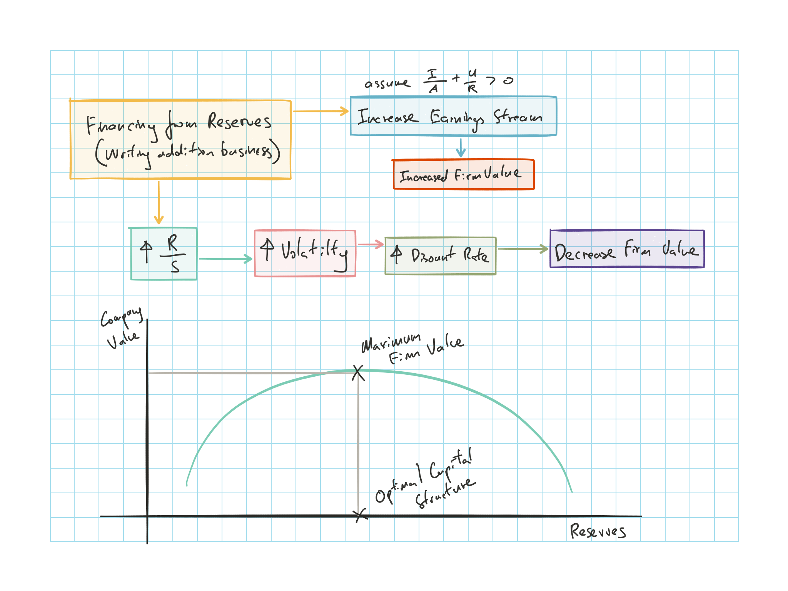

## Cliff's Summary

[Relationship](#formula1) of ROE and ROA

$\dfrac{T}{S} = \dfrac{I}{A} \left( 1 + \dfrac{R}{S} \right) + \dfrac{U}{P} \times \dfrac{P}{S}$

[Alt formula](#formula2)

$\dfrac{T}{S} = \dfrac{I}{A} + \dfrac{R}{S} \Big( \dfrac{I}{A} + \dfrac{U}{R} \Big)$

Look at the [optimal](#optimal) capital structure and factors that impact value of the firm:

* Expected earnings stream
* Rate at which they are discounted

$\hookrightarrow$ Mix of equity & liabilities impact both

How to [determine](#determine) the optimal captial structure and added [complexity](#complex) for insurer

Need to consider additional [interactions](#interaction) between ratios

### Types of Exam Questions

Haven't done TIA practice questions

**Calculation**

* 2001, Q17: ROE calc formula manipulations
* 2001, Q44: Formula manipulations
* 2002, Q27 a: ROE
* 2005, Q20: ROE
* 2006, Q18: Formula plug and play
* 2007, Q17: ROE calc (need to back out the u/w profit and R/S from just R/A)
* 2008, Q17: insurance leverage, exposure and ROE (need to make tax adj)
* 2009, Q8: Formla manipulations
* 2010, Q9: Formla backing out surplus
* 2011, Q15: insurance leverage, exposure and ROE

**Concepts**

* 2000, Q24: Continue to write business or not
* 2002, Q27 b: underwriting return as interest
* 2003, Q41: View $R$ as non equity capital; complication of debt with insurance; optimal portfolio mix
* 2005, Q20: interactions of ratios
* 2007, Q13: interactions of ratios
* 2009, Q9: Different interest on the return
* 2011, Q15: Insurance leverage factor and exposure
* 2012, Q12: interactions of ratios
* 2013, Q24: interactions of ratios
* 2013, Q25: impact of non equity financing
* 2015, Q21: 

## Impact of Leverage on ROE

 Relationship of ROE and ROA

$\underbrace{\dfrac{T}{S}}_{ROE} = \underbrace{\dfrac{I}{A}}_{ROA} \underbrace{\left( 1 + \dfrac{R}{S} \right)}_{\begin{array}{c} \text{Insurance} \\ \text{Leverage} \\ \text{Factor} \\ \end{array}} + \underbrace{\dfrac{U}{P}}_{ROS} \times \underbrace{\dfrac{P}{S}}_{\begin{array}{c} \text{Insurance} \\ \text{Exposure} \\ \end{array}}$

* $T$: total after-tax return to the insurer
* $S$: equity
    * Includes equity in UEPR
* $I$: investment gain or loss after tax
* $A$: total asset
* $R$: reserves & other liabilities
    * excluding equity in UEPR
* $U$: underwriting profit after tax
* $P$: premium
* Remember that $\dfrac{U}{P} = 1 -$ Combined Ratio

Different parties are interested in different components:

* Investors $\rightarrow$ ROE
* Society $\rightarrow$ ROA
* Regulators/ Actuaries $\rightarrow$ ROS

**Insurance leverage factors**: arises from reserve, essentially loans from the policyholder

### Reserves as Non-Equity Capital

 Rearranges the above equation

$\dfrac{T}{S} = \dfrac{I}{A} + \underbrace{\dfrac{R}{S}}_{(1)} \overbrace{\Big( \underbrace{\dfrac{I}{A}}_{(2)} + \underbrace{\dfrac{U}{R}}_{(3)} \Big)}^{(4)}$

1) Leverage to modify the return, increase leverage increase volatility
2) Return on asset, investment income, main source of return
3) U/w return: if negative $\approx$ interest cost incurred by the firm to use the reserve (as non equity capital)
4) Keep writing business if > 0

Formula used to decided whether or not to keep writing business

Increased insurance leverage results in increased variability in returns $\Rightarrow$ Greater level of risk associated with increased leverage

## Optimal Capital Structure

 **Optimal Capital Structure**:  
Mix of equity & liabilities that maximize the value of the firm

Factors that impact value of the firm:

* Expected earnings stream
* Rate at which they are discounted

$\hookrightarrow$ Mix of equity & liabilities impact both

Writing more business $\Rightarrow$ Growing the reserves has both (+) and (-) impact on the value of the company

 To determine the optimal capital structure

* Determine expected relationship between $\dfrac{I}{A}$ and $\dfrac{U}{R}$ and the resulting impact on the expected earning stream of writing more business

* Determine the increased probability of unfavorable result due to the higher volatility and resulting impact on insurer value due to higher discount rates

 Additional complexity for insurer

* Accounting for reserves is more complicated than accounting for debt
* Increased level of reserve does not necessarily implies a higher amount of premium written
* Possible for a higher level of premium will increase the diversification $\Rightarrow$ $\downarrow$ variability

Need to consider the volatility of the investment earnings stream

* If investment earnings are volatile, should reduce the leverage from reserves to prevent total risk from getting too large

Uses of the determination of optimal cash structure:

* If public believes that the company is not insuring enough people, company can justify by showing the optimal capital structure calls for relatively loss $\dfrac{R}{S}$ ratio

* Determine if overly aggressive investment portfolio is driving the low $\dfrac{R}{S}$

* If optimal structure requires higher $\dfrac{R}{S}$ than the average company it may suggest that the industry is overcapitalized

## Discussions by Balcarek

Need to be careful with the 2^nd^ formula

* It implies premium volume must grow as the $\left( \dfrac{I}{A} + \dfrac{U}{R} \right)$ term is (+)

* This ignores the additional risk from writing more premium

Ferrari's conclusions were derived by focusing on certain variables while holding everything else constant

However we need to consider interactions between variables

1. $\uparrow \dfrac{P}{S} \longrightarrow \; \downarrow \dfrac{I}{A}$

    * Higher portion of surplus is from current business and is therefore in form of cash or agent's balances which can not be invested
    
    * Higher $\dfrac{P}{S}$ results in more risk to owner's equity $\Rightarrow$ More conservative investment policies to compensate

2. $\uparrow \dfrac{U}{P} \longrightarrow \; \uparrow \dfrac{P}{S}$

    * Higher u/w profit means that insurers can write more business
    
    * This goes back to 1.
    
3. $\uparrow \dfrac{U}{P} \longrightarrow \; \uparrow \dfrac{I}{A}$

    * Higher u/w profit allows for more aggressive investments
    
4. $\uparrow \dfrac{P}{S} \longrightarrow \; \downarrow \dfrac{U}{P}$

    * Looser u/w standards in order to grow
    
    * This relationship is not as strong, insurer can avoid this by maintaining current u/w-ing standards while growing
    
## Past Exam Questions