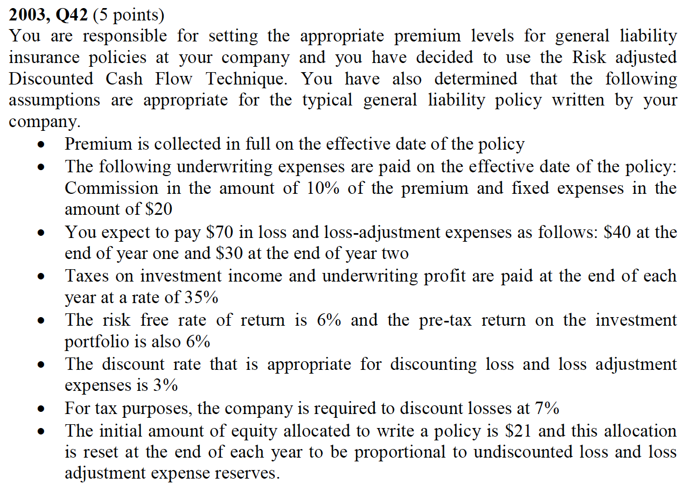
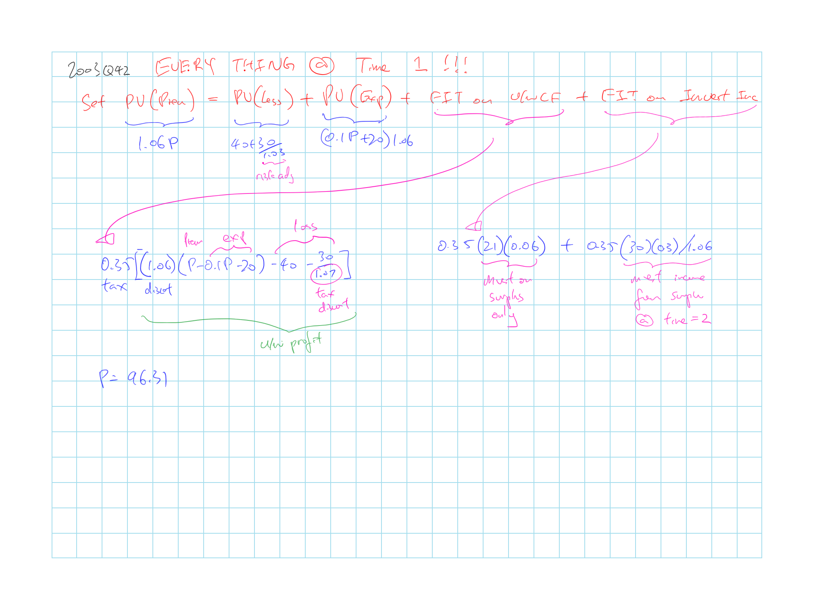

## Cliff's Summary

The 6 methods: procedure, assumptions and pros/cons

### Types of Exam Questions

Haven't done TIA practice questions

**CY Offset**

* 2002, Q21: cons of CY offset; when does it not work well
* 2009, Q14 a: calc and distortion

**CY ROE**

* 2000, Q26: Calc; CY ROE vs CY offset
* 2001, Q40: Calc; CY ROE vs CY offset
* 2003, Q44: pros/cons; PY Offset fixed some of the issue
* 2004, Q13: Calc
* 2004, Q36: Backout ROE
* 2006, Q17: @ breakeven (target RoR = risk free)
* $\star$ 2007, Q18: PHSF needs to take out prepaid expense and receivable; Also get the reserve baed on ratio of reserve/incurred $\times$ Permissible LR
* 2008, Q15: Calc; pros/cons
* 2009, Q14 b: calc
* 2010, Q12: Back out ROE; pros
* 2011, Q20: Calc; pros/cons
* 2013, Q17: Calc; risk is reflected in the ROE and P:S ratio

**PV Offset**

* 2001, Q43: Calc; pros/cons of using prior portfolio yield
    * So PLR = 1 - exp% - u/w%
* 2002, Q24: Calc; Premium; inputs
    * Why is the Premium formula yeild different result from direct calc with the % from (a)
* 2005, Q13: Calc; pros/cons
* 2008, Q12: Calc; pros/cons
* 2010, Q15: Calc
* 2011, Q21: arithmatic; pros/cons
* 2014, Q19: back out PLR; rate use

**PV Cashflow**

* 2012, Q18: Go through with the calc

**Risk Adjusted Discounted Cashflow**

* $\star$ [2003, Q42](#2003-42): Calc premium
* 2003, Q45: Calc premium and pre tax income
* 2007, Q19: Calc premium then u/w profit
* 2010, Q10: Calc premium
* $\star$ 2013, Q18: Need to back out the $\beta_l$; Also quite long

**IRR**

* 2001, Q39: Calc; GAPP and SAP should be similar for IRR
* 2008, Q14: Calc; Can do Feldblum method

**General Concepts**

* 2005, Q14: Discount
    * Discount PHSF at risk free as the insured is not bearing the risk and XS should goes to own for putting assets at risk
    * Exclude investment income on surplus in ratemaking as surplus belon to insurer so p/h should not get credit; don't want to penalize insured
* 2014, Q20: types of u/w profit; use stockholder funds because split is arbitrary
* $\star$ 2015: Consideration with each method

## Underwriting Profit Provision

$P = \dfrac{\overbrace{(1+c)L}^{\text{L&LAE}} + Fix}{1-Var\% - U}$

General steps to calculate the u/w profit provision

1) Calculate the premium using the different method and assumptions

2) Calculate Combined Ratio = $Var\% + \dfrac{(1+c)L + Fix}{P}$

3) U/w profit provision = 1 - Combined Ratio

| Methods         | Description                                              |
| --------------- | -------------------------------------------------------- |
| CY Investment Income Offset | Adjusts traditional profit provision for investment income |
| Present Value Offset | Adjust traditional profit provision by comparing investment income of a particular line to the income of a reference line |
| CY ROE Method | Provision based on target ROE |
| $\dfrac{PVI}{PVE}$ Method | Provision based on target $\dfrac{PVI}{PVE}$ |
| PV Cash Flow Return | Provision based on setting PV of cash flow = PV $\Delta$ in equity |
| Risk Adjusted Discounted Cash Flow | Provision based on fair premium |
| Internal Rate of Return | Provision based on premium that achieves a certain IRR of the equity flows between insurer & shareholders |

### U/w Profit and Total Profit

Provision is adequate if it results in an adequate total profit after investment income and taxes

**Problem** of above definition

* Not obvious how to apply in ratemaking
* What is an adequate total return
* Ratemaking should be on a prospective PY basis while total return is measured on a CY basis

### Types of U/w Profit

**Manual/filing rate** provision in manual rate filing

**Corporate target** u/w-ing profit provision:  
Provision to generate an expected return similar to that provided by investment with similar risk

**Breakeven** u/w-ing profit provision:  
Provision that provide rate of return = risk free investment for shareholders $\Rightarrow$ No risk premium

**Charged** u/w-ing profit provision:  
Provision after applying experience and schedule mod and other adjustments

**Actual** u/w-ing profit provision:  
Provision based on actual L&LAE

## Method 1: CY Investment Offset

$U = U^0 - i_{AFIT} \cdot PHSF$

* $U$ = Adjusted u/w profit provision
* $U^0$ = Traditional u/w profit provision
* $i_{AFIT}$ = Investment yield after tax
* $PHSF$ = Policyholder supplied fund

$PHSF$ has 2 components

* $PHSF$ on unearned premium
    * Need to subtract out pre paid expense and premium receivable
    * Can be expressed as a % of EP
* $PHSF$ on loss reserve
    * $\dfrac{\text{Reserve}}{\text{Premium}} = PLR \times \dfrac{\text{Reserve}}{\text{Incurred}}$
    * Avoid distortion by premium inadequacy

Technically the analysis should be performed over several iterations as the permissible loss ratio is used to determine the profit provision but the provision also impact the permissible loss ratio

**Key Assumptions**

* CY based
* Only policyholder supplied funds are investible
    * Total surplus is not investible
* $i_{AFIT}$ is based on portfolio yield from recent year

**Advantages**

* Data is easily obtained and verified from AS
* Figures are from files documents so less likely it is making pessimistic projections to increase profit provision
* CY investment portfolio yields are relatively stable (compared to investments initiated in a certain year)
* Calculation is short and relatively straight forward

**Disadvantage**

* CY results are retrospective while ratemaking is prospective (changes in growth and loss experience)
* Results distorted if large change in volume of reserve adequacy
* Lack of economic theory supporting the calculation

## Method 2: PV Offset

Similar to 1 but assume traditional provision reflects investment income from a reference line

Offset based on difference between:

* PV loss for a short tail reference line
* PV loss for line under review
* Difference driven by the length of discount (payout pattern)
* Reference line should have a higher discounted payout ratio (since shorter tail)

Discount rate options:

* Portfolio yield from a recent year
    * Method 1, more stable and verifiable
* Estimated portfolio yield for the year in which the rate will be in effect
* New money yield (Prospective so more suitable)

$U$ = 1 - Combined Ratio = $U^0 - PLR \times$ $\left( PV_{factor}[x^0] - PV_{factor}[Loss] \right)$

* PLR = Projected LR (or Permitted LR?)
* This is just 1 iteration

Proof:

$\begin{array}{ccc}
  P &= &PV[Loss] + Fix + Var\% \cdot P + U^0 \cdot P + Loss \cdot (1 - PV_{factor}[x^0])\\
  P &= &PV[Loss] + Fix + Var\% \cdot P + U^0 \cdot P + Loss -  Loss \cdot PV_{factor}[x^0]\\
  1 &=  &\dfrac{Loss + Fix + Var\% \cdot P}{P} + U^0 - \dfrac{PV[Loss] + Loss \cdot PV_{factor}[x^0]}{P} \\
  1 - \text{Combined Ratio} &= &U^0 - \dfrac{Loss \cdot PV_{factor}[Loss] + Loss \cdot PV_{factor}[x^0]}{P}\\
\end{array}$

**Key assumptions**

* ??

**Advantages**

* Accounts for investment income
* Not distorted by rapid growth/ decline since it uses PLR which is prospective
* No need to select a target return or allocate surplus

**Disadvantage**

* Lack of economic theory to support

## Method 3: CY ROE

Selects underwriting profit provision to achieve the target ROE

$U = \underbrace{\dfrac{1}{1 - t_u}}_{(1)} \bigg[ \underbrace{r \cdot \dfrac{\text{Equity}}{\text{Surplus}} \dfrac{\text{Surplus}}{\text{Premium}}}_{(2)} - \underbrace{i_{AFIT} \left( PHSF + \dfrac{\text{Surplus}}{\text{Premium}} \right)}_{(3)} \bigg]$

1) Gross up to pre tax
2) Total target return on premium
    * $r$: target ROE
3) After tax investment return on $PHSF$ and surplus

**Key assumptions**

* Both $PHSF$ and surplus are investable (Take it out from the ROE Req)
* Investment yield use ??
* ROE is based on GAAP equity
    
**Advantages**

* Figures are easy to verify (from AS and IEE)
* Produces ROE similar to GAAP ROE

**Disadvantages**

* CY method $\Rightarrow$ Can be distorted by large change in growth or reserve adequacy
* Need target rate of return
* Need leverage ratio

## Method 4 PVI/PVE

U/w-ing profit to achieve a target **present value return**: $\dfrac{\text{Present Value of Income}}{\text{Present Value of Equity}}$

**Present value of equity**

* Based on average equity during each period
    * Use the value at year end before it was taken down to 0
* Discount from end of the period (even though it's the average value)
* Strange concept as equity is a balance not cash flow

**Annualize the equity**

* $\dfrac{PVE}{\sum \text{Discount Factors}}$

* $\frac{PVI}{PVE}$ depends on the time-period the model use

**Key Assumptions**

* $PVI$ discounted to **end** of first year
* $PVE$ discounted to **beginning** of first year
* Annualized the PVE
* Discount using pre-tax risk free rate
    * We separately deduct tax
    * U/w profit provision should not depend on the investment strategy
* Everything is investable (UPR + Reserve + Surplus - Receivable)
    
**Advantages**

* Based on measure of rate of return that is comparable to GAAP ROE

**Disadvantages**

* Need to select discount rate
* Need to select a target rate of return

### PVI/PVE Procedure

**Assumptions**

* EP pattern
* Paid Loss Pattern
* Inc'd Loss Pattern
* Paid Expense Pattern
* Inc'd Loss Pattern (Assume incurred as paid, i.e. no expense reserve)

**Underwriting Income**

| Time | Earned Premium | Incurred Loss | Incurred Expense | U/w Income |
| :--: | :-----------: | :-----------: | :-----------: | :-----------: |
| (1) | (2) | (3) | (4) | (5) = (1) - (2) - (3)|

1) Assumption, could be quarterly, start from 0
2) Assumption on earning (uniformly)
3) Assumption on incurred (uniformly)
4) Assumption on incurred (inccured as paid)
5) U/w income = EP - Incurred Loss - Incurred Expense

**Investment Income**

| Time | Unearned Premium Reserves | Loss Reserve | Expense Reserve | End of Qtr Surplus | Premium Receivable | Investable Assets | Average Investable Assets | Investment Income |
| :--: | :------: | :------: | :------: | :------: | :------: | :------: | :------: | :------: |
| (1) | (2) | (3) | (4) | (5) | (6) | (7) = (2) + (3) + (4) + (5) - (6) | (8) | (9) |

1) Assumption, could be quarterly, start from 0
2) Assumption on earning (uniformly)
3) = Cumulative Inc'd Loss - Paid Loss based on assumed pattern
4) = 0 Based on assumption expense incurred as paid
5) Based on P:S assumption and surplus release assumption
6) Based on premium receive pattern
7) **Average** Investible Asset = Avg(UPR + Loss Reserve + Expense Reserve + Surplus - Premium Receivable)
8) Average investable asset $\times$ investment yield; for the right period length

**Present Value Income**

| Time | U/w Income | Investment Income | Total Income | After Tax Income | PV Factor | PV Income |
| :--: | :------: | :------: | :------: | :------: | :------: | :------:
| (1) | (2) | (3) | (4) = (2) + (3) | (5) | (6) | (7) |

1) Assumption, could be quarterly, start from 0
2) From earlier 
3) From earlier
4) Total Income = U/w Income + Investment Income
5) Discounted to **end of first year** using pre-tax risk free rate

**Present Value Equity**

| Time | Ending GAAP Equity | During Period GAAP Equity | PV Factor | PV GAAP Equity |
| :--: | :------: | :------: | :------: | :------: |
| (1) | (2) | (3) | (4) | (5) |

1) Assumption, could be quarterly, start from 0
2) Based on Equity:Surplis assumption
3) Average of beginning and ending GAAP equity
4) Discounted to **time 0** and annualized Confirm annualized calc 

**U/w profit provision**

Goal seek the premium which will achieve $\dfrac{PVI}{PVE} =$ target rate of return

Then do the calculation for [u/w profit](#uwprofit)

## Method 5: PV Cash Flow Return

U/w provision necessary for:  
PV(total cash flow @ investment return) = PV($\Delta$ equity @ target return)

**Cash flow**

* Cash flow = u/w cash flow + investment income - tax
* From single policy

**Key Assumptions**

* PV(CF) discounted @ *investment* rate of return
* PV($\Delta$ equity) discounted @ *target* rate of return
* Only surplus are investible

**Advantages**

* PV of u/w cash flow is what most people think about with regards to underwriting profit

**Disadvantages**

* Not clear what profit is being measured. Cash flow do not have the same timing as GAAP income

### PV Cash Flow Procedure

**Cash flow**

| Time | Surplus | Investment Income on Surplus | Paid Premium | Paid Loss | Paid Expense | Total Cash Flow | After Tax Cash Flow | PV Factor | PV Cash Flow |
| :--: | :------: | :------: | :------: | :------: | :------: | :------: | :------: | :------: | :------: |
| (1) | (2) | (3) | (4) | (5) | (6) | (7) = (3) + (4) - (5) - (6) | (8) = (7) $\times$ (1 - $t_u$) | (9) | (10) |

1) Assumption, could be quarterly, start from 0
2) Based on P:S assumption
3) Surplus $\times$ investment yield
4) Pattern assumption
5) Pattern assumption
6) Pattern assumption
7) Total cash flow = investment income + paid premium - paid loss - paid expense
8) Total cash flow $\times$ (1 - tax rate)
9) Discount to time 0 @ **investment yield**

**Change in Equity**

| Time | Equity | $\Delta$ Equity | PV Factor | PV $\Delta$ Equity |
| :--: | :-----------: | :-----------: | :-----------: | :-----------: |
| (1) | (2) | (3) | (4) | (5) |

1) Assumption, could be quarterly, start from 0
2) Surplus $\times$ Equity:Surplus ratio
3) Change at given time point
4) Discount to time 0 @ **target rate of return**

**U/w profit provision**

Goal seek the premium which will achieve PV(CF) = PV($\Delta$ Equity)

Then do the calculation for [u/w profit](#uwprofit)

## Method 6: Risk Adj'd Disc'd CF

**Fair Premium** = Risk adjusted PV u/w cash flow + PV of tax

**Risk adjusted discount rate** from CAPM  
$i_r = i_f + \beta(i_m - i_f)$

* Recall $\beta = \dfrac{\operatorname{Cov}(r_M, r)}{\operatorname{Var}(r_M)}$

* Difficult to use with liabilities as there is no active market where liabilities are traded $\Rightarrow$ Little data exist to calculate the parameters

**Key Assumptions**

* Losses are discounted @ risk adjusted rate based on CAPM
* Other components are discounted @ risk free
* Everything is discounted to the **end of 1st year**
* Only surplus is investible

**Advantages**

* Great intuitive appeal
* Grounded in modern financial theory
* Not necessary to determine a target rate of return

**Disadvantages**

* Hard to determine $\beta$

### Risk Adj'd Disc'd CF Procedure

Look at u/w CF separately from investment income

* Get u/w CF including tax
* Investment income we just need the tax

**Underwriting Cash Flows**

| Time | Premium Payment | Premium PV Factor | Paid Premium | Paid Loss | Loss PV Factor |
| :--: | :------: | :------: | :------: | :------: | :------: |
| (1) | (2) | (3) | (4) = (2) $\times$ (3) | (5) | (6) |

| PV Loss | Paid Expense | Expense PV Factor | PV Expense | PV UW CF | U/W Tax |
| :------: | :------: | :------: | :------: | :------------: | :-----------: |
| (7) = (5) $\times$ (6) | (8) | (9) | (10) | (11) = (4) - (7) - (10) | (12) = (11) $\times$ $t_u$ |

1) Assumption, could be quarterly, start from 0
2) Pattern assumption
3) Discounted to **end of first year** @ **risk free**
4) PV Premium
5) Pattern assumption
6) Discounted to **end of first year** @ **risk adjusted rate**
7) PV Loss
8) Pattern assumption
9) Discounted to **end of first year** @ **risk free**
10) PV Expense
11) PV U/W CF = PV Premium - PV Loss - PV Expense
12) PV U/W CF $\times$ Tax Rate

**Tax on Investment Income**

| Time | Surplus | Investment Income on Surplus | Federal Income Tax | PV Factor | PV Taxes |
| :--: | :------: | :------: | :------: | :------: | :------: |
| (1) | (2) | (3) | (4) = (3) $\times$ $t_u$ | (5) | (6) |

1) Assumption, could be quarterly, start from 0
2) Based on P:S ratio assumption
3) Surplus $\times$ Investment Income
4) Investment Income $\times$ $t_u$
5) Discounted to **end of first year** @ **risk free**
6) PV Taxes on investment income

**U/w profit provision**

Goal seek to achieve PV(Premium) = PV(Loss) + PV(Expense) + FIT on u/w CF + FIT on investment income

Then do the calculation for [u/w profit](#uwprofit)

## Method 7: IRR on Equity

Select premium to get a target rate of return on the equity flows between company and shareholders

* From a single policy

Equity flow = Income - $\Delta$ Statutory Surplus

**Advantages**

* Return to stockholders similar to a rate on loan
* Reflect accounting rules via impact on the cash flows

**Disadvantages**

* Need target rate of return
* Need surplus requirement

### IRR on Equity Procedure

**Underwriting Cash Flows**

| Time | Earned Premium | Incurred Loss | Incurred Expense | U/w Income |
| :--: | :------: | :------: | :------: | :------: |
| (1) | (2) | (3) | (4) | (5) = (2) - (3) - (4) |

1) Assumption, could be quarterly, start from 0
2) Based on earning pattern assumption
3) Based on incurred pattern assumption
4) Based on incurred pattern assumption
5) U/w income = EP - Incurred Loss - Incurred Expense

**Investment Income**

| Time | Unearned Premium Reserve | Loss Reserve | Expense Reserve | SAP Surplus | Premium Receivable | Investable Assets | Average Investable Assets | Investment Income |
| :--: | :------: | :------: | :------: | :------: | :------: | :------: | :------: | :------: |
| (1) | (2) | (3) | (4) | (5) | (6) | (7) = (3) + (4) + (5) - (6) | (8) = (7) $\times$ (1 - $t_u$) | (9) |

1) Assumption, could be quarterly, start from 0
2) Based on pattern consistent with u/w-ing income table
3) Based on pattern consistent with u/w-ing income table
4) Based on pattern consistent with u/w-ing income table (Assume incurred as earned)
5) Based on P:S assumption and release pattern
6) Based on premium pattern
7) Investable assets = UPR + loss reserve + expense reserve + SAP surplus - premium receivable
8) Average of beginning and ending investment assets
9) Average investable assets $\times$ investment yield

**Equity Flows**

| Time | U/w Income | Investment Income | Pre-tax Income | After-tax Income | Surplus Change | Equity Flow | PV Factor | PV Equity Flow |
| :--: | :---: | :------: | :------: | :-----------: | :------: | :------: | :---: | :---------------: |
| (1) | (2) | (3) | (4) = (2) + (3) | (5) = (4) $\times$ (1 - $t_u$) | (6) | (7) = (5) - (6) | (8) | (9) = (7) $\times$ (8) |

1) Assumption, could be quarterly, start from 0
2) Underwriting Cash Flows Column (5)
3) Investment Income Column (9)
4) Pre-tax income = (2) + (3)
5) Pre-tax income $\times$ (1 - $t_u$)
6) Surplus $\Delta$ at the given point
7) Equity flow = after-tax income - surplus $\Delta$
8) Discounted to **time 0** @ **target rate of return**
9) PV Equity Flow = Equity flow $\times$ PV Factors

**U/w profit provision**

Goal seek to achieve PV(Equity Flow) = 0

Then do the calculation for [u/w profit](#uwprofit)

## Conclusion

**Model construction questions**

* Include surplus?
* How to determine surplus requirement
* How to incorporate risk into the model
* Cashflows vs incomes flows
* How to reflect income taxes

**Parameter selection questions**

* Discount rate
* Target return

## Regulation

Profit provisions regulation approaches

Rate of return approach

* Rates should be regulated to ensure that companies are able to achieve an adequate return
* Supporters of this argue that insurers should be regulated in a same fashion to utility companies
* Counter argument is that utilities are natural monopolies where insurance industry there are a large number of firms with relatively low market shares

Constrained free market theory

* Premium will move to an optimal level (from the initial starting point: the manual rates) via market forces
* Direct regulation is not necessary

## Past Exam Questions

 2003, Q42

