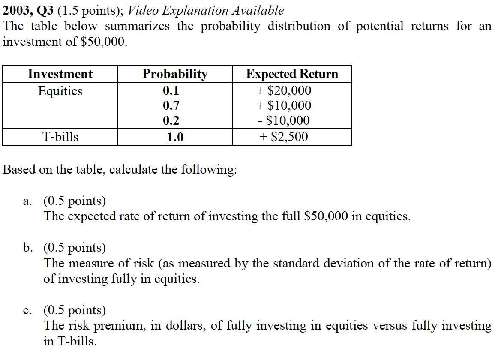
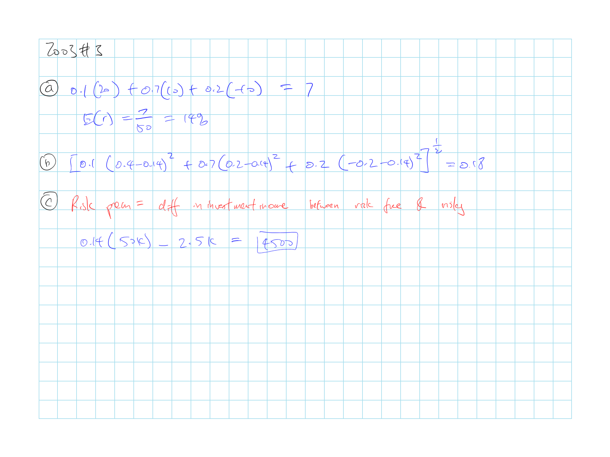
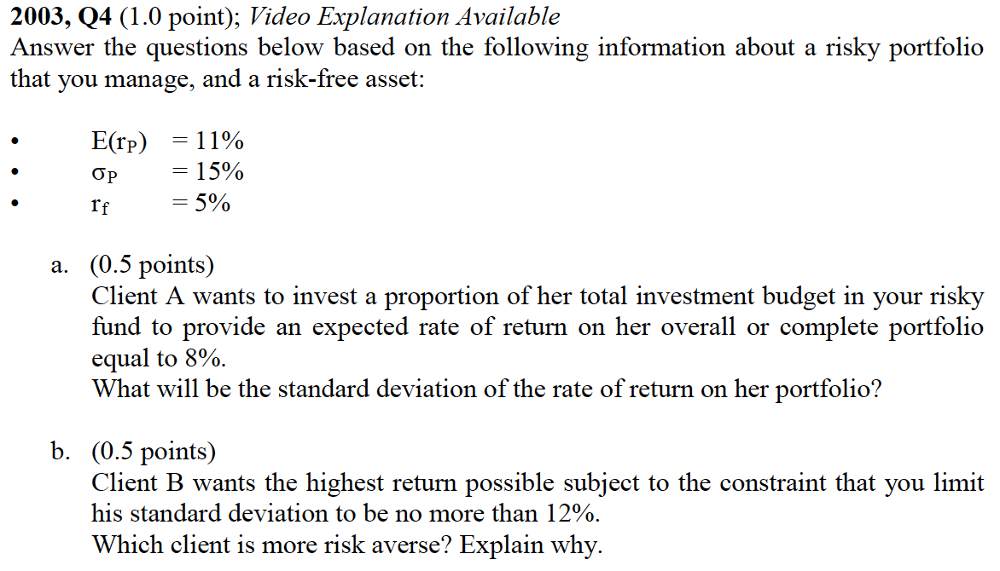
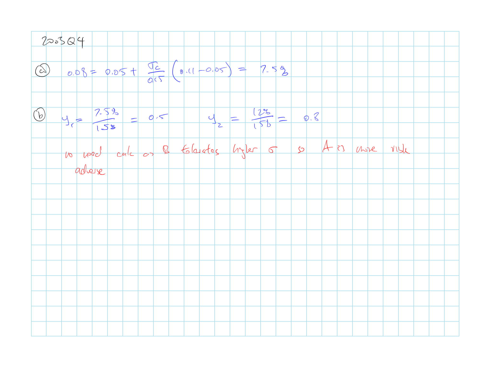
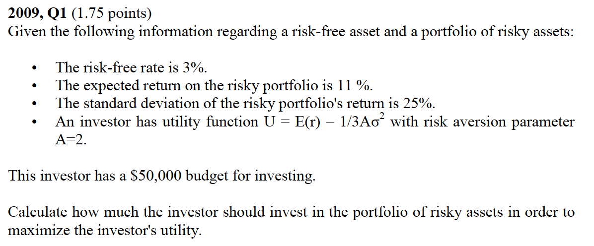
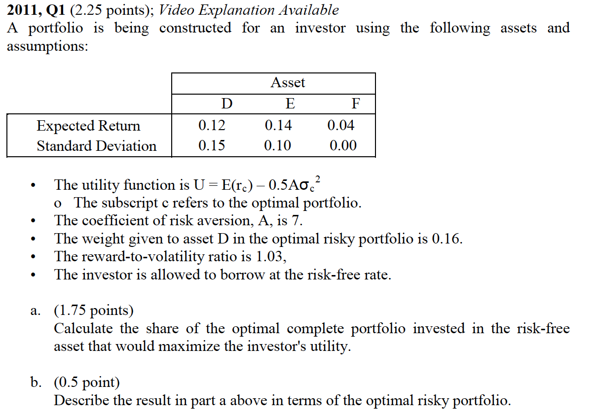
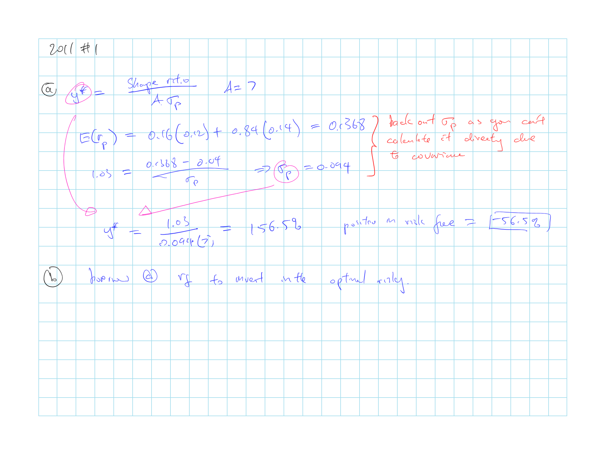
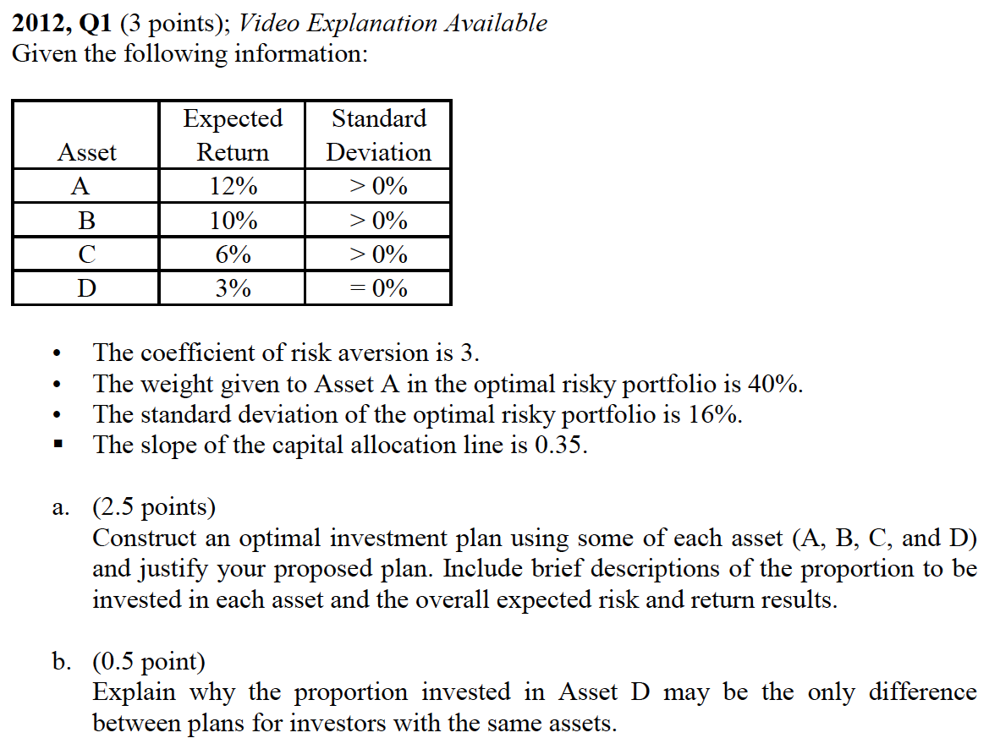
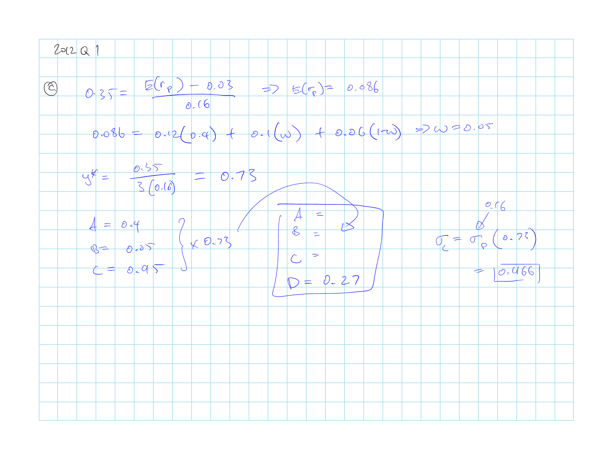

# A1 BKM 6: Risk Averison & Capital Allocation to Risk Assets

Z. Bodie, A. Kane, A. Marcus

## Cliff's Summary

Need to memorize and know all the equations by heart and what they represent

Utility: $U = \operatorname{E}[r] - 0.5A\sigma^2$

* $A > 0$: Risk adverse

[CE](#CE): $U = \operatorname{E}[r_f] = \operatorname{E}[r] - 0.5A\sigma^2$

Complete portfolio $c$:

* $\operatorname{E}[r_c] = r_f + \dfrac{\sigma_c}{\sigma_p}\left( \operatorname{E}[r_p] - r_f \right) = r_f + \sigma_c \cdot (\text{Sharpe Ratio})$

* $\sigma_c = y \sigma_p$

[Capital allocation line](#CAL)

* Capital market line is the CAL that uses a passive portfolio as the risky portfolio

Sharpe Ratio: $\dfrac{\operatorname{E}[r_p] - r_f}{\sigma_p}$

Optimal complete portfolio ratio on risky asset: $y^* = \dfrac{\operatorname{E}[r_p] - r_f}{A\sigma^2_p}$

[Graphically](#graphically) derive optimal risk portfolio with indifference curves

* Curves that contain different portfolios that the investor is indifferent about, given the same $U$ and $A$

### Types of Exam Questions

Haven't done TIA practice questions

**Return and $\sigma$**

* [2003, Q3](#2003-3): return and $\sigma$ and risk premium
* [2003, Q4](#2003-4): plug and play to formula for expected return for complete portfolio
* 2004, Q3: plug and play return and $\sigma$
* 2007, Q1 a: complete ptf return and $\sigma$
* 2010, Q2 a: back out $\operatorname{E}[r_c]$ with sharpe ratio and $\sigma_c$
* 2013, Q1 b: returna and $\sigma$ plug and play

**CAL**

* 2006, Q4: Draw CAL and the CAL equation
* 2007, Q1 b: Draw CAL and CAL equation
* 2010, Q2 b: Draw CAL
* 2014, Q1: Draw CAL with borrowing restriction

**Utility**

* 2005, Q4 b c: utility function calcuation and CE
* $\star$ [2009, Q1](#2009-1): Need to convert the standard $y^*$ formula
* 2010, Q3: same as above
* 2013, Q1 a: CE

**Portfolio Weights**

* $\star$ [2011, Q1](#2011-1): get $y^*$ and describe
* $\star$ [2012, Q1](#2012-1) a: Getting weights for each assets
* 2013, Q1 c: $y^*$ plug and play

**Concepts**

* 2005, Q4 a: risk neutral implication
* 2012, Q1 b: seperation principle (BKM7)
* 2014, Q2: active vs passive investment

|  | Active | Passive |
| -------------------------- | -------------------------- | -------------------------- |
| Constructing Portfolio | Seeks (+)$\alpha$, picking investment | Replicate diversified portfolio |
| Implementation and Cost | More fees from trading | Much cheaper, less frequent trading | 
| Expected Return | Additional profit if find $\alpha$ but offset by transaction cost | Market index return |

## Introduction

Risk appetites:

* Risk adverse: $A>0$ Prefer lower risk, require risk premium
* Risk neutral: $A=0$ Ignore risk, only cares about expected return
* Risk lovers: $A<0$ Prefer higher risk, accept lower return for higher risk

## Utility

Utility is dependent on investor's risk appetite, expected return and risk level

$U = \operatorname{E}[r] - 0.5A\sigma^2$

 **Certainty Equivalent Rate**  
Rate that a risk free investment need to offer to provide the same level of utility as the risky investment

* Where investors is indifferent between a sure thing and the risky option

* Solve for the $\operatorname{E}[r]$ by setting $U = \operatorname{E}[r_f] = \operatorname{E}[r] - 0.5A\sigma^2$

Based on **mean-variance (M-V) criterion**, portfolio $A$ dominates $B$ if:

* $\operatorname{E}(r_A) \geq \operatorname{E}(r_B)$

* $\sigma_A \leq \sigma_B$

### Estimating Risk Aversion

Binomial loss

$r = \begin{cases} -1 & p \\ 0 & (1-p) \\ \end{cases}$

$\hookrightarrow$ $\operatorname{E}[r] = -p$; $\sigma^2(r) = p(1-p)$

$\hookrightarrow$ $U = -p-0.5Ap(1-p)$

Insurance with premium $v$

$\operatorname{E}[r] = -v$; $\sigma^2(r) = 0$

$\hookrightarrow$ $U = -v$

Set $U$ from binomial loss and premium equal

$A = \dfrac{2v}{p-1}\dfrac{1}{1-p}$

## Capital Allocation

**Complete Portfolio**  
Allocation between risk free (F) and risky assets (P)

* Assumption: Money is shifted between F & P and components of P remain in fixed proportions

$\operatorname{E}[r_c] = r_f + \dfrac{\sigma_c}{\sigma_p}\left( \operatorname{E}[r_p] - r_f \right) = r_f + \sigma_c \cdot (\text{Sharpe Ratio})$

* $\operatorname{E}[r_c] = y \operatorname{E}[r_p] + (1-y) r_f = \cdots$

* $\sigma_c = y \sigma_p$

* Drawing this equation out gets you the CAL, it represents the $\operatorname{E}[r_c]$ and $\sigma_c$ you can get for different weight on risky assets $y$

### Capital Allocation Line (CAL)

Slop of CAL = $\left. \dfrac{\operatorname{E}[r_p] - r_f}{\sigma_p} \right \} \text{Sharpe Ratio} = \dfrac{\text{Incremental Return}}{\text{Unit of }\sigma}$

CAL to the right of ($\operatorname{E}[r_p]$, $\sigma_p$) is achieve by borrowing at risk free rate

* If borrowing at risk free is not possible, the slope will be less steep = $\dfrac{\operatorname{E}[r_p] - r_f^B}{\sigma_p}$ where $r_f^B$ is the risk free rate we can borrow

### Risk Tolerance & Asset Allocation

**Optimal Portfolio** maximizes investor utility with ratio $y^*$ on the risky asset

$y^* = \dfrac{\operatorname{E}[r_p] - r_f}{A\sigma^2_p}$

* Derived by setting the derivative of the utility equation = 0

 **Graphically** derive optimal risk portfolio

1) Plot **indifference curves**, which are curves that contain different portfolios that the investor is indifferent about, given the same $U$ and $A$

    * Higher $A$ produceds a steeper sloping indifference curve as an increase in $\sigma$ requires higher $\operatorname{E}[r]$ for investors that are more risk adverse

2) Investor will pick the highest possible indifference curve that touches the CAL

3) Optimal portfolio is located at the intersection point of the CAL and the curve **tangential** to the CAL

    * As higher $U$ will shift the curve upwards

**Proof** for $y^*$ equation:

$\begin{array}{lcccl}
  U &= &\operatorname{E}[r_c] &- &\frac{1}{2}A\sigma_c^2 \\
  U &= &y \operatorname{E}[r_p] + (1-y)r_f &- &\frac{1}{2}A(y\sigma_p)^2 \\
  \frac{dU}{dy} &= &\operatorname{E}[r_p] - r_f &- & A y \sigma^2_p \\
  0 &= &\operatorname{E}[r_p] - r_f &- & A y \sigma^2_p \\
  A y \sigma^2_p &= &\operatorname{E}[r_p] - r_f \\
  y &= &\dfrac{\operatorname{E}[r_p] - r_f}{A \sigma^2_p } \\
\end{array}$

### Non Normal Returns

Analysis so far used the $\sigma$ as the measure of risk and it assumes return $\sim N(\mu, \sigma)$

If returns are more heavy tailed than normal $\Rightarrow$ Reduce allocation to the risky portfolio compared to the indication above

### Capital Market Line

**Capital Market Line**  
CAL that uses a passive portfolio as the risky portfolio

**Passive** strategy for risky portfolio:

* Based on a selected benchmark portfolio
* Significant cheaper than an active strategy
* Free rider benefit: Assets should be fairly priced as mispricings should disappear from investors implementing the active strategy

**Active** strategy is to determine the risky portfolio with security analysis

## Past Exam Questions

 2003, Q3

 2003, Q4

 2009, Q1

 2011, Q1

 2012, Q1

