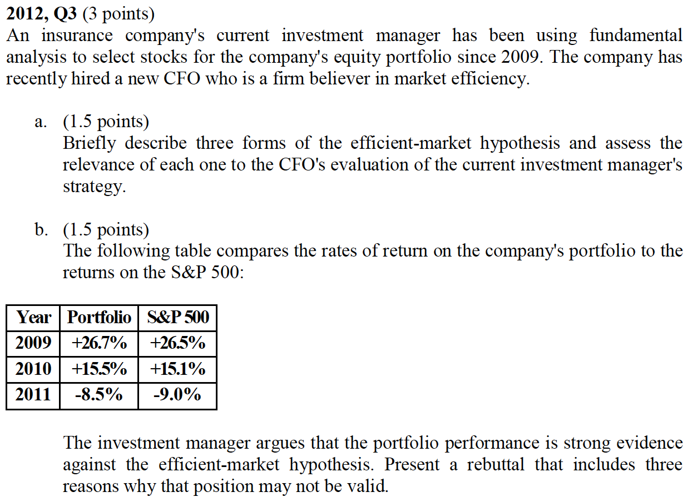
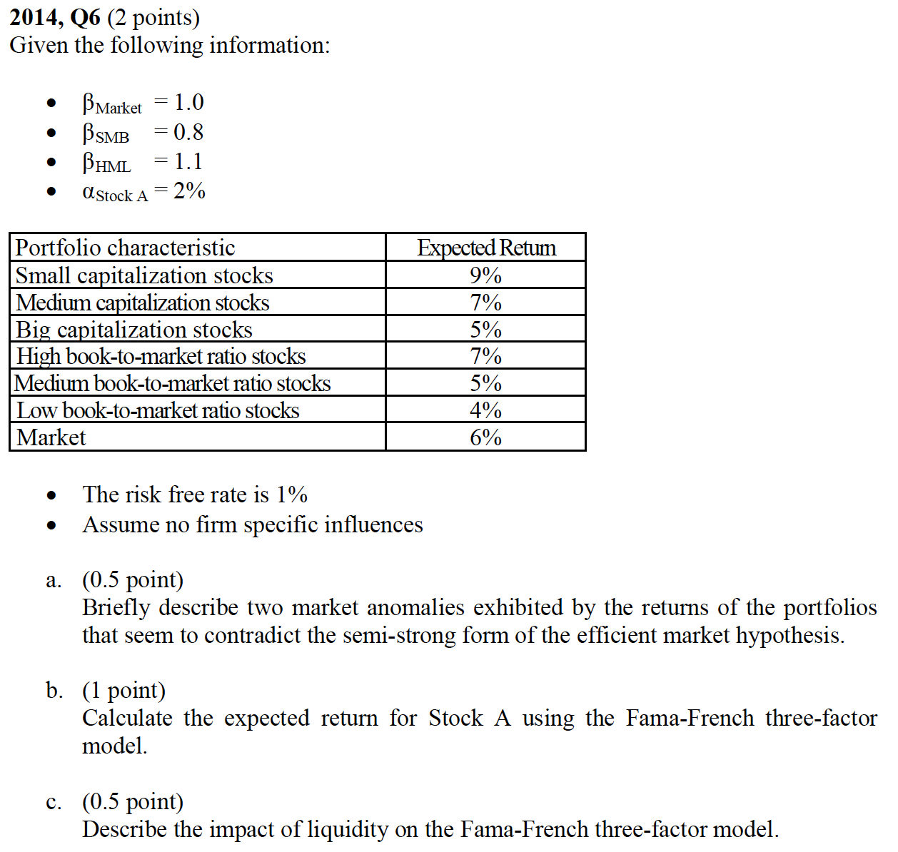

# A6 BKM11: Efficient Market Hyothesis

Z. Bodie, A. Kane, A. Marcus

## Cliff's Summary

3 [forms](#EMH-forms) of EMH and [implications](#EMH-implications)

Event studies and the [difficulties](#event-diff)

[Difficulties](#efficient-diff) in assessing whether the market is efficient

* Also the test should be risk adjusted which is also difficult

* [Test](#EMH-3-forms-test) for the 3 forms of EMH

    * Efficient market anomalies

* Interpretation might be difficult too

* There is still perpose for portfolio management

Look at performance of stock analyst and also mutual fund managers

### Types of Exam Questions

Haven't done TIA practice questions

**Concepts**

* 2003, Q14: passive investment strategy and why is it better under EMH
* 2003, Q15: Small firm in jan and B:M ratio anomalies
* 2004, Q10: 3 EMH; Technical analysis; EMH implication; ptf managment purpose
* 2006, Q8: Anomalies
* 2007, Q5: semi-strong, anomalies
* 2008, Q5: 3 EMH; price drift violate semi strong
* 2008, Q7: Should not be persistent performance
* 2010, Q1: value of portfolio managment; if everyone actually use the passive portfolio not price correction will happen
* $\star$ [2012, Q3](#2012-3): 3 form of EMH; examples
* $\star$ [2014, Q6](#2014-6: market anomalies based on data

## Introduction

Stock prices should reflect all available information

New information relevant to the stock will cause the price to change and since new information is unpredictable, so is the movement of stock price (random walk process)

 3 versions of EMH

* **Weak form**: Reflect all information that can be derived from examining market (trading) data

* **Semi-strong form**: Reflect all publicly available information about the firm's prospects

* **Strong form**: Reflect all information relevant to the firm including non-public information

All 3 versions pertain only to information available

## Implication of EMH {.tabset}

If EMH holds, it'll impact the following investment strategies

### Technical Analysis

Technical analysis search for predictable patterns of stock prices to used to derive a profit from trading

Rely on sluggish response of the stock price to fundamental factors and exploit the trend

* Uses metrics such as: *Resistence levels* (levels above prices should not rise); *Support levels* (levels below which prices should not fall)
    
Can only be successful if markets are not efficient in weak form of EMH

### Fundamental Analysis

Uses the fundamentals of a firm to determine the appropriate prices

Try to gain insight into future performance that is not yet reflected by the market

* Earning & dividend prospects; Future interest rate expectations; risks

Semi-strong form of EMH states that it will not work unless investors have a unique insight

### Active vs Passive Managment

Takes a lot of effort and cost to gain unique insight

For smaller investors cost will be > benefits

Should resort to passive investments or mutual funds and ETFs

EMH advocates believe that stocks are priced fairly which means buy and sell frequently is pointless

## Event Studies {.tabset}

 **Event study**: To determine the importance of an event by measuring the resulting price changes

* Since price changes reflect new information

2 difficulties with these studies:

1) Market movement
2) Leakage

### Market Movement

Stock price may respond to a wide range of economic news in addition to the event

**Abnormal return** = Actual return - benchmark return

* Need to calculate a proxy for what the return would have been in absence of the event (benchmark return)

Several methods to calculate the benchmark:

* Market return
* Return of the stock implied by CAPM
* Return of the stock implied by index model ($e_t =$ abnormal return)

### Leakage

Information about the event maybe leaked prior and price maybe begin to move before the event

Maybe more appropriate to measure the impact of the event by referring to the cumulative abnormal return

* Beginning at a time period before the actual event is made public

## Are Market Efficient?

 Difficulties in determining if the markets are truly efficient:

**Magnitude Issue**: 0.1% of a huge portfolio will be a big dollar term contribution but very small compared to the normal volatility of the market $\Rightarrow$ Hard to assess how much the manager actually contributed

**Selection Bias Issue**: Investment scheme that are known by others will no longer generate abnormal returns $\Rightarrow$ Only schemes that do not work will be reported

**Lucky Event Issue**: The number of investors is so large so that just by chance some will have to make huge returns

### Tests of Different EMH Forms {.tabset}

 Tests can be constructed for each version of EMH

#### Weak-Form Tests

Patterns in stock returns

**Returns over short horizons**

* Measure *serial correlation* of stock market returns to see whether investors can use historical trends to earn abnormal profits over the short term

* Results show only small correlations over short periods

    * Exception being sectors with the best and worst returns exhibit stronger correlation, *momentum effect*
    
**Returns over long horizons**

* Similar to above but for longer term

* Results show negative correlation over the long term $\Rightarrow$ Fads hypothesis maybe

* $\hookrightarrow$ A contrarian investment strategy may be profitable

***

#### Semi-strong Form Tests

Efficient market anomalies

Investigate whether publicly available information beyond the trading history can be used to generate abnormal returns

Results show that some easily available diagnostics can be used to predict abnormal returns

* **Small firm in January effect**: Small firms have historically generate superior returns particularly in January

* **Neglect firm effect**: Some firms are neglected by large investors so less information is available. The superior returns might be due to additional premium required to compensate for the risk of less information

* **Book:Market ratios**: High B:M firm have historically outperformed the rest

* **Post-earnings-announcement price drift**: Cumulative abnormal return of stocks has been shown to continue to increase even after the information about the even become public

Tests require the level of risk to be reflected $\Rightarrow$ Need to appropriately risk adjust the return, which can be more difficult than EMH itself

***

####Strong Tests

Markets are not expected to be strong-form efficient, people with inside information should be able to make superior profits

***

### Intrepreting the Evidence

Results above might still not be sufficient to show that the market is inefficient:

* Properties are only proxies for fundamental determinants of risk

* Properties arise just due to data mining and many of the anomalies disappear after discovered

### Role of Portfolio Management

Portfolio management can still be beneficial in efficient market

* Helps selects a diversification strategy to eliminate firm risk
* Reflects tax considerations of the individual investors
* Adjust portfolio to reflect the unique risk profile of the investor

### Resource Allocation

Inefficient resource allocation, deviations from market efficiency will generate a cost to everyone

e.g. firms with overpriced securities will be able to obtain capital too cheaply

## Mutual Fund and Analyst Performance

### Stock Market Analysts

Expect positive bias since they work for brokers

* Need to look at the relative strength of a recommendation compared to other analysts

* Or the change in recommendation of an analyst

Study showed changes are associated with permanent change in stock prices $\Rightarrow$ Likely due to analyst's insight

* Or instead the change is just due to the change in recommendation itself

Another study indicates that firms with highest ratings do outperform those with the least favorable ratings

* However costs of trading would eliminate the additional profits

### Mutual Fund Managers

No evidence that managers can consistently beat the market

There are some evidence that indicates better managers in a period tend to be better managers in following periods

Adjusts tests above for exposure to systematic risk factors

* e.g. Risk adjust return XS of CAPM indication

* But market index may not be an adequate benchmark as managers may have significant holdings in small firms that's not represented in the market index

**4 Factor Fama French Model**

Benchmark return with 3 Fama French factors model + momentum factor $\Rightarrow$ Fund have not been shown to exceed this benchmark

The 4 factor model also only show minor persistence in mutual fund performance, mostly due to expenses and transaction costs

Another test from Bollen & Busse was to rank mutual fund to decile and track results in the following quarters

* Results showed only small persistence that is not sufficient to justify performance chasing

***

Argument supporting the lack of persistence is that fund that had good performance will attract new funds, driving the alpha down due to the additional cost & complexity of managing the new funds

Study of bond fund indicate that the bond fund under perform the passive indexes by the expense amount and with no persistence in performance $\Rightarrow$ Bond market is efficient

## Past Exam Questions

 2012, Q3

a. 

    * Weak form reflect all past market trading data. Technical analysis can't generate XS returns
    * Semi strong: price reflect all public information, fundamental analysis won't benefit
    * Strong form: all information is reflected. Unlikely this hold so fundamental analysis could work with non public information
    
b.

    * Lucky event: 50% for each of the 3 years is not impossible
    * Wide variance in return and small difference, might just be random
    * Companys might be taking on more risk to achieve higher returns

 2014, Q6

